[Powrót](https://numizmatyka.satola.net)

# Mennictwo bizantyjskie (491-1453)

## Spis treści

- [Wstęp](#wst)
- [Geneza powstania bizantyjskiego systemu monetarnego](#sm)
    - [Moneta złota](#sm1)
    - [Moneta srebrna](#sm2)
    - [Moneta brązowa](#sm3)
- [Pięć okresów bizantyjskiego systemu monetarnego](#po)
    - [I - ](po1)
- [Zewnętrzne cechy monet](#zcm)
- [Metale i próby kruszcu XXX TODO](#me)
- [Mennice cesarstwa bizantyjskiego](#men)

=======================

W III wieku podupadł autorytet cesarzy rzymskich, wynoszonych na tron i obalanych przez armię (większość władców tego okresu została zamordowana). Napotykali też oni coraz większe trudności w rządach nad rozległym imperium. Pod koniec III wieku cesarz <a href="https://pl.wikipedia.org/wiki/Dioklecjan">Dioklecjan (284-305)</a> wprowadził w roku 293 tetrarchię, czyli system rządów, w którym władzę równocześnie sprawowało czterech panujących nad różnymi obszarami rozległego imperium: Dioklecjan (wschodnie wybrzeże Morza Śródziemnego), Maksymian (Italia, Afryka i Hiszpania), Galeriusz (dolina Dunaju i Bałkany) i Konstancjusz I Chlorus (Brytania i Galia). System ten przetrwał zaledwie do początków IV stulecia. Trwały - jak się później okazało - podział cesarstwa nastąpił dopiero sto lat później.

Ekonomika bizantyjska wyrastwa z wielowiekowej tradycji gospodarki rzymskiej, w której pieniądz odgrywał ważną rolę środka wymiany towarów (powszechnego ekwiwalentu), a także środka tezauryzacji. Pieniądz był też nośnikiem treści politycznych (propagandowych i prestiżowych), religijnych (monety ceremonialne) oraz dawał świadectwo ówczesnej techniki menniczej, modnych trendów w kulturze i sztuce, jednak jego nadrzędną rolą zawsze pozostawało służenie obiegowi dóbr, czyli funcja ekonomiczna. 

W III wieku rzymski system monetarny przeżywał ciężki kryzys (inflacja i dewaluacja pieniądza), który udało się przełamać dopiero cesarzowi Dioklecjanowi (284-305). W 294 roku władca ten przeprowadził reformę, w wyniku której podstawą systemu monetarnego stał się pieniądz złoty, a nie jak dotąd srebrny. Podstawowym nominałem miał być odtąd **aureus** bity wg stopy 1/60 funta. Dioklecjan wprowadził też tzw. **folis** - posrebrzaną monetę brązową o wadze początkowo 9,7 g, a później stale redukowanej. W V wieku w państwie rzymskim emitowano już tylko niewielkie monetki brązowe o wadze ok. 1 g, które nie zaspokajały potrzeb rynku.

Gromadząc pełnię władzy w swoim ręku, Konstantyn I (306–337), założyciel Konstantynopola (w 330 roku miasto to uzyskało prawa stołeczne), ok. 313 roku w prowincjach zachodnich, a w 324 roku we wschodnich wprowadził monetę o 1/3 lżejszą od aureusa, zwaną **solidem** (_solidus_, po grecku _nomisma_) i bitą wg stopy 1/72 funta. Solid ważył ok. 4,54 g, tj. **24 karaty** (w rzeczywistości ok. 23,5 karata). Aureusy emitowano odtąd jedynie okolicznościowo do czasów Justyniana I (527-565), zaś podstawowym nominałem złotym stał się solid.

Oprócz solida, bito także kilka mniejszych nominałów:
- 1 **semissis** (2,27 g) = 1/2 solida
- 1 **tremissis** (1,51 g) = 1/3 solida
- 1/6 solida (0,76 g) emitowane tylko okresowo w VII w.

Waga solida nie ulegała w zasadzie zmianom - jego stabilność zadecydowała o odrodzeniu późnorzymskiej i bizantyjskiej gospodarki pieniężnej. Nie osłabiło pozycji solida puszczenie w obieg przez Justyniana I (527–565) ok. 538 roku tzw. **solidów lżejszych** o wadze 22 karatów, później także 20 i 23 karatów. Monety te posiadały oficjalny niższy kurs i służyły jedynie ułatwieniu operacji technicznych przeliczania sum w pieniądzu złotym na brązowy. Lżejsze solidy przestano emitować za Konstantyna IV (668-685).

**Karat** (0,189 g) był zbyt małą jednostką wagową, aby można go było bić w złocie, ale nadawał się jako jednostka wagi w przypadku monet srebrnych (BCPG. 3). I tak Cesarz Konstantyn I (306-337), prawie 150 lat przed upadkiem cesarstwa zachodniorzymskiego, wprowadził do obiegu tzw. **miliaresion** (_miliarense_, podwójny karat, 1/12 solida) i **silikwę** (łac. karat), monety bite z czystego srebra oraz ich odmiany, lekką i ciężką. Monety srebrne wymieniano na złote wg stałej proporcji określonej w 397 roku jako 14,4 do 1:
- 1 miliaresion lekkie = 2 silikwy lekkie = 1/14,4 solida
- 1 miliaresion lekkie = 5/6 miliaresion ciężkiego
- 1 miliaresion ciężkie = 2 silikwy ciężkie = 1/12 solida

Monety srebrne miały uzupełniać w obiegu pieniężnym monety złote, które posiadały dużą siłę nabywczą, ale do VII w. nie były emitowane zbyt licznie i nie odegrały większej roli.

Umierając w 395 roku, cesarz <a href="https://pl.wikipedia.org/wiki/Teodozjusz_I_Wielki">Teodozjusz I (379-395)</a> pozostawił władzę nad Imperium swoim synom: Arkadiuszowi (395-408) i Honoriuszowi (395-423). Pierwszy rządził odtąd z Konstantynopola prowincjami wschodnimi (imperium greckie), drugi z Mediolanu i Rawenny zachodnimi (imperium łacińsko-romańskie). Granice ustalono tak, że pokrywały się one z wpływami języków łacińskiego i greckiego. Do pełnego i rzeczywistego połączenia władzy nad obiema częściami państwa w rękach jednego monarchy nigdy już nie doszło. Rok 395 można zatem uznać za moment wyodrębnienia się państwa wschodniorzymskiego.

<table class="center">
  <tr>
    <td></td>
  </tr>
  <tr>
    <td>Cesarstwo Rzymskie w roku 395 (źródło: <a href="https://pl.wikipedia.org/wiki/Wielka_w%C4%99dr%C3%B3wka_lud%C3%B3w#/media/Plik:Roman_empire_395.jpg">Wikipedia</a>)</td>
  </tr>
</table>

Cesarstwo zachodniorzymskie przeżywało stopniowy rozkład, osłabiane <a href="https://pl.wikipedia.org/wiki/Wielka_w%C4%99dr%C3%B3wka_lud%C3%B3w">wielką Wędrówką ludów</a> i najazdami Hunów oraz Wandalów, aż w końcu przestało istnieć, kiedy w roku 476 barbarzyński wódz Odoaker obalił młodocianego cesarza Romulusa Augustulusa (475-476), władcę Rzymu i Rawenny. 

W tym czasie we wschodniej części cesarstwa legalne rządy sprawował cesarz Zenon (474-491). Po nim na tronie rzymskim, choć w Rzymie Nowym - Konstantynopolu, zasiadały dziesiątki następców aż do 29 maja 1453 roku, gdy Turcy zdobyli miasto nad Bosforem i położyli kres ponad tysiącletniemu istnieniu cesarstwa. W przekonaniu władców i poddanych, wschodnia część imperium nadal była cesarstwem rzymskim (nazywali oni siebie "Romaioi", czyli Rzymianami). Dopiero w czasach nowożytnych nadano jej nazwę "Cesarstwo Bizantyjskie", gdyż kształtowana w czasie długotrwałej ewolucji kultura, ustrój, sztuka, a także mennictwo części wschodniej cesarstwa rzymskiego znacznie odbiegały od wzorów zachodniorzymskich.

===

W 498 roku, Anastazjusz I (491-518) przeprowadził gruntowną reformę mennictwa brązowego, które załamało się w trakcie wielkiej wędrówki ludów oraz inwazji barbarzyńców na cesarstwo zachodnie. Stworzyło to podstawy funkcjonowania stabilnego bizantyjskiego systemu monetarnego. Za początek cesarstwa bizantyjskiego przyjmuje się rok 395, natomiast mennictwa bizantyjskiego dopiero rok 491 (początek rządów Anastazjusza I, ułatwia to rozpatrywanie jego mennictwa bez podziału na część "rzymską" i "bizantyjską").

W 498 roku Anastazjusz I (491-518) ustalił trwały system nominałów brązowych. Dotychczas emitowane monetki brązowe zostały zrównane co do wartości z najmniejszą jednostką tego systemu **nummus-minimus** bitą wg stopy 1/288 funta (1,13 g). Podstawowym nominałem był jednak nie **nummus** lecz nowy **follis**. Stopa mennicza, wg której bito follisy, ulegała zmianom - w 498 roku wynosiła 1/36 funta (9,10 g), w 512 roku 1/18 funta (18,19 g), w 538 roku 1/13,25 funta (24,95 g). Emitowano także inne nominały brązowe, głównie:
- 1 **follis** = 40 **nummi*
- 1 **półfollis** = 20 **nummi**
- 1 **dekanumion** = 10 **nummi**
- 1 **pentanumion** = 5 **nummi**

Zreformowanie systemu nominałów brązowych wobec istnienia stabilnego, opartego na solidzie, mennictwa złotego, pozwoliło na pomyślny rozwój gospodarki pieniężno-towarowej w państwie wczesnobizantyjskim przełomu V i VI w. Liczne mennice (w Konstantynopolu, Tessalonice, Antiochii, Kartaginie, Rawennie, Rzymie i w innych ośrodkach) zapewniały nasycenie rynku pieniężnego. Mennictwo nowych państw, które plemiona barbarzyńskie (np. Wizygoci, Frankowie, Wandalowie i Ostrogoci) tworzyły na terenie zdobytych przez siebie prowincji, wzorowało się na bizantyjskim. Także na terenach należących dziś do Polski, odkryto skarby zawierające monety biznatyjskie (najczęściej na Pomorzu, datowane do pocz. VI w.).

Zasięg terytorialny mennictwa bizantyjskiego, to:
- koniec V i początek VI w. - monety bite na obszarze prefektury wschodniej (od Tracji i KOnstantynopola po Egipt i Aleksandrię) oraz iliryjskiej (Tessalonika)
- połowa VI w. - XI w., gdy wojska Justyniana podporządkowały bezpośrednio cesarstwu wschodniemu obszary Afryki, Italii, Sycylii, części Hiszpani oraz wysk w zachodniej części Morza Środziemnego
- XII-XIII w.
    - formalnie 1204-1261 mennictwo bizantyjskie nie istniało, bo stolica znajdowałą się w obcych rękach
    - monetę emitowały tzw. państwa sukcesyjne

===
Zawartość/materiał - slajd

Ponieważ nie wszystkie relacje wymienne monet w różnych okresach są znane, nie jest do końca pewne jaki system, monometaliczny (pełnowartościową monetą złotą i kredytową z innych metali) czy bimetaliczny (monety złote i brązowe), funkcjonował w Bizancjum. Najprawdopodobniej w różnych okresach występowały na przemian oba, chociaż wszystko wskazuje na to, że dominował system monometaliczny z pełnowartościową monetą złotą i kredytową z innych metali. Trudności zharmonizowania w jednym systemie monetarnym różnych gatunków pieniądza znajdują odbicie w wahaniach stopy (wagi) i próby (stopu) monet przez cały okres istnienia cesarstwa. Wyjątek stanowi moneta złota w okresie V/VI-XI i XII w. Jej wysoka i niemal niezmienna wartość kruszcowa wzbudzała zaufanie na rynku wewnętrznym jak i zewnętrznym, zwiększając popyt na nią i podwyższając kurs wymienny.

W systemie monetarnym Bizancjum wartość monety zależała od materiału, z którego została ona wykonana. Było to zwłaszcza istotne, gdy moneta wykonan była z kruszcu. Za pomocą kamienia probierczego ówcześni specjaliści byli w stanie określić próbę takiej monety (zawartość szlchetnego metalu w stopie) z dokładnością nawet do 1/12 karata. W Bizancjum karat był miarą wagi. 1 złoty solid ważył 24 karaty, a przy próbie bliskiej 100% (IV-V w.) były to 24 karaty czystego złota. Dlatego można było uznać, że 1 karat to 1/24 zawartości tego kruszcu, 6 karatów to 6/24 czyli 25%, itd. Współcześnie traktuje się jednak karat jako miarę wartości i do liczby karatów złota dodaje się przeliczoną na odpowiednik w złocie ilość znajdującego się w stopie srebra. W rezultacie np. nomisma histamenon Nikefora Botaniatesa (1078-1081) zawierające 29% złota (ok. 7 karatów) i 63% srebra zostanie określone jako moneta o wartości 8 karatów. Gdy w 1092 roku wraz z oficjalnym obniżeniem próby monety złotej (hyperpyron) o niecałe 15%, karat uległ także zmniejszeniu w odpowiedniej proporcji. Nie mógł już obecnie uchodzić równocześnie za miarę wartości i wagi, stał się jedynie miarą zawartości złota w monecie. Był odtąd równy 1/24 wartości hyperpyronu ważacego tyle, co dawny solid, lecz zawierającego ok. 85% złota (20 3/4 dawnych karatów). Nowy karat obowiązujący w XI/XII-XVw. równy jest ok. 7/8 dawnego.

Monety złote (491- - uchodziły za przykład pieniądza najczystrzej próby
Obrazek str. 23 na temat wahania monet złotych

Monety z elektronu i bilon 1092-1204, początkowo zawierają 30% złota, potem coraz mniej, w XIII wieku stają się właściwie monetami srebrnymi

Monety srebrne (z wyjątkiem 1092-1204) - zwykle stabilnie przynajmniej 90% kruszcu, w latach 1070-1092 obniża się nawet do 40-60%, od XIII nabiera znaczenia i w końcu staje się głónym gatunkiem pieniądza cesarstwa

Monety z bilon 1092-1204, zawieraja ok. 6% srebra i miedź, w XIII wieku spadek do 5-2%, w XIII-XIV wieku równolegle do srebrnego basilikon pojawiają się emisje bilonowe 20-25% srebra

Monety brązowe (monety wykonane z różnych stopów (cynku, cyny, ołowiu), w których głównym składnikiem jest miedź)

Monety ołowiane - dekanumia (pieniądz kredytowy, zastępczy), eitowane w Cherosnie (24-60%), najmniejszy nominał w reformie z 1092 (Aleksy I Komnen) - nie przyjęły się

===
Nominały

W bizantyjskim systemie monetarym dominuje system dueodecymalny (dwunastkowy). Jednostki monetarne oraz relacje między nimi zmieniały się w czasie. Jednostki obliczeniowe wykazywały większą stabilność. W stosunku do monet kruszczowych często posługiwano się jednostkami wagowymi (funt/libra, karat/siliqua).

nomisma, nummus = moneta

===
Mennice

W Bizancjum zachowała się rzymska zasada, z godnie z którą emitowanie monet było regale cesarskim. Władzom lokalnym udostępniano tego prawa rzadko (Cherson), choć w okresach istnienia wielu mennic, szczególnie na obszarach oddalonych od stolicy, część z nich podlegała lokalnej administracji państwowej.

Mennica stanowiła nie tylko miejsce produkcji monet, ale zapewniała też kontrolę ich jakości. Istniały też mniejsze jednostki organizacyjne zwane oficynami, które uczestniczyły w pracach mennicy w różnym zakresie - mogły podejmować działalność produkcyjną jak i kontrolną. Dominowało bicie monet, chociaż od XI w. odlewanie stosowane było przez mennice w Chersoniu. Do bicia stosowano odlane lub wycięte krążki (blankiety), które umieszczano między dwoma stemplami. Uderzeniem młota odciskano stemple na krążku.     

W okresie wczesnobizantyjskim istniało wiele mennic lokalnych. Od VII można zaobserwować zanik mennictwa lokalnego. W IX-X w. istnieje (obok Chersonu) jedna mennica stołeczna. W wieku XI pojawia się mennica w Tessalinikach, w drugim co do wielkości ośrodku miejskim Bizancjum. Inne mennice mają znaczenie efemeryczne. Po upadku Konstantynopola w 1204 roku, aż do jego odzyskania w 1261 roku działa kilka mennic. Po 1261 roku znowu istnieje mennica w Konstantynopolu, Tessalonikach, Chersonie oraz nowa w Trapezuncie.

=======================

## Wstęp

W III wieku podupadł autorytet cesarzy rzymskich, wynoszonych na tron i obalanych przez armię (większość władców tego okresu została zamordowana). Napotykali też oni coraz większe trudności w rządach nad rozległym imperium. Pod koniec III wieku cesarz <a href="https://pl.wikipedia.org/wiki/Dioklecjan">Dioklecjan (284-305)</a> wprowadził w roku 293 tetrarchię, czyli system rządów, w którym władzę równocześnie sprawowało czterech panujących nad różnymi obszarami rozległego imperium: Dioklecjan (wschodnie wybrzeże Morza Śródziemnego), Maksymian (Italia, Afryka i Hiszpania), Galeriusz (dolina Dunaju i Bałkany) i Konstancjusz I Chlorus (Brytania i Galia). System ten przetrwał zaledwie do początków IV stulecia. Trwały - jak się później okazało - podział cesarstwa nastąpił dopiero sto lat później, w 395 roku (MBS. 1).

Umierając w 395 roku, cesarz <a href="https://pl.wikipedia.org/wiki/Teodozjusz_I_Wielki">Teodozjusz I (379-395)</a> pozostawił władzę nad imperium swoim synom: Arkadiuszowi (395-408) i Honoriuszowi (395-423). Pierwszy rządził odtąd z Konstantynopola prowincjami wschodnimi (imperium greckie), drugi z Mediolanu i Rawenny zachodnimi (imperium łacińsko-romańskie). Granice ustalono tak, że pokrywały się one z wpływami języków łacińskiego i greckiego.

<table class="center">
  <tr>
    <td></td>
  </tr>
  <tr>
    <td>Cesarstwo Rzymskie w roku 395 (źródło: <a href="https://pl.wikipedia.org/wiki/Wielka_w%C4%99dr%C3%B3wka_lud%C3%B3w#/media/Plik:Roman_empire_395.jpg">Wikipedia</a>)</td>
  </tr>
</table>

Cesarstwo zachodniorzymskie przeżywało stopniowy rozkład, osłabiane <a href="https://pl.wikipedia.org/wiki/Wielka_w%C4%99dr%C3%B3wka_lud%C3%B3w">wielką Wędrówką ludów</a> i najazdami Hunów oraz Wandalów, aż w końcu przestało istnieć, kiedy w roku 476 barbarzyński wódz Odoaker obalił młodocianego cesarza Romulusa Augustulusa (475-476), władcę Rzymu i Rawenny. 

W tym czasie we wschodniej części cesarstwa legalne rządy sprawował cesarz Zenon (474-491). Po nim na tronie rzymskim, choć w Rzymie Nowym - Konstantynopolu, zasiadały dziesiątki nastepców aż do 29 maja 1453 roku, gdy Turcy zdobyli miasto nad Bosforem i położyli kres ponad tysiącletniemu istnieniu cesarstwa. W przekonaniu władców i poddanych, wschodnia część imperium nadal była cesarstwem rzymskim (nazywali oni siebie "Romaioi", czyli Rzymianami). Dopiero w czasach nowożytnych nadano jej nazwę Cesarstwo Bizantyjskie, gdyż kształtowana w czasie długotrwałej ewolucji kultura, ustrój, sztuka, a także mennictwo części wschodniej cesarstwa znacznie odbiegały od wzorów rzymskich.

## Geneza powstania bizantyjskiego systemu monetarnego
Ekonomika bizantyjska wyrastwa z wielowiekowej tradycji gospodarki rzymskiej, w której pieniądz odgrywał ważną rolę środka wymiany towarów (powszechnego ekwiwalentu), a także środka tezauryzacji (MBS. 17).

W 498 roku Anastazjusz I (491-518) przeprowadził gruntowną reformę mennictwa brązowego, które załamało się w trakcje wielkiej wędrówki ludów oraz inwazji barbarzyńców na cesarstwo zachodnie. Stworzyło to podstawy funkcjonowania stabilnego bizantyjskiego systemu monetarnego. Za początek cesarstwa bizantyjskiego przyjmuje się rok 395, natomiast mennictwa bizantyjskiego dopiero rok 491 (początek rządów Anastazjusza I) (MBS. 8).

### Moneta złota
W III wieku rzymski system monetarny przeżywał ciężki kryzys (inflacja i dewaluacja pieniądza), który udało się przełamać dopiero cesarzowi Dioklecjanowi (284-305). W 294 roku władca ten przeprowadził reformę, w wyniku której podstawą systemu monetarnego stał się pieniądz złoty, a nie jak dotąd srebrny. Podstawowym nominałem miał być odtąd **aureus** bity wg stopy 1/60 funta. Dioklecjan wprowadził też tzw. **folis** - posrebrzaną monetę brązową o wadze początkowo 9,7 g, a później stale redukowanej. W V wieku w państwie rzymskim emitowano już tylko niewielkie monetki brązowe o wadze ok. 1 g, które nie zaspokajały potrzeb rynku.

Gromadząc pełnię władzy w swoim ręku, Konstantyn I (306–337), założyciel Konstantynopola (w 330 roku miasto to uzyskało prawa stołeczne), ok. 313 roku w prowincjach zachodnich, a w 324 roku we wschodnich wprowadził monetę o 1/3 lżejszą od aureusa, zwaną **solidem** (_solidus_, po grecku _nomisma_) i bitą wg stopy 1/72 funta. Solid ważył ok. 4,54 g, tj. **24 karaty** (w rzeczywistości ok. 23,5 karata). Aureusy emitowano odtąd jedynie okolicznościowo do czasów Justyniana I (527-565), zaś podstawowym nominałem złotym stał się solid (MCBS. 2).

Oprócz solida, bito także kilka mniejszych nominałów:
- 1 **semissis** (2,27 g) = 1/2 solida
- 1 **tremissis** (1,51 g) = 1/3 solida
- 1/6 solida (0,76 g) emitowane tylko okresowo w VII w.

Waga solida nie uległa w zasadzie zmianom - jego stabilność zadecydowała o odrodzeniu późnorzymskiej i bizantyjskiej gospodarki pieniężnej. Nie osłabiło pozycji solida puszczenie w obieg przez Justyniana I (527–565) ok. 538 roku tzw. **solidów lżejszych** o wadze 22 karatów, później także 20 i 23 karatów. Monety te posiadały oficjalny niższy kurs i służyły jedynie ułatwieniu operacji technicznych przeliczania sum w pieniądzu złotym na brązowy. Lżejsze solidy przestano emitować za Konstantyna IV (668-685).

### Moneta srebrna
**Karat** (0,189 g) był zbyt małą jednostką wagową, aby można go było bić w złocie, ale nadawał się jako jednostka wagi w przypadku monet srebrnych (BCPG. 3). I tak Cesarz Konstantyn I (306-337), prawie 150 lat przed upadkiem cesarstwa zachodniorzymskiego, wprowadził do obiegu tzw. **miliaresion** (_miliarense_, podwójny karat, 1/12 solida) i **silikwę** (łac. karat), monety bite z czystego srebra oraz ich odmiany, lekką i ciężką. Monety srebrne wymieniano na złote wg stałej proporcji określonej w 397 roku jako 14,4 do 1:
- 1 miliaresion lekkie = 2 silikwy lekkie = 1/14,4 solida
- 1 miliaresion lekkie = 5/6 miliaresion ciężkiego
- 1 miliaresion ciężkie = 2 silikwy ciężkie = 1/12 solida

Monety srebrne miały uzupełniać w obiegu pieniężnym monety złote, które posiadały dużą siłę nabywczą, ale do VII w. nie były emitowane zbyt licznie i nie odegrały większej roli.

### Moneta brązowa
W 498 roku Anastazjusz I (491-518) ustalił trwały system nominałów brązowych. Dotychczas emitowane monetki brązowe zostały zrównane co do wartości z najmniejszą jednostką tego systemu **nummus-minimus** bitą wg stopy 1/288 funta (1,13 g). Podstawowym nominałem był jednak nie **nummus** lecz nowy **follis**. Stopa mennicza, wg której bito follisy, ulegała zmianom - w 498 roku wynosiła 1/36 funta (9,10 g), w 512 roku 1/18 funta (18,19 g), w 538 roku 1/13,25 funta (24,95 g). Emitowano także inne nominały brązowe, głównie:
- 1 **follis** = 40 **nummi*
- 1 **półfollis** = 20 **nummi**
- 1 **dekanumion** = 10 **nummi**
- 1 **pentanumion** = 5 **nummi**

Zreformowanie systemu nominałów brązowych wobec istnienia stabilnego, opartego na solidzie, mennictwa złotego, pozwoliło na pomyślny rozwój gospodarki pieniężno-towarowej w państwie wczesnobizantyjskim przełomu V i VI w. Liczne mennice (w Konstantynopolu, Tessalonice, Antiochii, Kartaginie, Rawennie, Rzymie i w innych ośrodkach) zapewniały nasycenie rynku pieniężnego. Mennictwo nowych państw, które plemiona barbarzyńskie (np. Wizygoci, Frankowie) tworzyły na terenie zdobytych przez siebie prowincji, wzorowało się na bizantyjskim. Monety Wandali i Ostrogotów zaliczane są nawet do mennictwa bizantyjskiego. Także na terenach należacych dziś do Polski, odkryto skarby zawierające monety biznatyjskie (najczęściej na Pomorzu, datowane do pocz. VI w.) (MCBS. 3).

## Pięć okresów bizantyjskiego systemu monetarnego
Mennictwo Bizancjum można podzielić na pięć okresów odzwieciedlających ówczesną kondycję finasową i gospodarczą imperium:
- **Okres I (od 495 roku do połowy VIII w.)**: charakteryzuje się silną pozycją gospodarczą zachwianą dopiero przez inwazję Persów i Arabów w VII w.
- **Okres II**: odzwierciedla braki w dostępie do nowych zasobów kruszczu oraz zmniejszoną, w porównaniu z okresem poprzednim, wymianę handlową.
- **Okres III**: charakteryzuje się wzrostem ludności i dostępu do zasobów. Złote monety zachowują wiele ze swojego dawnego międzynarodowego prestiżu, pomimo fazy poważnej degradacji w połowie XI wieku (zob. niżej *). Ten prestiż przetrwa utratę Konstantynopola w 1204 roku, ale wydarzenie to rozpocznie powolny upadek solida, nawet pomimo odzyskania stolicy w 1261 roku.
- **Okres IV**: charakteryzuje się kontynuacją bicia złotych monet, ale dewaluowane przez cesarzy monety bizantyjskie są coraz bardziej wypierane z dotychczasowej strefy wpływów cesarstwa wschodniego przez pieniądz Europy zachodniej.
- **Okres V**: odzwierciedla kurczącą się od wielu lat gospodarkę Bizancjum, postępującą dewaluację monety złotej oraz problemy z utrzymaniem stałej relacji wartości złota do srebra skutkujące oparciem systemu monetarnego na monecie srebrnej.

* Bizancjum przechodziło poważne kryzysy kilka razy. W siódmym wieku, gdy zostało mu rzucone wyzwanie przez islam oraz w jedenastm wieku ze strony Turków seldżuckich, stepowego ludu Azji Środkowej prawdopodobnie mongolskiego pochodzenia. Wygrywając bitwę pod Manzikertem w 1071 roku, Turcy Ci pokonali i wzięli do niewoli cesarza Romana IV Diogenesa. Na zachodzie Robert Guiscard od ponad dziesięciu lat walczył z Bizantyjczykami w Kalabrii i Apulii zdobywając w końcu Bari. W skutek tego zbiegu okoliczności Bizancjum musiało stawić czoło dwom zupełnie różnym wrogom na odleglych rubieżach, oddalonych od siebie o tysiące kilometrów. Słabość Bizancjum w XI w. wynikała z ciągłej niestabilności politycznej, częstych zmiany cesarzy po śmierci Konstantyna VIII w 1028 roku oraz dwór zdominowany przez cywilnych urzędników i intelektualistów skupionych na promowaniu kultury i sztuki, zamieszki wewnętrzne oraz inwazje z regionów na północ od Dunaju dokonywane przez niechrześcijańskie plemiona Pieczyngów (BIZ. 264). Kiedy regularne bizantyjskie siły zbrojne okazały się niewystarczające i potrzebne były dodatkowe oddziały najemne, aby opłacić i zachować ich lojaność, Konstantyn IX (1042-1055) wybił nowe, lekkie monety ze złota gorszej próby (tetateron, ekwiwalent nomizmy). Była to pierwsza poważna dewaluacja złotego solida na przestrzeni przeszło siedmiuset lat. To stanowiło trzeci problem i wraz ze słabością militarną i niepewnością dynastyczną przyniosło fatalne skutki - żołnierze i kupcy żądali zapłaty w starych dobrych monetach, a wizerunek cesarstwa pogarszał się (BIZ. 265).

Co ciekawe, nie ma nigdzie wzmianki o dewaluacji monety w dokumentach, które przetrwały do naszych czasów. Proces dewaluacji monety odkryli numizmatycy, którzy badali zmiany w zawartości kruszców w monetach bizantyjskich. Na początku XII w. Aleksy I Komnen uświadomił sobie, że musi naprawić monetę i w roku 1092 wprowadził nową wypukłą nomizmę z 20,5 karatowego złota (BIZ. 267).

### Okres I: Od końca V (495) do połowy VIII w.

#### Monety złote
W okresie tym, obiegały trzy złote nominały: solidus, semissis oraz tremissis.

W wieku V i VII na awersie **solidusów** schematyczne ujęcie władcy występuje zwykle w zbroi (popiersie na wprost lub nieco w bok), na rewersie widnieje Wiktoria, archanioł wspierający krzyż, siedząca personifikacja Konstantynopola lub też krzyż na wywyższeniu. Na awersie **semissis** i **tremissis** występuje popiersie imperatora z profilu. Na rewersie **semissis** widnieje siedząca Wiktoria zapisujaca na tarczy liczbę lat panowania władcy, a na **tremissis** Wiktoria niosąca wieniec i kulę zwieńczoną krzyżem.

<table class="center">
  <tr>
    <th>Pan menniczy</th>
    <td>Anastazjusz I (491-518)</td>
  </tr>
  <tr>
    <th>Nominał, materiał</th>
    <td>Solidus, złoto</td>
  </tr>
  <tr>
    <th>Lata emisji, mennica</th>
    <td>491-498, Konstantynopol</td>
  </tr>
  <tr>
    <th>Waga [g]; średnica [mm]</th>
    <td>4,47; 20</td>
  </tr>
  <tr>
    <th>Awers</th>
    <td>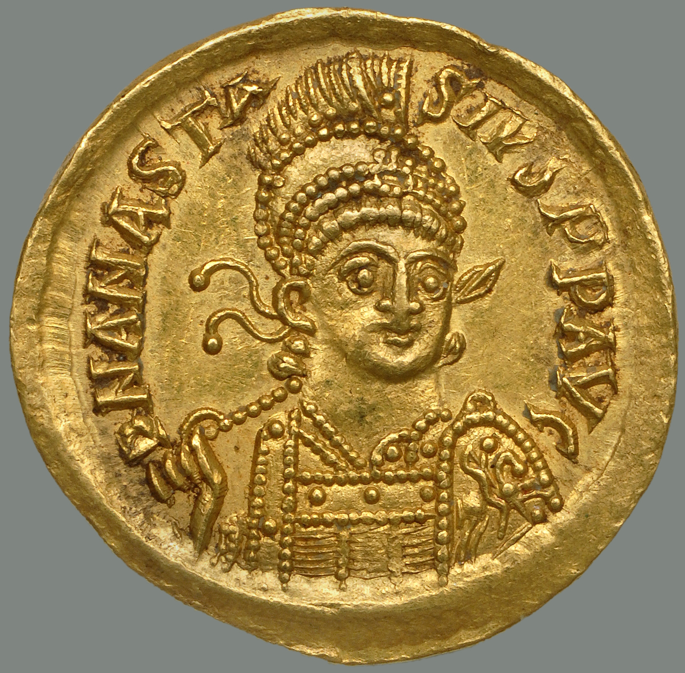</td>
  </tr>
  <tr>
    <th>Opis awersu</th>
    <td>Three-quarter view bust of Anastasios I facing right with spear and shield. Three pellets on breastplate. Helmet with diadem and pendants. Cross in center of diadem. DNANASTA-SIVSPPAVC</td>
  </tr>
  <tr>
    <th>Rewers</th>
    <td>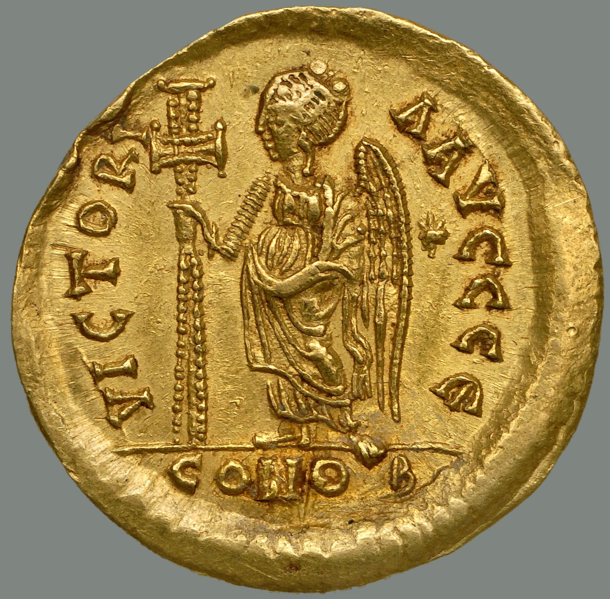</td>
  </tr>
  <tr>
    <th>Opis rewersu</th>
    <td>Victory standing and facing left with long cross in right hand. VICTORI-AAVCCCH. Eight-pointed star in right field. CONOB</td>
  </tr>
  <tr>
    <th>Literatura</th>
    <td>DOC 1, no. 3e</td>
  </tr>
  <tr>
    <th>Uwagi</th>
    <td></td>
  </tr>
  <tr>
    <th>Źródło</th>
    <td><a href="https://www.doaks.org/resources/coins">Dumbarton Oaks</a></td>
  </tr>
</table>

<table class="center">
  <tr>
    <th>Pan menniczy</th>
    <td>Justynian II (565-578)</td>
  </tr>
  <tr>
    <th>Nominał, materiał</th>
    <td>Solidus, złoto</td>
  </tr>
  <tr>
    <th>Lata emisji, mennica</th>
    <td>565-578, Konstantynopol</td>
  </tr>
  <tr>
    <th>Waga [g]; średnica [mm]</th>
    <td>4,41; 20</td>
  </tr>
  <tr>
    <th>Awers</th>
    <td>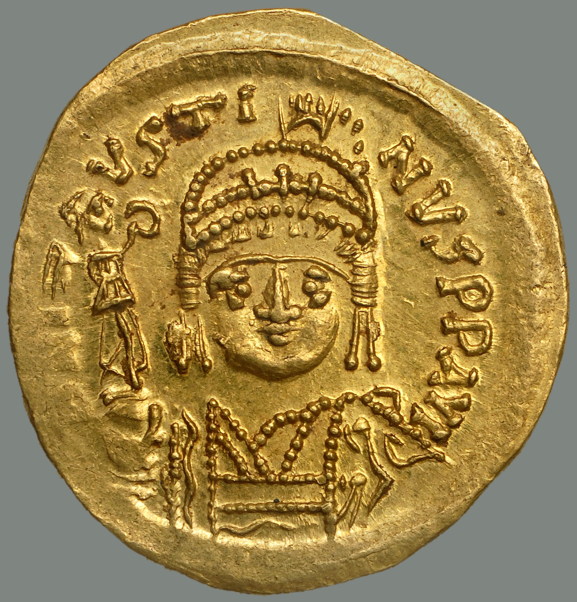</td>
  </tr>
  <tr>
    <th>Opis awersu</th>
    <td>XXXXXX</td>
  </tr>
  <tr>
    <th>Rewers</th>
    <td>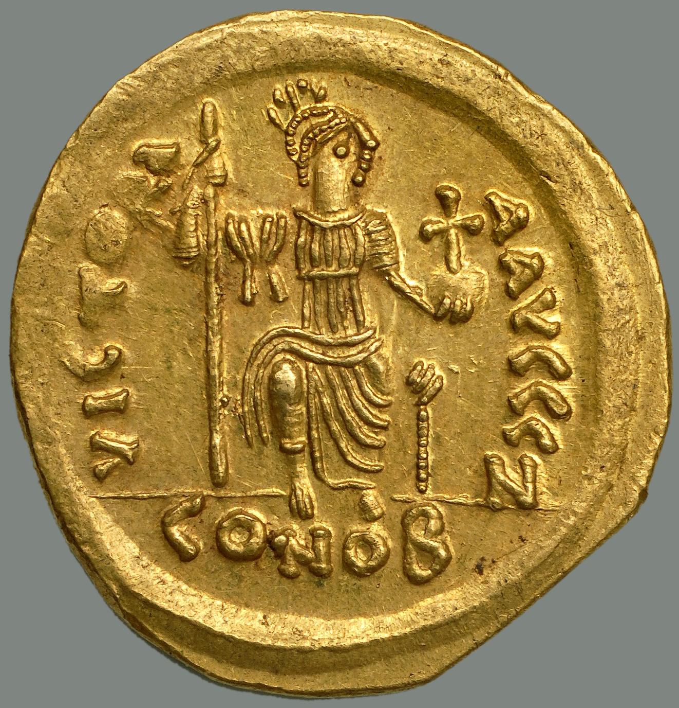</td>
  </tr>
  <tr>
    <th>Opis rewersu</th>
    <td>XXXXXX siedząca personifikacja Konstantynopola</td>
  </tr>
  <tr>
    <th>Literatura</th>
    <td>DOC 1, no. 4f</td>
  </tr>
  <tr>
    <th>Uwagi</th>
    <td></td>
  </tr>
  <tr>
    <th>Źródło</th>
    <td><a href="https://www.doaks.org/resources/coins">Dumbarton Oaks</a></td>
  </tr>
</table>

<table class="center">
  <tr>
    <th>Pan menniczy</th>
    <td>Justynian I (527–565)</td>
  </tr>
  <tr>
    <th>Nominał, materiał</th>
    <td>Solidus, złoto</td>
  </tr>
  <tr>
    <th>Lata emisji, mennica</th>
    <td>542-546, Rzym</td>
  </tr>
  <tr>
    <th>Waga [g]; średnica [mm]</th>
    <td>4,37; 21</td>
  </tr>
  <tr>
    <th>Awers</th>
    <td>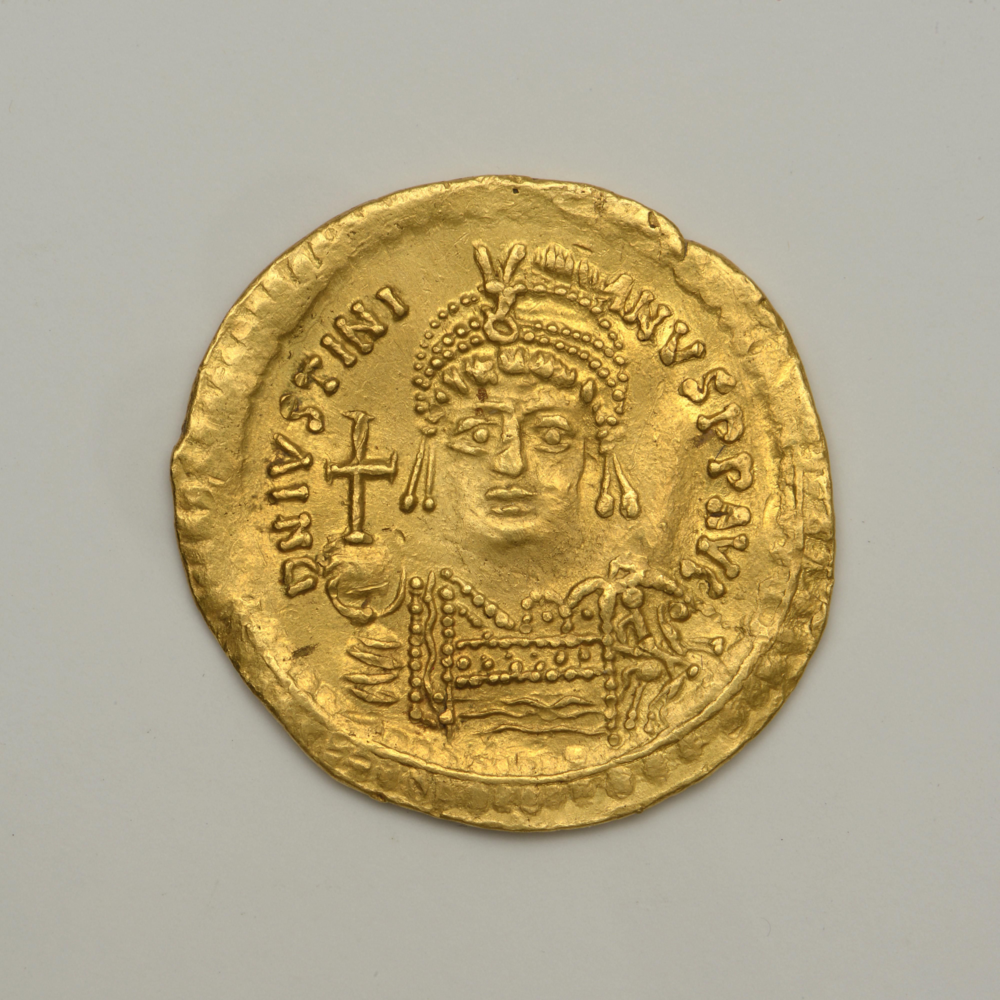</td>
  </tr>
  <tr>
    <th>Opis awersu</th>
    <td>Frontal bust of Justinian I wearing helmet with diadem, cuirass, and shield. Globus cruciger in left hand. Six pellets on cuirass. DNIVSTINI-ANVSPPAVC</td>
  </tr>
  <tr>
    <th>Rewers</th>
    <td></td>
  </tr>
  <tr>
    <th>Opis rewersu</th>
    <td>Standing angel with long cross in right hand and globus cruciger in left hand VICTORI-AAVCCCA Six-pointed star in right field CONOB - znowu nie mennica Konstantynopol?</td>
  </tr>
  <tr>
    <th>Literatura</th>
    <td>DOC 1:173, no. (318b) (citing BMC 111, no. 28), and MIBE 118, no. 29</td>
  </tr>
  <tr>
    <th>Uwagi</th>
    <td></td>
  </tr>
  <tr>
    <th>Źródło</th>
    <td><a href="https://www.doaks.org/resources/coins/catalogue/BZC.2015.009/view">Dumbarton Oaks</a></td>
  </tr>
</table>

<table class="center">
  <tr>
    <th>Pan menniczy</th>
    <td>Tyberiusz II (578-582)</td>
  </tr>
  <tr>
    <th>Nominał, materiał</th>
    <td>Solidus, złoto</td>
  </tr>
  <tr>
    <th>Lata emisji, mennica</th>
    <td>579-582, Konstantynopol</td>
  </tr>
  <tr>
    <th>Waga [g]; średnica [mm]</th>
    <td>4,48; 21</td>
  </tr>
  <tr>
    <th>Awers</th>
    <td></td>
  </tr>
  <tr>
    <th>Opis awersu</th>
    <td>XXXXXX</td>
  </tr>
  <tr>
    <th>Rewers</th>
    <td>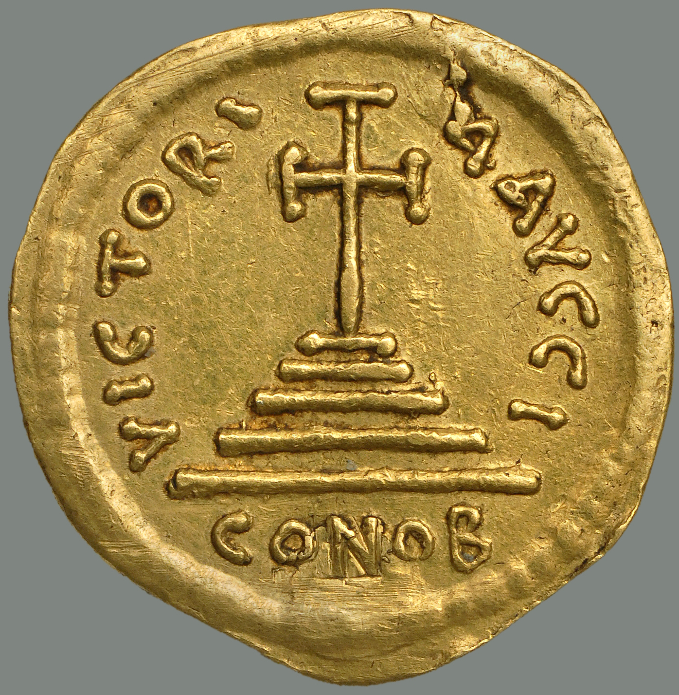</td>
  </tr>
  <tr>
    <th>Opis rewersu</th>
    <td>XXXXXX cross on steps (Fig. 5) which is believed to represent the great jeweled cross erected on Golgotha   na którym wzniesiono wielki, wysadzany klejnotami krzyż
Golgota Teodozjusza II (408–450)</td>
  </tr>
  <tr>
    <th>Literatura</th>
    <td>DOC 1, no. 3</td>
  </tr>
  <tr>
    <th>Uwagi</th>
    <td></td>
  </tr>
  <tr>
    <th>Źródło</th>
    <td><a href="https://www.doaks.org/resources/coins">Dumbarton Oaks</a></td>
  </tr>
</table>

<table class="center">
  <tr>
    <th>Pan menniczy</th>
    <td>Anastazjusz I (491–518)</td>
  </tr>
  <tr>
    <th>Nominał, materiał</th>
    <td>Semissis, złoto</td>
  </tr>
  <tr>
    <th>Lata emisji, mennica</th>
    <td>498–518, Konstantynopol</td>
  </tr>
  <tr>
    <th>Waga [g]; średnica [mm]</th>
    <td>2,25; 17</td>
  </tr>
  <tr>
    <th>Awers</th>
    <td>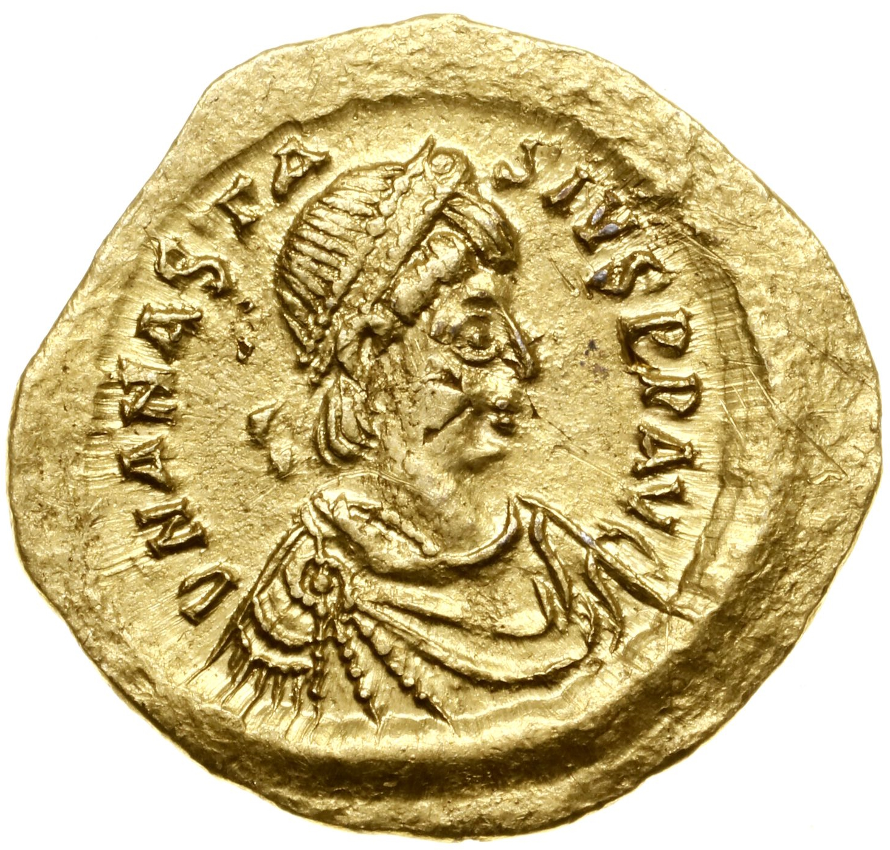</td>
  </tr>
  <tr>
    <th>Opis awersu</th>
    <td>Popiersie cesarza w prawo, D N ANASTASIVS P P AVC</td>
  </tr>
  <tr>
    <th>Rewers</th>
    <td>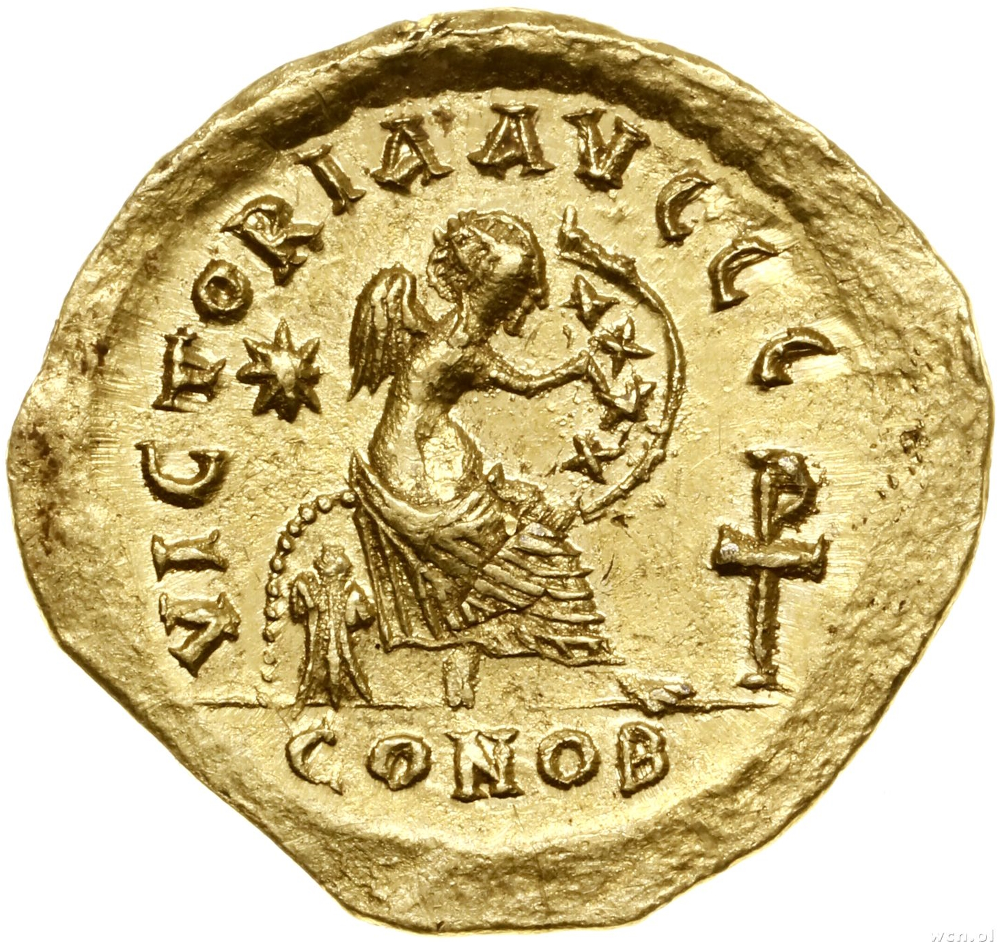</td>
  </tr>
  <tr>
    <th>Opis rewersu</th>
    <td>Wiktoria siedząca w prawo, trzymająca tarczę z XXXX, gwiazda w polu, staurogram z prawej strony, VICTORIA AVCCC, w odcinku CONOB</td>
  </tr>
  <tr>
    <th>Literatura</th>
    <td>Sear 7, DOC 9, MIB 10</td>
  </tr>
  <tr>
    <th>Uwagi</th>
    <td></td>
  </tr>
  <tr>
    <th>Źródło</th>
    <td><a href="https://wcn.pl/archive/338552?q=semissis">WCN</a></td>
  </tr>
</table>

<table class="center">
  <tr>
    <th>Pan menniczy</th>
    <td>Teodozjusz II (408–450)</td>
  </tr>
  <tr>
    <th>Nominał, materiał</th>
    <td>Tremissis, złoto</td>
  </tr>
  <tr>
    <th>Lata emisji, mennica</th>
    <td>408-420, Konstantynopol</td>
  </tr>
  <tr>
    <th>Waga [g]; średnica [mm]</th>
    <td>1,49; 15,6</td>
  </tr>
  <tr>
    <th>Awers</th>
    <td>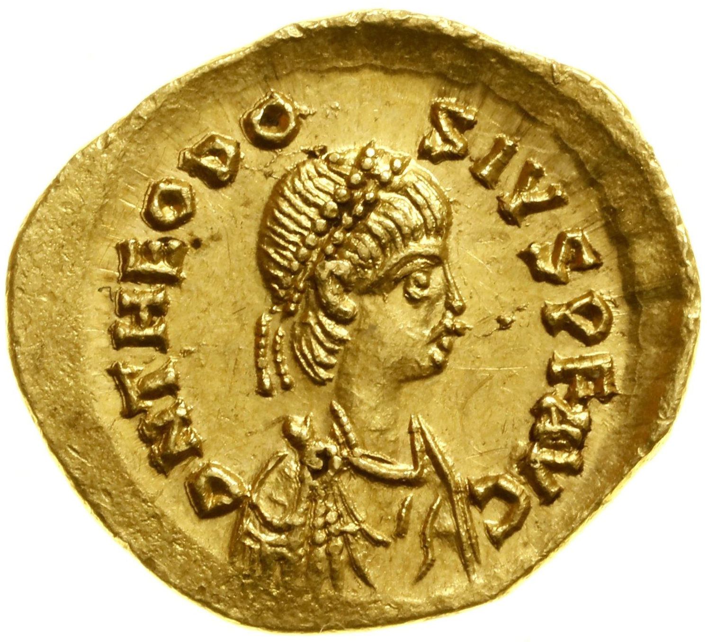</td>
  </tr>
  <tr>
    <th>Opis awersu</th>
    <td>Popiersie cesarza w prawo, D N THEODOSIVS P F AVG</td>
  </tr>
  <tr>
    <th>Rewers</th>
    <td>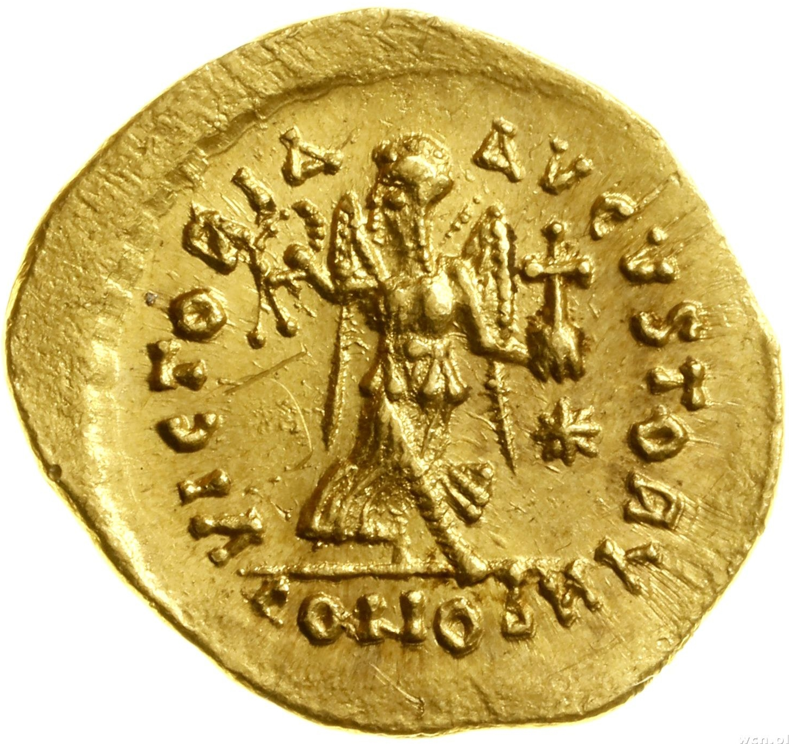</td>
  </tr>
  <tr>
    <th>Opis rewersu</th>
    <td>Wiktoria krocząca w prawo z głową zwróconą do tyłu, trzymająca wieniec i glob z krzyżem, w polu gwiazda, wokoło VICTORIA AVGVSTORVM, w odcinku CONOB    Victory bearing
a wreath and an orb surmounted by a cross</td>
  </tr>
  <tr>
    <th>Literatura</th>
    <td>RIC 213, Depeyrot 70/1</td>
  </tr>
  <tr>
    <th>Uwagi</th>
    <td></td>
  </tr>
  <tr>
    <th>Źródło</th>
    <td><a href="https://onebid.pl/pl/monety-cesarstwo-rzymskie-tremissis-408-420-konstantynopol/1743943">WCN</a></td>
  </tr>
</table>

W VII wieku nastąpiły duże zmiany w ikonografii monet. Za czasów Fokasa (602–610) i Herakliusza (610–641) wprowadzono portrety władców, a późniejsze monety odzwierciedlały zmiany zarówno w wyglądzie cesarza, jak i w ustaleniach, jakie poczynił w sprawie swojej sukcesji. Zatem Konstans II (641–668) i Justynian II (685–695; 705–711; ryc. 55) ukazani są jako młodzi chłopcy na najwcześniejszych monetach; Herakliusz i Konstans II (ryc. 8) zyskują ogromne brody i wąsy. Aby zapewnić sukcesję, cesarze kojarzyli z nimi swoich synów jako współcesarzy i moneta taka była przeznaczony do reklamowania dynastii; zatem Herakliusz Konstantyn i później Heraklony towarzyszą swojemu ojcu Herakliuszowi i nie mniej niż trzech synów widnieje na odwrocie monety Konstansa II (ryc. 8) (BCPG. 7). Na rewersach pojawia się też często krzyż, który na **solidusach** jest krzyżem wywyższonym, na **semissis** krzyżem na globie, a na **tremissis** prostym krzyżem.

<table class="center">
  <tr>
    <th>Pan menniczy</th>
    <td>Konstans II (641-668)</td>
  </tr>
  <tr>
    <th>Nominał, materiał</th>
    <td>Solidus, złoto</td>
  </tr>
  <tr>
    <th>Lata emisji, mennica</th>
    <td>663-668, Konstantynopol</td>
  </tr>
  <tr>
    <th>Waga [g]; średnica [mm]</th>
    <td>4,50; 20</td>
  </tr>
  <tr>
    <th>Awers</th>
    <td>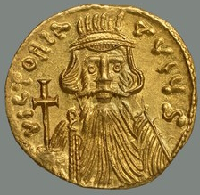</td>
  </tr>
  <tr>
    <th>Opis awersu</th>
    <td>xxxxxxxxx</td>
  </tr>
  <tr>
    <th>Rewers</th>
    <td>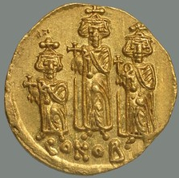</td>
  </tr>
  <tr>
    <th>Opis rewersu</th>
    <td>xxxxxxxxxxxxx</td>
  </tr>
  <tr>
    <th>Literatura</th>
    <td>DOC 2, no. 42e.1</td>
  </tr>
  <tr>
    <th>Uwagi</th>
    <td>8</td>
  </tr>
  <tr>
    <th>Źródło</th>
    <td><a href="https://www.doaks.org/resources/online-exhibits/byzantine-emperors-on-coins/sixth-seventh-centuries-emperors-491-717/solidus-of-constans-ii-641-668">Dumbarton Oaks</a></td>
  </tr>
</table>

<table class="center">
  <tr>
    <th>Pan menniczy</th>
    <td>Justynian II (685–695, 705–711)</td>
  </tr>
  <tr>
    <th>Nominał, materiał</th>
    <td>Solidus, złoto</td>
  </tr>
  <tr>
    <th>Lata emisji, mennica</th>
    <td>686/687, Konstantynopol</td>
  </tr>
  <tr>
    <th>Waga [g]; średnica [mm]</th>
    <td>4,12; 19</td>
  </tr>
  <tr>
    <th>Awers</th>
    <td></td>
  </tr>
  <tr>
    <th>Opis awersu</th>
    <td>Frontal bust of Justinian II with beard added as row of dots, wearing chlamys and crown with cross. Globus cruciger in right hand. IYSJINIA-NYSPEAV</td>
  </tr>
  <tr>
    <th>Rewers</th>
    <td></td>
  </tr>
  <tr>
    <th>Opis rewersu</th>
    <td>Cross potent on base and three steps. VICTORIA-AVSYS . Eight-pointed star in right field CONOB</td>
  </tr>
  <tr>
    <th>Literatura</th>
    <td>MIB 3:262–63, no. 10.</td>
  </tr>
  <tr>
    <th>Uwagi</th>
    <td>55</td>
  </tr>
  <tr>
    <th>Źródło</th>
    <td><a href="https://www.doaks.org/resources/coins/catalogue/BZC.1973.6/view">Dumbarton Oaks</a></td>
  </tr>
</table>

<table class="center">
  <tr>
    <th>Pan menniczy</th>
    <td>Konstans II (641–668)</td>
  </tr>
  <tr>
    <th>Nominał, materiał</th>
    <td>Semissis, złoto</td>
  </tr>
  <tr>
    <th>Lata emisji, mennica</th>
    <td>641-648, Syrakuzy</td>
  </tr>
  <tr>
    <th>Waga [g]; średnica [mm]</th>
    <td>2,15; 17</td>
  </tr>
  <tr>
    <th>Awers</th>
    <td></td>
  </tr>
  <tr>
    <th>Opis awersu</th>
    <td>Bust of Constans II, beardless, facing right and wearing diadem, cuirass, and paludamentum. dNCONSTAN-TINYSPPAV</td>
  </tr>
  <tr>
    <th>Rewers</th>
    <td></td>
  </tr>
  <tr>
    <th>Opis rewersu</th>
    <td>Cross potent on globe VICTORIA-AVSYO I in right field and pellet below</td>
  </tr>
  <tr>
    <th>Literatura</th>
    <td>MIB 3:244, no. 97</td>
  </tr>
  <tr>
    <th>Uwagi</th>
    <td></td>
  </tr>
  <tr>
    <th>Źródło</th>
    <td><a href="https://www.doaks.org/resources/coins/catalogue/BZC.1973.5/view">Dumbarton Oaks</a></td>
  </tr>
</table>

<table class="center">
  <tr>
    <th>Pan menniczy</th>
    <td>Herakliusz (610–641)</td>
  </tr>
  <tr>
    <th>Nominał, materiał</th>
    <td>Tremissis, złoto</td>
  </tr>
  <tr>
    <th>Lata emisji, mennica</th>
    <td>610-641, Ravenna</td>
  </tr>
  <tr>
    <th>Waga [g]; średnica [mm]</th>
    <td>1,48; 15</td>
  </tr>
  <tr>
    <th>Awers</th>
    <td></td>
  </tr>
  <tr>
    <th>Opis awersu</th>
    <td>Bust of Herakleios facing right, beardless, wearing cuirass, paludamentum, and diadem with cross in front DNHERACLI-PERPPAVC</td>
  </tr>
  <tr>
    <th>Rewers</th>
    <td></td>
  </tr>
  <tr>
    <th>Opis rewersu</th>
    <td>Cross potent VICTORIAAVCVSTORVM CONOB - to nie Konstantynopol tylko Ravenna?</td>
  </tr>
  <tr>
    <th>Literatura</th>
    <td>MIB 3:221, no. 126 (but obverse similar to no. 127)</td>
  </tr>
  <tr>
    <th>Uwagi</th>
    <td></td>
  </tr>
  <tr>
    <th>Źródło</th>
    <td><a href="https://www.doaks.org/resources/coins/catalogue/BZC.2004.1/view">Dumbarton Oaks</a></td>
  </tr>
</table>

Justynian II (685–695; 705–711) umieścił na swoich monetach popiersie Chrystusa, a swój wizerunek (całą postać lub popiersie) przeniósł na rewers, gdzie w prawej ręce trzyma krzyż, a w lewej (w czasie drugiego okresu panowania) kulę z krzyżem.

<table class="center">
  <tr>
    <th>Pan menniczy</th>
    <td>Justynian II (685–695, 705–711)</td>
  </tr>
  <tr>
    <th>Nominał, materiał</th>
    <td>Solidus, złoto</td>
  </tr>
  <tr>
    <th>Lata emisji, mennica</th>
    <td>692-695, Konstantynopol</td>
  </tr>
  <tr>
    <th>Waga [g]; średnica [mm]</th>
    <td>4,46; 19</td>
  </tr>
  <tr>
    <th>Awers</th>
    <td>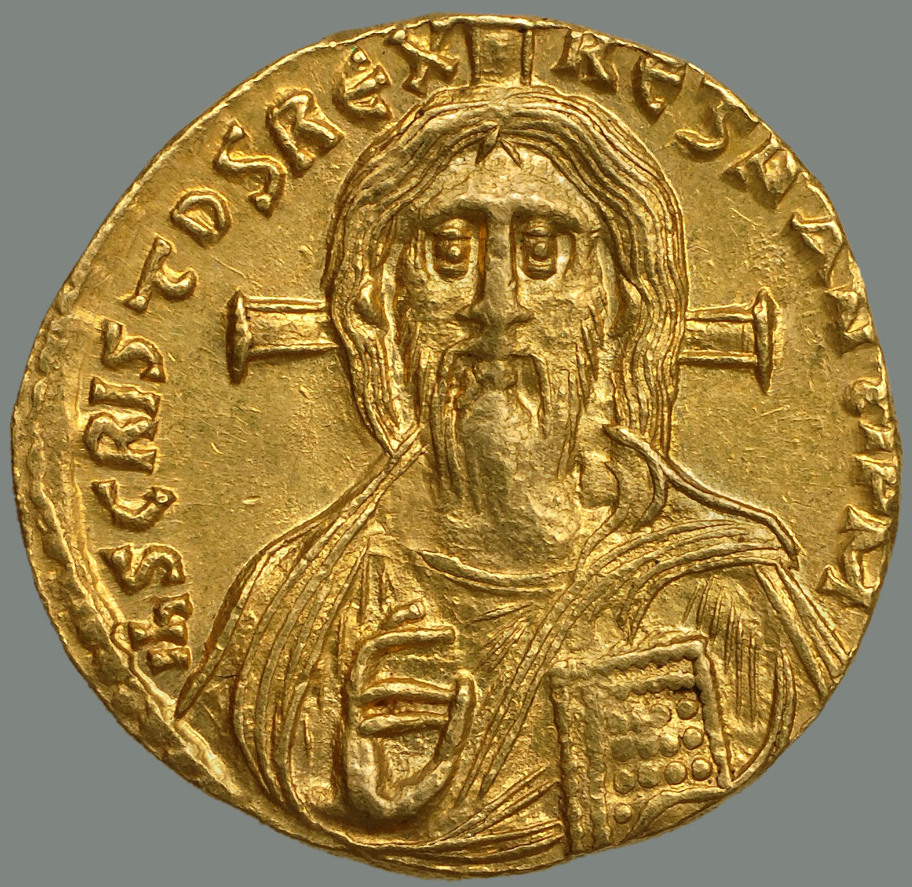</td>
  </tr>
  <tr>
    <th>Opis awersu</th>
    <td>xxxxxxxxxxx</td>
  </tr>
  <tr>
    <th>Rewers</th>
    <td>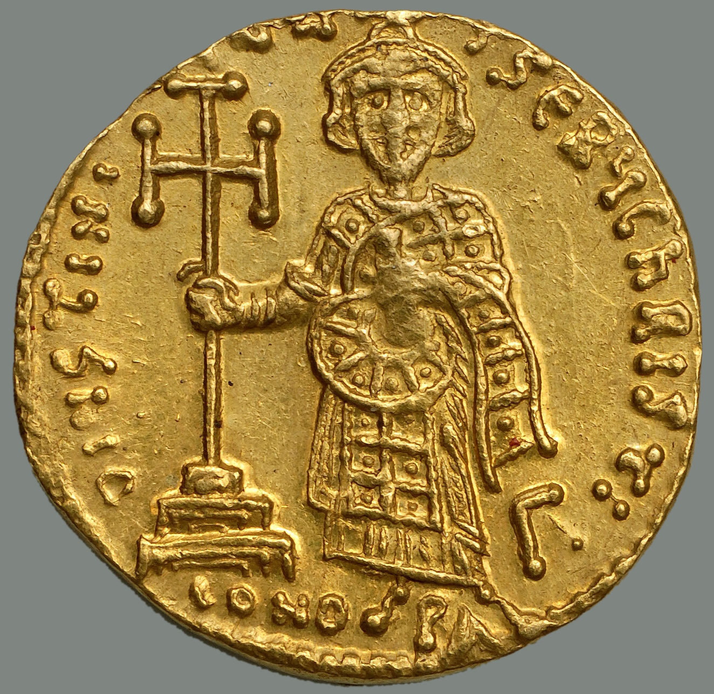</td>
  </tr>
  <tr>
    <th>Opis rewersu</th>
    <td>xxxxxxxx</td>
  </tr>
  <tr>
    <th>Literatura</th>
    <td>DOC 2, no. 8a</td>
  </tr>
  <tr>
    <th>Uwagi</th>
    <td>9</td>
  </tr>
  <tr>
    <th>Źródło</th>
    <td><a href="https://www.doaks.org/resources/online-exhibits/byzantine-emperors-on-coins/sixth-seventh-centuries-emperors-491-717/solidus-of-justinian-ii-685-695">Dumbarton Oaks</a></td>
  </tr>
</table>

<table class="center">
  <tr>
    <th>Pan menniczy</th>
    <td>Justynian II (685–695, 705–711)</td>
  </tr>
  <tr>
    <th>Nominał, materiał</th>
    <td>Solidus, złoto</td>
  </tr>
  <tr>
    <th>Lata emisji, mennica</th>
    <td>705-711, Konstantynopol</td>
  </tr>
  <tr>
    <th>Waga [g]; średnica [mm]</th>
    <td>4,42; 20</td>
  </tr>
  <tr>
    <th>Awers</th>
    <td></td>
  </tr>
  <tr>
    <th>Opis awersu</th>
    <td>xxxxxxxxxxx</td>
  </tr>
  <tr>
    <th>Rewers</th>
    <td></td>
  </tr>
  <tr>
    <th>Opis rewersu</th>
    <td>xxxxxxxx</td>
  </tr>
  <tr>
    <th>Literatura</th>
    <td>DOC 2, no. 1.4</td>
  </tr>
  <tr>
    <th>Uwagi</th>
    <td>9a</td>
  </tr>
  <tr>
    <th>Źródło</th>
    <td><a href="https://www.doaks.org/resources/online-exhibits/byzantine-emperors-on-coins/sixth-seventh-centuries-emperors-491-717/solidus-of-justinian-ii-705-711">Dumbarton Oaks</a></td>
  </tr>
</table>

============================================================

VIIIw - Iconoclast emperors
Ikonoklazm (dosłownie "kruszenie obrazów") był sporem o szkodliwości lub mocy obrazów religijnych w kontekście zagrożenia płynącego ze strony Arabów. W Bizancjum inspiracją dla ikonoklazmu było drugie przykazanie prawa Mojżeszowego: "Nie będziesz czynił sobie rzeźbionych wizerunków i nie będziesz oddawał im czci." 
Do VIII w. w Bizancjum ludność darzyła ikony świętych głębokim przywiązaniem, bardzo rozwiniety był nurt ilustrowania scen biblijnych spełniających rolę biblii dla niepiśmiennych i ubogich, a po całym cesarstwie krążyły złote monety z wizerunkiem Chrystusa. Ikonom oddawano cześć wedle starożytnych zwyczajów: całowano je i adorowano, palono przed nimi świece i kadzidło, kierowano modlitwy do przedstawionych świętych. 
Nie jest do końca jasne, kto był odpowiedzialny za rozpoczącie niszczenia ikon i sztuki religijnej, ale znane są dwa okresy, w których proces ten istniał w nasilonej postaci: w latach 730-787 oraz 815-843. W latach 717-718 Leon III (717-741) obronił Konstantynopol przed potężnym atakiem Arabów, a następnie starał się umocnić wpływy cesarstwa w południowych Włoszech i na Krecie. Jednak prowincje Azji Mniejszej nadal były nękane nieustannymi najazdami. Leon III koronował swojego rocznego syna na następcę, i zaczął wybijać nowe monety z wizerunkiem swoim i syna. Bizantyjczycy wiedzieli, że to Bóg przyznaje zwycięstwo w boju, i w przeszłości dopomógł im w pokonaniu perskiego imperium, musieli więc zapytywać, dlaczego teraz pozwala triumfować Arabom. W 726 roku nastąpiła poteżna erupcja wulkaniczna na Morzu Egejskim, która została zinterpretowana jako boski znak, ostrzeżenie przed bałwochwalstwem - przesadną czcią, jaką darzono ikony, czego efektem było usuwanie ikon z kościołów i miejsc publicznych. Uważano, że wprowadzenie ikonoklazmu pozwoli na odzyskanie przychylności boskiej i pokonanie Arabów, którzy nie tylko niszczyli ikony w podbitych miastach, ale też przestrzegali zakazu bałwochwalstwa. Zrozumiano też, że ikony obdarzane kultem nie potrafiły już ochronić miast, a ich zdolność uzdrawiania była dużo mniej skuteczna. Leonowi III w końcu udało się pokonać Arabów w roku 740 pod Akroinonem, co wg niektórych zawdzięczano między innymi ograniczeniu bałwochwalstwa. Wizerunki świętych usuwano z miejsc widocznych, ale wydaje się, że nie dochodziło do masowego niszczenia ikon. Syn Leona III, Konstantyn V (741-775) rozwinął włąsną teorię ikonoklazmu, opowiadając się za unikaniem bałwochwalczej czci dla malowanego drewna, uznając Eucharystię jako jedyny prawdziwy obraz Chrystusa. Konstantyn V odnosił wiele zwycięstw na Arabami, Słowianami i Bułgarami, które przyczyniły się do wzmocnienia wiary w słuszność ideologii ikonoklazmu. Irena, wdowa po synie i następcy Kontantyna V Leonie IV (775-780), postanowiła odejść od ikonoklazmu, i podczas synodu w 787 powrócono do praktyk oddawania czci postaci Chrystusa i wizerunkom świętych. Irena, oślepiając własnego syna, zajęła jego miejsce i władała jako cesarz w latach 797-802. W roku 815 Leon V (813-820), odwołując się do sukcesów militarnych Konstantyna V, zainicjował drugą fazę ikonoklazmu, ściśle powiązaną z obietnicą sukcesów wojennych. W kolejnych latach, także za panowania Michała II (820-829) oraz Teofila (829-842) odnoszono sukcesy w walkach z Bułgarami, a niepoprawni malarze i czciciele ikon byli prześladowani. Jednak po śmierci Teofila, wdowa po nim, Teodora, która objęła regencję w imieniu swego małoletniego syna - Michała III, znowu odstąpiła od ikonoklazmu. 10 marca 843 roku uroczyście przywrócono kult obrazów, a ikonoklazm uznano za herezję - określa się to wydarzenie jako "triumf ortodoksji". Niewiele wiadomo na temat argumentów ikonoklastów, gdyż za każdym razem, gdy powracano do kultu ikon, niszczono wszelkie dokumenty utworzone przez zwolenników ograniczania bałwochwalstwa. (BIZ 136, 146)

XXXXX moneta Leon III z synem - przykłąd dać

- oficjalna fala niszczenia świętych obrazów (ikon)

3 zmiany
First, the treatment of the imperial bust becomes purely linear and every
vestige of portraiture disappears, with older emperors being differentiated from
their junior colleagues only by their larger sizes and by faint traces of a beard
and mustache, whether or not they wore such in real life

Second, the traditional
cross on the reverse is replaced by the effigy of another emperor, initially
the emperor’s son and intended successor, but subsequently one or more of his
ancestors, with the emperor’s son then being placed beside his father on the obverse
(Fig. 10). Thus the coinage represented the whole dynastic lineage in order
of birth

And, finally, the semissis and tremissis are eliminated
they
were issued only in small quantities and for ceremonial distribution on particular
occasions
at the mint of Syracuse, they continued to be struck until
the city’s loss to the Arabs in 878

SILVER
- with, from 615 onward, one denomination of silver as well (Fig. 19)

It was the emperor Heraclius who in 615 revived an effective silver coinage,
drawing the metal for his abundant issues mostly from the secularization of
church plate during the crisis of the Persian war. The new coins were known as
hexagrams (Fig. 19), since they weighed 6 grammata (6.84 grams), a weight
higher than any used for regular coinage during the entire period of the Roman
Empire. Hexagrams continued to be struck on a substantial scale under Constans
II and Constantine IV (668–685), but their volume trailed off in the 680s,
and by the end of the century the empire was back on the gold-copper basis
that had been in effect under Anastasius I and Justinian I.

silver
coins, which would have bridged the rather large gap between the follis and
the tremissis, were not issued, presumably because of the fluctuations in that
metal’s value against gold

- four (sometimes five) of copper (Figs. 29–31, 33, 34)

The introduction of the large copper follis, worth 40 nummi, had been the
great innovation of Anastasius I in 498. The coin was marked with the
Greek letter M (Fig. 29), which as a numeral stood for “40,” and it was initially
accompanied by only two fractions, a half-follis marked with K (= 20; Fig. 30)
and a decanummium marked with I (= 10; Fig. 31). In 512 the weights of these
coins were doubled (Fig. 32), and a further denomination of 5 nummi, marked
with E (Fig. 33), was added; moreover, the minting of nummi (Fig. 34), apparently
suspended in 498, was resumed

VI
Justinian I, in his twelfth year (538/9), further increased the weight of the
follis to about 25 grams. Moreover, he improved its appearance and altered its
iconography by substituting a facing bust for the traditional profile portrait on
the obverse and by adding a date on the reverse (Fig. 35), thus applying to coins
the provisions of his Novel 47 (537) for the dating of all official documents by
regnal years. This coin, however, was too heavy for convenience, and the weight
was reduced to about 22 grams in 541/2. Further reductions took place at intervals
over the remainder of the century, so that ultimately the minting of nummi
had to be abandoned, and a new unit of 30 nummi, marked with L or XXX,
was inserted into the system. Yet even to the end of the century the follis remained
a handsome, massive coin whose weight and size must have given its
users solid assurance of its value.

VII
The seventh century saw the decline of the follis. The designs of the coins,
which show changing combinations of rulers, remain of interest, but their
weights were repeatedly reduced and their execution became increasingly slovenly.
Folles of Constans II average only about 3 grams, in contrast to the 25 grams
of a century earlier, and while their iconography is quite varied, their fabric is
abominable (Fig. 36). They were by then so small that the half-follis could not
easily be minted and lower denominations virtually disappeared. The empire
was at that time in desperate political straits, with its richest provinces, Egypt
and Syria, lost forever to the Arabs and much of the Balkans occupied by the
Slavs. These circumstances only aggravated the decline of the purchasing power
of the subsidiary coinage that had begun already in the second half of the sixth
century, and it is not surprising that the copper coins of this period were the
worst struck in the entire Byzantine series.

The later years of the seventh century saw sporadic attempts at improvement,
often with initial issues of heavy coins at imperial accessions; but none of
these efforts proved permanent. 

- This wide range of coins was made possible by the use of three metals, and in this respect it is comparable to modern coinage

Od drugiej połowy VI w. waga monet brązowych zaczyna spadać, stają się one monetą kredytową. Ograniczono liczbę mennic lokalnych, właściwie do VIII w. bimetaliczne (złoto, brąz) mennictwo bizantyjskie stało się monometaliczne, oparte przede wszystkim o złoto. Cesarz Herakliusz (610-641) zwiększył ok. 614/615 roku znaczenie srebra wprowadzając nowy nominał **heksagram** bity wg stopy 1/48 funta (6,82 g), jednak ograniczenie zapasów kruszcu pod koniec VII w. spowodowało zawieszenie tej emisji (MCBS. 4).

ratio monet brązowych do złotych podłegało ciągłym zmianom, tabelka str. 43-45 i nie do końca jest to rozeznany temat

## Metale i próby kruszcu
XXXXXXXXXXXXXXXXX TODO: tutaj z Salamona grubego napisac o stopach (jako osbny paragraf = braz czy miedz? złoto, srebro czy elektron?, itp.)
brąz? stop miedzi?
W starożytności brąz był stopem miedzi w stosunku 90% miedzi do 10% cyny,
https://pl.wikipedia.org/wiki/Br%C4%85zy

## Mennice cesarstwa bizantyjskiego
Mennice bizantyjskie rozsiane były po całym terytorium imperium, a ich liczba i lokalizacja zmieniały się wraz z podbojami lub utratą terenów. W większości mennic wybijano monety brązowe. Monety srebrne wybijane były głównie w Ravennie i Kartaginie, a złote wyłącznie w Ravennie, Kartaginie i Konstantynopolu. Mennice były często podzielone na warsztaty (_officinae_, oficyny), które umieszczały swoje znaki mennicze w formie numerów (_alpha_ = 1, _beta_ = 2, itd.).

<table class="center">
  <tr>
    <td>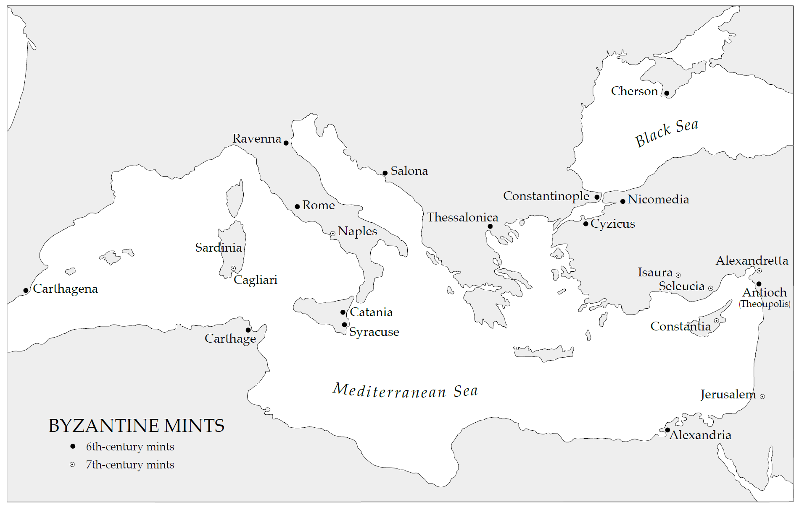</td>
  </tr>
  <tr>
    <td>Główne mennice Bizancjum (BCPG. 4)</td>
  </tr>
</table>

Nazwy mennic umieszczano czasem jedynie na monetach brązowych (np. CON w przypadku Konstantynopola lub NICO w przypadku Nikomedii). Monety złote bite w stolicy oznaczano akronimem **CONOB** (od CONstantinopolis OBryzum, gdzie _obryzum_ oznacza "czyste złoto") oraz liczbę 72 zapisaną alfabetem greckim.

W wieku VII zmniejszono znacznie liczbę mennic z 21 do 8 z powodu reorganizacji przeprowadzonej w 629 roku oraz utraty Bałkanów (Słowianie), znacznej części Włoch (Lombardowie), Syrii, Egiptu i całej Afryki północnej (Arabowie). W VIII i IX wieku prowincjonalne mennice były zamykane wraz z utratą zwierzchnictwa Bizancjum nad poszczególnymi dzielnicami. Ostatnia prowincjonalna mennica w Syrakuzach została zamknięta w 878 roku po zdobyciu miasta przez Arabów. Aż do XI w. jedyna mennica Bizancjum ulokowana była w Konstantynopolu, wtedy to wznowiono też bicie monet w Salonikach (_Thessalonica_). Po zdobyciu Konstantynopola przez IV Wyprawę Krzyżową w 1204 roku poszczególne państwa roszczące sobie prawa do sukcesji po cesarstwie (Cesarstwo Łacinskie, Cesarstwo Nicejskie, Despotat Epiru, Cesarstwo Trapezuntu), emitowały niezależnie od siebie monetę luźno opartą o system monetarny Aleksego I Komnenosa (1081-1118) (BCPG. 4, 11). 

<table class="center">
  <tr>
    <td>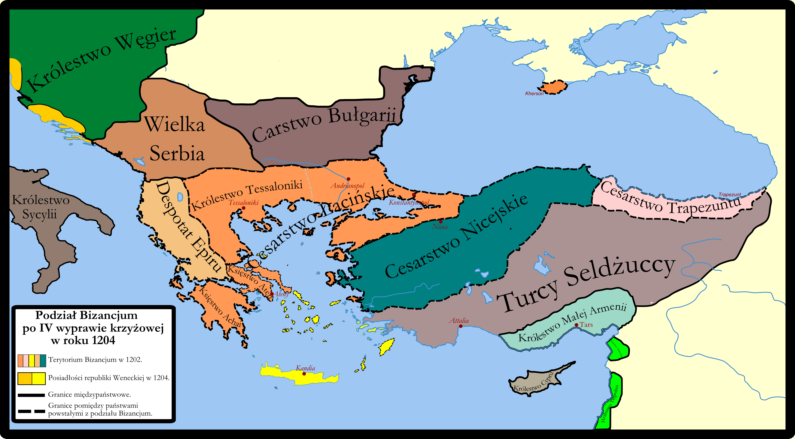</td>
  </tr>
  <tr>
    <td>Rozpad Bizancjum w 1204 roku (źródło: <a href="https://pl.wikipedia.org/wiki/Cesarstwo_Nicejskie#/media/Plik:Cesarstwo_%C5%81aci%C5%84skie1204.png">Wikipedia</a>)</td>
  </tr>
</table>

Po odzyskaniu Konstantynopola w 1261 roku, głównymi siedzibami mennic upadającego imperium pozostały Konstantynopol i Saloniki. Więcej informacji można znaleźć w <a href="https://en.wikipedia.org/wiki/Byzantine_mints">Wikipedii</a>. 

======================= brudnopis ===========================
<a href="https://pl.wikipedia.org/wiki/Konstantynopol">Konstantynopol</a> został założony przez Konstantyna I Wielkiego (306-337) - w latach 330–395 był stolicą Cesarstwa Rzymskiego, w latach 395–1453 stolicą Cesarstwa Bizantyńskiego i Cesarstwa Łacińskiego (1204–1261), stolicą Imperium Osmańskiego w latach 1453–1922. Od 1930 miasto nazywa się Stambuł.

Chrystus Pantokrator (wszechwładca)

### Wizerunki na monetach
!!!! dla kazdej monety wyszukac w griersonie Fig. <numer>, zeby dowiedziec się wiecej o wyobrazeniu na monecie
    
Coin types are too varied to be categorized in any very exact fashion. Most
of those current in Byzantium fall into one of three groups: ruler representations,
religious images, and “functional” types consisting mainly of marks of
value.
    
Pictorial types in the literal sense, such as objects or images taken from
nature or representations of public buildings and events, play almost no role at
all, making Byzantine coinage in this respect much less interesting than that of
ancient Greece and Rome
    
Marks of value, in the form of a large
Greek or Latin numeral, are confined to the copper and only used for about
three and a half centuries, from their introduction by Anastasius I in 498 to
their disappearance in the ninth century
    
Na co zwracac uwage? 
    
----
Przedstawienia władców
    - Ile jest postaci, czy są one współrządzącymi, aktualnie rządzącym i następcą lub poprzednikiem.
    - Jak wygląda ubiór imperatora
    
From the fourth to the early
seventh century the emperor was fairly consistently shown in military dress,
since such dress was inherent to the office of imperator (Fig. 4). In the seventh
century it became less common, and under the Isaurians military types disappeared
completely, and were absent for the next three hundred years. In the
eleventh century such types were revived, but the emperor was now normally
shown standing armed with a sword (Fig. 51), whereas in earlier times he had
regularly been armed with a spear.
    
The two forms of civilian dress preferred between
the seventh and the eleventh centuries were the chlamys (Fig. 8), a long
purple cloak fastened at the right shoulder by a fibula and decorated with a
panel known as a tablion, and the loros, the traditional consular dress. The loros
evolved into an elaborate jeweled scarf and eventually into a robe with a long
train that was brought around the right side of the body and hung down over
the emperor’s extended left forearm (Fig. 9; rear cover). It was worn by the emperor
during the religious ceremonies of Easter Sunday, for the long scarf
wrapped around the emperor like a winding sheet was thought to associate him
with the dead and resurrected Christ.
    
- W jakie insygnia został wyposażony

Imperial insignia included the globus cruciger, an orb surmounted by a
cross signifying the heavenly basis of imperial rule, and the mappa, a handkerchief
used to signal the start of the games. The latter was originally a consular
emblem but in time was amalgamated with a scroll, becoming a small cylindrical
object with jeweled ends known as an akakia (Fig. 56).
    
Another consular emblem was the scipio, an ivory scepter surmounted by an eagle, which was often
borne by emperors on coins of the fourth to the sixth century (Fig. 52), but
which disappeared with Philippicus (711–713).
From the fifth century onward,
long-shafted scepters often take the form of a cross, either plain or decorated,
or of a labarum (Fig. 16), a scepter with a rectangular head elaborately ornamented
or inscribed with a Christogram—usually reduced to the letter X or a
quincunx—which derived from the Roman legionary standard.
    
The imperial
crown, when not shown in the form of a simple diadem, is characterized by
pendilia hanging down on either side (Fig. 12). The crowns of empresses
usually have longer pendilia and are distinguished from the crowns of their
consorts by the presence of a circlet of sharply pointed triangular plaques or
pinnacles (Fig. 49).
    
Characterized portraiture is completely absent on coins of the fifth and
sixth centuries. It was revived by Phocas, who is shown on his coins with the
shaggy locks and untidy beard that are familiar from a bronze weight in the
British Museum (Figs. 53, 54). Heraclius in later life and his grandson Constans II
(Fig. 8) are remarkable for their vast beards. A strong element of portraiture
exists in coins of the late seventh century, when the imperial mint had the services
of a die-sinker of talent who rendered admirably the wispy mustache of
Constantine IV, the youthful features of Justinian II (Fig. 55), and the fat,
bearded face of Leontius (695–698; Fig. 56).
    
Portraiture was again absent during
the Isaurian and Amorian periods, when faces were depicted in a purely linear
manner (Fig. 10). Under the Macedonians the same tradition remained
dominant, but there are occasional issues showing what are clearly intended to
be personal likenesses of Leo VI, Romanus I (920–944), Constantine VII (Fig. 12),
and Romanus II (959–963). Larger and much more impressive versions of these
occur on imperial seals and ivories (Fig. 57).
    
Personalized elements continue to appear on some eleventh-century coins,
as, for example, on those of Constantine VIII (Fig. 58), whose beard, growing
in profusion on the cheeks and combed forward to conceal the absence of hair
on the chin, corresponds closely to Psellus’ description of the beard of Constantine’s
brother, Basil II. But personal elements are often absent. The rare histamenon
of Zoe and Theodora (1042; Fig. 59) gives neither empress any recognizable
features, although we know from Psellus that the two sisters differed as much in
personal appearance as they did in character and disposition. In the twelfth
century Andronicus I’s coins show him with a long forked beard, a feature
noted in the written sources; such beards subsequently became fashionable and
are found on the coins of a number of his successors. The effigies of the last
Palaeologan emperors can only be regarded as grotesque (Figs. 27, 28).
    
---
Wyobrażenia religijne
    
Coins of the early Roman Empire had displayed a rich variety of religious
types, with well-known pagan deities being supplemented by allegorical
representations of provinces or towns (e.g., Britannia) or personifications announcing
objectives of imperial policy (e.g., Concordia). With the adoption of
Christianity in the fourth century all of these disappeared, with the exceptions of
Roma and Constantinopolis, whose allegorical character was self-evident, and
Victory, who formed the focus of too many hopes and aspirations to be lightly
abandoned. Roma, usually represented as a seated, helmeted figure, and Con-
stantinopolis, distinguished from Roma by having her foot on the prow of a
ship, which symbolized Constantine’s naval victory over Licinius in the
Hellespont, were frequent coin types during the fourth and fifth centuries, but
then disappeared. When Constantinopolis appeared for the last time, on solidi
of Justin II (Fig. 60), she was already so unfamiliar that some users thought her
to represent the goddess Venus. Victory had slightly greater staying power. Ubiquitous
on coins of the fourth and fifth centuries, she lasted through the sixth and
made her last appearance, in a very subordinate role surmounting an orb, on
coins struck by Heraclius after his defeat of the Persians in 629.
    
In view of the major role played by religion in Byzantine life, one would
expect pagan types to have been quickly replaced by Christian ones after the
conversion of Constantine I. This was not the case, since Christian iconography
was slow to assert itself in the fourth century and emperors had to take account
of public opinion, and particularly of the sentiments of the army, which was
probably much less Christian than our written sources suggest. It is true that
Christian symbols such as the Christogram and the cross already figure on
coins of the fourth century, but they normally do so in a subordinate capacity.
The cross as a major element in coin design became prominent only in the fifth
century, and the common use of representations of Christ on coins did not
begin until the ninth. Coin types of the Virgin became frequent only in the
eleventh century, while those of other saints did not become common until the
twelfth.
    
The most obvious and satisfactory religious devices to be represented on
coins were the monogram of Christ (i.e., the Christogram, which conveyed an
Orthodox, anti-Arian claim) and the cross. They were simple to design and did
not offend Christians concerned with the propriety of representing Christ in
person. At first these devices were used very discreetly, the Christogram as a
decoration on the helmet of Constantine I (Fig. 61), and either a Christogram
or a cross as an issue mark in the field. The fifth century, however, was a time of
decisive changes in Byzantine art, and, unsurprisingly, Christianization was reflected
in the coinage: a cross in a wreath became one of the main types of the
tremissis, while a Victory holding a long cross was the chief solidus type in
the east from 420 onward. Justin I (518–527) transformed the profile female
Victory, with a high girdle beneath her breasts (Fig. 4), into a facing angel
of indeterminate sex, while Tiberius II dispensed with the angel, making a cross
potent on steps the reverse type of his solidus (Fig. 5). It was to occupy this position
throughout the seventh century. In 720 Leo III transferred the cross to
his newly constituted silver coin, the miliaresion (Fig. 20), since he preferred
to use a bust of his son and colleague Constantine V as the reverse type
on his gold. The cross remained characteristic of the miliaresion until the eleventh
century, when it began to be displaced by representations of the Virgin or
Christ. History repeated itself, however, for as the cross was gradually removed
from the silver, room was found for it on the copper, where it became fairly
common between the eleventh and the thirteenth centuries.
    
The earliest and most important figurative religious representations on
Byzantine coins are those of Christ. Two quite different busts of Christ were
introduced in succession by Justinian II (685–695; 705–711)—the first a majestic
bearded face, which seems ultimately to derive from that of the Phidian
Zeus, stressing his divine nature (Fig. 9); the other a youthful head with a mop
of closely curled hair, a portrait type that referred to his human nature and was
considered to be more “true,” which is believed to have originated in Syria (Fig. 62).
The second variant never appeared again, though a bust of the infant Jesus
(Christ Emmanuel) was introduced by Manuel I (1143–80; Fig. 63) as a play on
his name and was used by many of his successors, but the first, in cruder form,
was revived under Michael III a century and a half later (Fig. 11). Basil I (867–886)
replaced it in 867 with an image of Christ enthroned (Fig. 64), and thenceforward
representations of Christ are a regular feature of the coinage. Some of the types
derive from well-known icons of the capital. The earliest seated Christ probably
reproduced the figure in the conch of the apse above the imperial throne in the
Chrysotriklinos of the Great Palace, initially set up under Justin II and restored
between 856 and 866, while the bust of Christ Pantocrator (Fig. 13) had first
been used in the post-Iconoclastic period to decorate the summit of the dome
in Byzantine churches (Fig. 65). Within each type, and especially in the
Pantocrator bust and the icons of Christ enthroned, one can follow closely the
evolution of artistic fashions and concepts.
    

Second in importance to the representations of Christ are those of the Virgin,
which, after occasional appearances in the tenth century (Fig. 23), proliferate
on coinage from the 1030s onward. The emperor Romanus III (1028–34) had a
particular devotion to the Virgin, founding in Constantinople the monastery of
St. Mary Peribleptos and bringing to light an old icon of the Theotokos
Nikopoios (literally, “the Mother of God who brings victory”) in the church of
the Blachernae. The Virgin is represented on coins in various manners: as a bust
or standing figure with hands raised in the traditional gesture of prayer
(Blachernitissa; Fig. 24), later represented inside the walls of Constantinople
the “God-Guarded City” (Fig. 18); as a bust holding a medallion of Christ
(Nikopoios; Fig. 23); as a standing figure holding in her arms the infant Jesus
(Hodegetria; Fig. 66); and as a seated figure, usually with a medallion of Christ
on her lap. Her costume is always the same: a long-sleeved tunic and a veil (the
maphorion), which covers her head and falls to the level of her ankles. At her
forehead and shoulders the maphorion is decorated with four pellets in the
form of a cross (Fig. 23). Like the depictions of Christ, some of these representations
of the Virgin correspond to well-known icons: the Hodegetria, for example,
reputedly painted by St. Luke, was preserved in the church of that name
near Seraglio Point in Constantinople (Fig. 67, ivory version).
    
    
Saints first appear on coins in the tenth and eleventh centuries, but become
common as coin types only from the twelfth century onward. For the most part
they are military in character and include Sts. Michael, Demetrius (Fig. 44),
George (Fig. 17), and Theodore, as well as the sanctified emperor Constantine.
In the thirteenth century additional saints appeared, notably Nicholas and
Tryphon, but they never attained the same degree of popularity, any more than
did representations of seraphim and cherubim, which appeared in the Nicene
period and under the Palaeologans. Usually there is no clue to the rationale
behind the choice of a particular saint. However, St. Demetrius was particularly
venerated at Thessalonica, and St. Tryphon at Nicaea, while some emperors
showed a predilection for the saints after whom they were named. St. Michael is
shown presenting the emperor to Christ on hyperpyra of Michael VIII; an
assarion of Andronicus II has as its obverse type the obscure St. Andronicus;
and two rare coins of John V depict St. John the Baptist, known in Greek as
Prodromos (“the Forerunner”).
    
    
Often Christ, the Virgin, or a saint is shown directly associated with the
emperor. The Virgin may bless him or hold jointly with him a long cross or
labarum; military saints do the same (Fig. 17), or hand him a sword or other
symbol of power (Fig. 68). When the Virgin is shown touching the emperor’s
head (Fig. 69), she is often regarded as crowning him, but the gesture is no
more than one of benediction; the emperor owes his crown to Christ, and sometimes
a Hand of God or a suspended crown is shown above his head (Fig. 13).
The depiction of the Virgin or a saint in company with the emperor raised a
delicate question of protocol, for one would expect the holy figure to be
accorded the position of honor, on the spectator’s left. The Virgin does indeed
occupy this position on the earliest coin on which this situation arose, a
nomisma of Nicephorus II Phocas. Subsequently, however, the emperor is normally
shown on the left, partly to do him honor and partly because it was
thereby easier to show the heavenly personage using his or her right hand to
touch the emperor’s crown or to hold some symbol. In the latter case, superiority
is shown by the positioning of the saint’s hand above that of the emperor
(Fig. 17).
    
---
Napisy
    
A feature of coin inscriptions in many periods is their extreme conservatism,
most notably in their employment of traditional formulae and of languages
no longer in common use. In Byzantium this conservatism is manifest in
the long delay before Latin (language and script) was entirely replaced by
Greek, although denomination marks were usually in Greek right from the
start. The earliest Greek inscription to appear on the coins is the phrase en touto
nika (“in this [sign] conquer”) used on the earliest folles of Constans II; these
were the words that accompanied the Christogram in Constantine’s vision before
the battle of the Milvian Bridge. Only in the mid-eleventh century was the
replacement of Latin characters by Greek completed, and then only after a long
period during which they were used indiscriminately, with C having the value
of “K” in one place and of “S” in another.
    
The distinctive imperial titulature on early Byzantine coinage took shape
in the mid-fourth century, with DN (Dominus noster, “Our Lord”) preceding
the emperor’s name, and PF (pius felix, “pious, fortunate”) or PP (perpetuus,
“eternal”) AVG[ustus] following it (Fig. 4). By the end of the seventh century
the letters DN and PFAVG had ceased to be generally intelligible. In the early
eighth century the first formula was dropped and the second replaced by
PAMVLT (per annos multos, “for many years”), an imperial acclamation that
was, significantly, still used in Latin during court ceremonies. The Latin term
augustus did not survive the eighth century, being replaced on coins by a variety
of equivalent Greek terms, such as despotes, basileus (Fig. 20), or autokrator. Epithets
such as doulos Christou (“servant of Christ”) and eusebes (“pious”) were
sometimes added, or the phrase en Christo, en Theo (“in Christ, in God”), the
latter being the equivalent of the western formula Dei Gratia (“by the grace of
God”).
    
One epithet of particular interest is orthodoxos (Fig. 70). It was used by two
rulers of the mid-eleventh century, who thereby intended to assert the “orthodoxy”
of eastern sovereigns during the conflict with Rome that resulted in the
schism of 1054. Yet another epithet is porphyrogenitus (“purple-born”), which
signified that an emperor had been born in the porphyry-lined chamber in the
palace, i.e., after his father’s accession to power. It is used on a coin of Constantine
VII (Fig. 71), who had an interest in asserting the legitimacy of his birth
against those who denied the validity of his father Leo VI’s fourth marriage; it
was used again under John II Comnenus (1118–43), the first emperor for over a
century who had come to the throne by hereditary succession. Beginning in the
eleventh century, family names, which had progressively come into use from the
eighth century onward, were added to personal ones in coin inscriptions (Fig. 24).
A notable feature of imperial inscriptions from the reign of Alexius I onward
is the frequency with which they are arranged in vertical columns (Fig. 16), like
those accompanying figures in church mosaics, instead of following the circumference
of the coin as was customary earlier.
    

    
Reverse inscriptions were also initially in Latin, and usually between the
fourth and the seventh centuries they supplemented the Victory or the cross
that formed the type by including some reference to Victory, such as Victoria
Augustorum, “the Victory of the emperors” (Fig. 7). In the fourth and the early
fifth centuries the number of associated emperors was indicated by the number
of Gs in AVG[GG], but in the second half of the fifth century this became standardized
to three Gs and later to two, even if there was only a single emperor (Figs.
4, 5). In the Isaurian period, with the replacement of the cross by a second imperial
figure, the latter’s name and sometimes his relationship to the reigning emperor
are given. Leo IV’s nomismata, for example, have a long inscription identifying on
the reverse “Leo the grandfather, Constantine the father,” and on the obverse, “Leo
the son and grandson, Constantine the young” (Fig. 10). The religious types
from the ninth century onward are accompanied by appropriate inscriptions, at
first partly in Latin (e.g., IHS XPS REX REGNANTIVM [“Jesus Christ, king
of those who rule”]), but later wholly in Greek.
    
Occasionally there are long inscriptions reading from one side of the coin
to the other. The miliaresion of Romanus III, for example, shows a standing
Virgin Hodegetria (literally, “the one who leads the way”) with the following
metrical text: “O Virgin all-glorious, he who places his hope in thee will prosper
in all that he does” (Fig. 66). The double circle of inscriptions on the
reverse sides of the stavrata of John V (Fig. 27) and of his successors made
possible a long sequence of imperial titles, though the lettering is by that time
so bad that the inscriptions are never wholly legible. Indeed, it is with coins like
these last ones that we find ourselves in the twilight of Byzantium’s long and
distinguished numismatic tradition, a decline manifested in figural representations
as well. Few greater contrasts can be imagined than that between the
deplorable effigy of John VIII (1425–48) on his coinage (Fig. 72) and the
splendid medal of the same emperor made by Pisanello when John VIII journeyed
to Italy in 1438 for the councils of Ferrara and Florence in a vain search
for aid against the Turks (Fig. 73). Byzantium was dying, and its tradition of
numismatic excellence, received centuries earlier from the Romans, was passing
back to the West—to a dawning Renaissance.
    
    

=========================

### Okres I: Od końca V (495) do połowy VIII w.

- 3 złote nominały fig 4, 6, 7 - sredn. 20mm

VIw
    - solidus fig4
        - awers: władca zwykle w zbroi
        - rewers: Wiktoria lub archanioł wspierający krzyż lub 
            - Justin II (565–578): siedząca personifikacja Konstantynopolu (fig 60)
            - Tiberius II (578–582) chose a cross on steps (Fig. 5) which is believed to represent the great jeweled cross erected on Golgotha
    - semissis f6
        - awers: semissis and tremissis have on the obverse the emperor’s bust, but shown in profile rather than facing
        - rewers: seated Victory inscribing a numeral on a shield This numeral had originally referred to the “vows” repeated by the emperor at five-year intervals, but in the course of time it had become merely a formula
    - tremissis f7
        - awers: semissis and tremissis have on the obverse the emperor’s bust, but shown in profile rather than facing
        - rewers: Victory bearing a wreath and an orb surmounted by a cross
    
VIIw
obverse: 
The seventh century saw great changes in the iconography of these coins.
Portraiture was introduced under Phocas (602–610; Fig. 53), and from Heraclius
(610–641) onward coinage reflected changes both in the emperor’s appearance and
in the arrangements he made for his succession. Thus, Constans II (641–668)
and Justinian II (685–695; 705–711; Fig. 55) are shown as young boys on their
earliest coins; Heraclius and Constans II (Fig. 8) acquire enormous beards and
mustaches in the course of their issues. In order to assure the succession, emperors
associated their sons with them as co-emperors, and the coinage was
intended to advertise the dynasty; thus, Heraclius Constantine and later
Heraclonas accompany their father Heraclius, and no fewer than three sons
appear on the reverse under Constans II (Fig. 8).

reverses:
frequently a cross whose form indicates the denomination, the solidus having a
cross on steps (Fig. 5), the semissis a cross on a globe, and the tremissis a
simple cross

When Justinian II (685–695; 705–711) placed a bust of Christ on his coins he removed
himself to the reverse, where, on the gold, he is shown holding the type of cross
appropriate to the denomination (Fig. 9; cover illustrations)

VIIIw - Iconoclast emperors
3 zmiany
First, the treatment of the imperial bust becomes purely linear and every
vestige of portraiture disappears, with older emperors being differentiated from
their junior colleagues only by their larger sizes and by faint traces of a beard
and mustache, whether or not they wore such in real life

Second, the traditional
cross on the reverse is replaced by the effigy of another emperor, initially
the emperor’s son and intended successor, but subsequently one or more of his
ancestors, with the emperor’s son then being placed beside his father on the obverse
(Fig. 10). Thus the coinage represented the whole dynastic lineage in order
of birth

And, finally, the semissis and tremissis are eliminated
they
were issued only in small quantities and for ceremonial distribution on particular
occasions
at the mint of Syracuse, they continued to be struck until
the city’s loss to the Arabs in 878

SILVER
- with, from 615 onward, one denomination of silver as well (Fig. 19)

It was the emperor Heraclius who in 615 revived an effective silver coinage,
drawing the metal for his abundant issues mostly from the secularization of
church plate during the crisis of the Persian war. The new coins were known as
hexagrams (Fig. 19), since they weighed 6 grammata (6.84 grams), a weight
higher than any used for regular coinage during the entire period of the Roman
Empire. Hexagrams continued to be struck on a substantial scale under Constans
II and Constantine IV (668–685), but their volume trailed off in the 680s,
and by the end of the century the empire was back on the gold-copper basis
that had been in effect under Anastasius I and Justinian I.

silver
coins, which would have bridged the rather large gap between the follis and
the tremissis, were not issued, presumably because of the fluctuations in that
metal’s value against gold

- four (sometimes five) of copper (Figs. 29–31, 33, 34)

The introduction of the large copper follis, worth 40 nummi, had been the
great innovation of Anastasius I in 498. The coin was marked with the
Greek letter M (Fig. 29), which as a numeral stood for “40,” and it was initially
accompanied by only two fractions, a half-follis marked with K (= 20; Fig. 30)
and a decanummium marked with I (= 10; Fig. 31). In 512 the weights of these
coins were doubled (Fig. 32), and a further denomination of 5 nummi, marked
with E (Fig. 33), was added; moreover, the minting of nummi (Fig. 34), apparently
suspended in 498, was resumed

VI
Justinian I, in his twelfth year (538/9), further increased the weight of the
follis to about 25 grams. Moreover, he improved its appearance and altered its
iconography by substituting a facing bust for the traditional profile portrait on
the obverse and by adding a date on the reverse (Fig. 35), thus applying to coins
the provisions of his Novel 47 (537) for the dating of all official documents by
regnal years. This coin, however, was too heavy for convenience, and the weight
was reduced to about 22 grams in 541/2. Further reductions took place at intervals
over the remainder of the century, so that ultimately the minting of nummi
had to be abandoned, and a new unit of 30 nummi, marked with L or XXX,
was inserted into the system. Yet even to the end of the century the follis remained
a handsome, massive coin whose weight and size must have given its
users solid assurance of its value.

VII
The seventh century saw the decline of the follis. The designs of the coins,
which show changing combinations of rulers, remain of interest, but their
weights were repeatedly reduced and their execution became increasingly slovenly.
Folles of Constans II average only about 3 grams, in contrast to the 25 grams
of a century earlier, and while their iconography is quite varied, their fabric is
abominable (Fig. 36). They were by then so small that the half-follis could not
easily be minted and lower denominations virtually disappeared. The empire
was at that time in desperate political straits, with its richest provinces, Egypt
and Syria, lost forever to the Arabs and much of the Balkans occupied by the
Slavs. These circumstances only aggravated the decline of the purchasing power
of the subsidiary coinage that had begun already in the second half of the sixth
century, and it is not surprising that the copper coins of this period were the
worst struck in the entire Byzantine series.

The later years of the seventh century saw sporadic attempts at improvement,
often with initial issues of heavy coins at imperial accessions; but none of
these efforts proved permanent. 

- This wide range of coins was made possible by the use of three metals, and in this respect it is comparable to modern coinage

Od drugiej połowy VI w. waga monet brązowych zaczyna spadać, stają się one monetą kredytową. Ograniczono liczbę mennic lokalnych, właściwie do VIII w. bimetaliczne (złoto, brąz) mennictwo bizantyjskie stało się monometaliczne, oparte przede wszystkim o złoto. Cesarz Herakliusz (610-641) zwiększył ok. 614/615 roku znaczenie srebra wprowadzając nowy nominał **heksagram** bity wg stopy 1/48 funta (6,82 g), jednak ograniczenie zapasów kruszcu pod koniec VII w. spowodowało zawieszenie tej emisji (MCBS. 4).

ratio monet brązowych do złotych podłegało ciągłym zmianom, tabelka str. 43-45 i nie do końca jest to rozeznany temat

### Okres II: Od połowy VIII do końca XI w.
- the simplification of this pattern to only three denominations, one in each metal: 
    - the nomisma (Fig. 11), 
    - a silver coin known as a miliaresion (Fig. 20), 
    - and the follis (Fig. 38)
    
nomisma?
nomisma [gr. nómisma ‘moneta’], złota moneta cesarstwa bizant. od IX w., waga ok. 4,4 g, kontynuująca tradycję solida, na Zachodzie zw. bezant;
Nicefor II Fokas wprowadził obok n. ciężkich, 23-karatowych (histamenon), także n. lekkie, 22-karatowe (tetarteron, 4,17 g); po znacznej dewaluacji w XI w. Aleksy I Komnen przywrócił 1092 pierwotny standard wagowy solida (n. hyperpyron, 4,55 g); po ponownej dewaluacji zaniechano emisji n. w połowie XIV w.
https://encyklopedia.pwn.pl/haslo/nomisma;3948147.html

Not until the mid-ninth century does a fresh series of changes occur. After
image worship was restored in 843, Michael III’s (842–867) guardians placed
on his nomismata a bust of Christ copied from that of Justinian II’s coins
(Figs. 9, 11). Thereafter either a bust or a seated figure of Christ became a
regular feature of the nomisma.
    
Ogień grecki BIZ początek 175 + ostatnie zdania na 182
    
Poza tajną bronią, jaką był ogień grecki, kolejnym elementem, dzięki któremu Bizancjum odzyskało równowagę po stratach zadanych przez Arabów, była koncepcja dynastii cesarskiej. Mimo niskiego  pochodzenia jego założyciela (armeński ujeżdżacz koni, który w końcu został współcesarzem Michała III, a następnie go otruł), ród Bazylego I (867-XXX) utrzymał się u władzy przez niemal dwa wieki (867-1056). Dynastia ta zwana "Macedońską", przy pomocy środków propagandowych oraz ciągłą i uregulowaną sukcesję z ojca na syna wpłynęła na pogłębienie poczucia porządku w państwie (BIZ 181). Temu odrodzeniu towarzyszyło uzdrowienie gospodarki - Konstantynopol kontrolował szlaki biegnące z północy na południe oraz ze wschodu za zachód, utrzymywał też lukratywne rynki odwiedzane licznie przez obcych kupców. Stabilny podatek (wpłacany w złotej monecie rocznie, ryczałtem w sumie przez całą wioskę) od guntów i osób przynosił cesarstwu stały i ogromny dochód. Cesazre zawsze dążyli do poszerzania granic imperium, gdyż łupy oraz dodatkowe opłaty ze zdobytych lub odzyskanych prowincji dostarczały dodatkowych dochodów, które mogły być przeznaczane na fortyfikacje, kościoły i inne budowle. Każde uszczuplenie podległego władzy cesarza terytorium oznaczało natomiast spadek wpływów z podatków. To tłumaczy częściowo nieustanne ubożenie cesarstwa po roku 1261 (BIZ 187).

Leo VI (886–912) struck some nomismata
bearing a true portrait instead of an undifferentiated imperial figure, as did
his son Constantine VII Porphyrogenitus (913–959; Fig. 12). Subsequently the
use of portraiture became common, so that coins of many eleventh-century
emperors can be recognized at once from the ruler’s appearance.

Much more fundamental than these alterations in the external appearance
of post-Iconoclastic coinage were changes in their weights and fineness (purity).
The emperor Nicephorus II Phocas (963–969), apparently for fiscal reasons,
struck a new class of nomismata slightly lighter in weight, which came to
be called tetartera (literally, coins lacking a “quarter”), in contrast to those of
full weight, which were named histamena
These light coins—the weight reduction
was really much less than a quarter, but the term tetarton could have the
same lack of precision that “quarter” can have in English, as in the “quarter” of a
city—were not at first differentiated in appearance from those of full weight,
but under Basil II (976–1025) the histamena were made larger and thinner
(Fig. 13), and the tetartera smaller and thicker (Fig. 14). Both, however, were
still technically nomismata, and their differing values were sometimes taken
into account by having payments expressed in nomismata settled half-and-half
in each.

A new and more lasting return to silver was made in 720, when Leo III, in
association with his son Constantine V (720–741), introduced a coin known as
a miliaresion (Fig. 20). It was much thinner and broader than the hexagram
and drew its inspiration from the Islamic dirham, which was itself derived from
the earlier Sasanian drachma. Like the Islamic coin, the miliaresion had no ruler
representations, being ornamented instead with only a cross and the joint emperors’
names and titles. For the first century of its existence there were no coins in the
name of a single emperor, apparently because they represented ceremonial issues,
struck for the public distributions that were customary when a co-emperor was
appointed. Not until the reign of Theophilus (829–842) did silver coin become
a regular part of the currency, struck by each ruler from his accession onward

The weight of the miliaresion was modified several times over the next two
hundred years, but virtually no change was made in its design, and only one significant
change occurred in its wording. Michael I (811–813) added the word
Romaion (“of the Romans”; Fig. 21) to the simple basileis (“emperors”) of his
predecessors in order to distinguish the “Roman” Empire of Byzantium from
that ruled by Charlemagne, who had assumed the imperial title at Rome in 800.

In the tenth century, with the Macedonian Renaissance, attempts were made to
render the coin more attractive. Initially a bust of Christ, and subsequently one
of the emperor (Fig. 22), was inserted at the intersection of the arms of the
cross that formed the reverse type. The cross itself was made more elaborate,
and on one anonymous issue of the tenth century the icon of the Virgin
Nikopoios, which was believed to have given victory to Basil II at the battle of
Abydos in 989, took the place of the cross (Fig. 23).

Braz

Under the Isaurian emperors (717–797) copper
coinage began to undergo the same process of simplification as had the gold.
Decanummia and pentanummia were last struck in the middle years of the
reign of Constantine V (741–775), and half-folles with the value mark K under
Leo IV (775–780); the half-folles of Constantine VI (780–797) were half the
size of his folles but of the same design, despite the obvious inappropriateness
of the numeral M. Dating had been abandoned earlier in the century, with a
meaningless XXX NNN having substituted for the ANNO and a numeral (Fig.
37). As for the officina marks, the letter A was uniformly retained to fill the vacant
space beneath the M. Since nummi had long since ceased to be minted,
the concept of “40” was meaningless, and Theophilus finally abandoned the M
in favor of an inscription in several lines that filled the field.

Under Theophilus’ father, Michael II (820–829), the weight of the follis
was increased to about 8 grams; this broad, heavy piece was to become the characteristic
copper coin of the middle Byzantine period. The normal design, from
the reign of Theophilus onward, consisted of an imperial figure or figures on
one side, and an inscription giving the emperor’s name and title, and perhaps
some laudatory epithet like eusebes, “pious,” or pistos, “faithful,” on the other
(Fig. 38). Under the emperor John I Tzimisces (969–976) a bust of Christ was
substituted for the imperial figure, and the inscription “Jesus Christ, king of
those who rule,” for the imperial name and title. Thus was initiated the series of
so-called anonymous folles (Fig. 39), which were to continue, with a variety of
designs, until 1092.

    
Od pierwszej połowy IX w. cesarze Michał II (820-829) i Teofil (829-842) zdołali ponownie wprowadzić do obiegu i utrzymać follis o podniesionej wadze (7,7 g). Teofil wprowadził też srebrne **miliaresion**, który był wymieniany w relacji 1/12 solida. W latach kolejnych rosła waga folisów, aż do ok. 18 g na początlu XI w. (powrót do systemu bimetalicznego).

Cesarz Nikefor II Fokas (963-969) zróżnicował wagę solidów na cięższe **histamena** (24 karaty) i lżejsze **tetaretra** (22 karaty). Oba gatunki miały identyczny wygląd, dlatego przyjmuje się, że Nikeforowi chodziło o uzyskanie dodatkowego zysku z mennicy. Zmiana to nie podważyła jednak zaufania do solida. Cesarz Bazyli II (976-1025) nadał zróżnicowany wygląd obu odmianom i odtąd ich użytkownicy mogli wymieniać je zgodnie z ich rzeczywistą wartością kruszcową bez obawy poniesienia straty.

W IX-XI w. Bizancjum miało zatem dwa nominały złote (histamena, tetaretra) oraz dwa srebrne (cięższe i lżejsze miliaresion). W zachodniej Europie wysoko ceniono złotą monetę bizantyjską, zwaną tu **bezantem**. Monety bizantyjskie wzorowały się emisje wielu krajów europejskich i azjatyckich. W Polsce srebrne miliaresia uczestniczyły w obiegu, np. tzw. "ruskie" denary Bolesława Chrobrego z napisem cyrylicznym i wyobrażeniami wzorowanymi na typach miliaresion z przełomu X/XI w. (MCBS. 5).

Okres stabilizacji bizantyjskiego systemu monetarnego zakończył się ok. połowy XI w. Za czasów Konstantyna X Monomacha (1042-1055) mennica cesarska zaczęła po raz pierwszy na szerwszą skalę stosować proceder obniżania zawartości złota w stopie aż do ok. 80% zlota (19 karatów). Była to zmiana trudno zauważalna dla użytkowników, ale cesarzowi przynosiła zysk. W latach 70-tych XI w., podczas walki z naporem Turków seldżuckich, zawartość złota w monetach spadła do ok. 40% (9,5 karata), co spowodowało załamanie się zaufania do pieniądza. Podobnie zmniejszyła się zawartość srebra w miliaresion i waga brązowego follisa. Bizantyjski system monetarny uległ w 2 połowie XI w. zupełnemu załamaniu (MCBS. 6).

A more serious change was the decline of the nomisma in fineness. For
seven centuries, from its creation by Constantine I the Great until the fourth
decade of the eleventh century, the nomisma as struck at Constantinople remained
a coin of pure gold. Michael IV (1034–41), who had been a moneychanger
in early life and who was believed to have dabbled in counterfeiting,
issued some of his nomismata in debased metal. During the middle years of the
century the debasement continued at intervals, until in the decade following the
disastrous Byzantine defeat at Manzikert (1071) the fineness of the nomisma
declined to about 8 carats. Then, in the 1080s, when Alexius I was compelled to
melt down imperial plate in order to pay his troops, the amount of gold in the
nomisma fell to virtually nothing. This debasement was accompanied by the
introduction, under Constantine IX (1042–55), of a concave fabric for the
histamenon (Fig. 15)—by now a thin coin some 26 millimeters in diameter—
apparently with the intention of making it stronger and less easily bent.

The last issues of anonymous folles in the 1080s were poorly struck coins
weighing generally no more than 6 grams.

### Okres III: Od 1092 do końca XIII w.
- from the monetary reform carried out by the emperor Alexius I Comnenus (1081–1118) in 1092
- use of several denominations of debased metal (called trachea by contemporaries) that were strikingly different from normal coins in being concave instead of flat (Fig. 15)
- The highest denomination was a coin of slightly base gold known as a hyperpyron (Fig. 16), which replaced the old nomisma of pure gold
- A coin of much baser gold (Fig. 17) revived the functions of the long-defunct tremissis, while small change was provided by trachea of very base silver (Fig. 25), which eventually became copper, and by two denominations of small flat coins that were copper (Fig. 40), one briefly becoming lead.

A monetary reform carried out by Alexius I in 1092 saw a return to
nomismata of good-quality gold, although, due to the constraints of the recycling
of earlier debased coins, the fineness was set at only 20 1/2 carats instead
of the traditional 24 (Fig. 16). These new coins were called hyperpyra, that is,
“super-refined,” which they no doubt were in comparison to their immediate
predecessors; they were also all of the higher weight of the traditional nomisma.

Accompanying them were coins between 6 and 7 carats fine, corresponding in
value both to the old tremissis and to the histamenon of the 1070s, in which
many values had been expressed. They seem not to have had a special name, but
were often nicknamed according to their types, for example, trikephala, “threeheaders,”
or hagiogeorgata, “Saint Georges” (Fig. 17).

The obverse types (i.e.,
those on the convex faces of the coins) are usually some representation of
Christ or the Virgin, while the reverses normally show a standing emperor accompanied
by Christ, the Virgin, or one of the saints.

Although the hyperpyron survived the disaster of 1204, when Constantinople
became the seat of the short-lived Latin Empire (1204–61), coins struck
by the exiled “emperors of Nicaea” at Magnesia in Asia Minor were little by
little debased, falling to 18 carats under John III (1222–54). Moreover, the

former electrum coins that had accompanied them were by now of virtually
pure silver. After Michael VIII Palaeologus (1259–82) recovered Constantinople
in 1261, the hyperpyron was reduced to 15 carats, and then fell further to
12 carats during the long reign of his son Andronicus II (1282–1328). At the
same time the striking of the coins became increasingly slovenly, and their
weights very irregular (Fig. 18). These coins were evidently valued by weight, as
gold coins have always been where large sums have been involved, rather than
by number.

The last hyperpyra of the traditional pattern, which effectively mark
the end of Byzantine gold coinage, were struck by John V in association with
John VI (1347–52). This suspension, coming a full century before the fall of
Constantinople to the Turks, is at first sight paradoxical, since at that very time
several countries in western Europe were beginning to mint gold on a substantial
scale. Yet it may well have been the demand for gold in Latin Christen-dom
that forced Byzantium to abandon it in favor of silver.

SILVER
In the eleventh century,
fractions of the miliaresion began to be struck, and a variety of types—standing
figures of the Virgin (Fig. 24) and the emperor, the bust of the Virgin or of
Christ, or a seated figure of Christ—began to appear.

The silver miliaresion shared the fate of the gold nomisma in the 1080s,
and was not replaced in the reform of 1092. Instead there appeared a concave
coin (Fig. 25) of low-grade billon (about 7 percent silver) that was initially
worth a quarter of the old miliaresion, being reckoned 48 to the hyperpyron

The government seems to have felt no obligation to maintain the quality of this
relatively poor billon trachy; by the end of Andronicus I’s reign (1183–85) its
fineness had fallen to about 2 percent silver, and it was reckoned at 120 to the
hyperpyron. Analyses of thirteenth-century specimens show that by that time it
had become a copper coin, although the retention of a concave fabric indicates
the continued pretense of a slight silver content—a pretense that allowed its
overvaluation against the gold coinage.

BRAZ

In 1092 Alexius I abolished the denomination
and replaced it with a small copper coin that, unlike all the higher
denominations, was flat instead of concave. Since it was about the same size as
the former gold tetarteron, resembled it in general appearance, and was possibly
worth a quarter of the final follis of the 1080s, it was in turn called a tetarteron
or tetarton. Tetartera were struck in profusion during the twelfth century at
Constantinople and Thessalonica, with a great variety of designs: busts or
standing figures of the emperors, representations of Christ, the Virgin (Fig. 40),
and saints, and imperial or other monograms. There are sometimes halftetartera,
and one issue of Alexius I was, most unusually, of lead, which allowed
for a larger coin than a copper one would have been. In the thirteenth century
the denomination became appreciably rarer, no doubt because of the declining
value of the billon trachy, which by then had itself degenerated into a copper
coin.

In the late thirteenth century the tetarteron-like copper coins disappeared,
to be replaced by thinner and slightly broader coins that were known by the old
Roman name of assaria (Fig. 41). Under Andronicus II and Andronicus III
(1328–41) their designs were probably changed annually, and are consequently
extraordinarily varied, but the slovenly striking and poor preservation of most
specimens make their details difficult to reconstruct. Paucity of hoard evidence
also leaves their precise dating uncertain. When the heavy silver stavraton was
introduced in 1367, the assaria were replaced by two copper denominations, one
called a tournesion (tornese in Italian), since some of the coins were modeled on
the denier tournois of Frankish Greece, and the other called a follaro, a tiny
piece less than 1 gram in weight, which had only its name in common with the
old follis (Fig. 42).

Aleksy I Komnenos (1081-1118) dokonał w 1092 roku próby reformy systemu monetarnego opierając go na czterech (a nie jak dotąd na trzech) metalach: złoto, elektron (stop złota i srebra), bilon (stop srebra i miedzi), brąz. Podstawowym nominałem było złote **hyperperon** o wadze 1/72 funta (4,54 g) i stosunkowo wysokiej zawartości złota - 21 karatów. System ten miał znaczenie raczej lokalne i nie przywrócił monecie bizantyjskiej znaczenia poza granicami.

Po zdobyciu Konstantynopola przez IV Wyprawę Krzyżową w 1204 roku poszczególne państwa roszczące sobie prawa do sukcesji po cesarstwie (<a href="https://pl.wikipedia.org/wiki/Cesarstwo_Nicejskie#/media/Plik:Cesarstwo_%C5%81aci%C5%84skie1204.png">Cesarstwo Łacinskie, Cesarstwo Nicejskie, Despotat Epiru, Cesarstwo Trapezuntu</a>), emitowały niezależnie od siebie monetę luźno opartą o system monetarny Aleksego I.

### Okres IV: Pierwsza połowa XIV w.
- lasting from soon after 1300 to the mid-fourteenth century, saw the introduction of a silver coin, the basilicon (Fig. 26), modeled on the silver ducat of Venice, and a small copper coin known as an assarion (Fig. 41)

The fourteenth century saw a return to silver on a massive scale. Soon after
1300, Andronicus II introduced the so-called basilicon (sc., “imperial” coin; Fig.
26), whose types copied those of the silver ducat (sc., coin “of the doge”) of
Venice and which was of a comparably high purity. Since it was of pure silver, it
was made flat and not concave, and as 1/12 of the hyperpyron it corresponded
to the old miliaresion and thus fitted easily into the system of account (see table
V, p. 45). In the 1330s and 1340s, however, its weight was significantly reduced—
much of Europe was then suffering from an acute silver shortage—and
after the mid-century it was no longer struck. Instead there appeared a new silver
coin known as a stavraton (Fig. 27), so called for the cross (stavros in Greek)
that had been a prominent feature of a Neapolitan or Provençal double gigliato,
which apparently provided the model for its issue. Since the stavraton was taking
over the functions previously fulfilled by the now-abandoned gold coinage,
it had to be made heavier than any silver coin previously used in Byzantium,
and indeed heavier than any silver coin used in Europe at that time, but even
so, at an initial weight between 8 and 9 grams, it had the value of only half the
hyperpyron. Fractions of a half (Fig. 28) and an eighth were also struck, but no
quarters, since this role was filled by the silver ducats of Venice. The stavraton
and its fractions were struck up to the last years of the empire, but the complete
series of the last emperor, Constantine XI (1449–53), has been known only
since 1990, when a hoard containing ninety specimens appeared on the market.
It had long been recognized that such coins were referred to in contemporary
narratives of the siege of Constantinople, but their existence had been doubted
for a long time, for until 1974, when two half-stavrata were published, not a
single coin of Constantine XI appeared to have survived

Po odzyskaniu Konstantynopola w 1261 roku przez władcę Nicei, Michała VIII Paleologa (1259-1282) utrzymano istniejący od 1092 system monetarny, jednak sukcesywnie zmniejszano zawartość kruszcu w hyperperonie, aż do 11 karatów w XIV w. Jego zasięg kurczył się coraz bardziej, aż w końcu coraz większą rolę zaczęły odgrywać emisje państw sąsiednich, m.in. państw utworzonych przez krzyżowców w Grecji oraz emisje napływające z Europy zachodniej (MCBS. 7).

### Okres V: Od drugiej połowy XIV do połowy XV w. 
- do upadku cesarstwa w 1453
- complete disappearance of gold coins and a return to ones of pure silver (Figs. 27, 28)
- the main denomination of which was larger and heavier than any previously used in the empire

===

## Zewnętrzne cechy monet

Monety bizantyjskie przeszły w ciągu tysiącletniej historii istnienia Cesarstwa powolną ewolucję, w trakcie której najpierw oddaliły się od swych wzorców antycznych, a następnie rozwinęły charakterystyczny dla siebie zespół wyobrażeń, w którym dominują elementy związane z władzą cesarską i religią chrześcijańską. Rola władzy cesarskiej i Kościoła była bowiem w dizejach ideologii Bizancjum dominująca (MCBS. 17).

W okresie wczesnobizantyjskim (V-VI w.) moneta emitowana w Cesarstwie Wschodnim niewiele się różniła od pieniądza rzymskiego. Dominującym wyobrażeniem awersów było popiersie władcy, traktowane nie jako realistyczny portret, lecz uosobienie władzy cesarskiej w ogóle. 

Na awersach mniejszych nominałów złotych i rewersach monet srebrnych często pojawia się profil władcy (podobnie jak na na monetach rzymskich).

XXXX 4-7

Na monetach złotych przeważa frontalne wyobrażenie cesarza, gdzie ważniejsze wydaje się uwidocznienie jego atrybutów władzy, niż jego indywidualnych rysów. Najważniejszym atrybutem monarchy był diadem - opaska wieńcząca jego głowę i związana z tyłu (na monetach wyobrażony jako podwójny sznur pereł ozdobiony z przodu szlachetnym kamieniem lub krzyżem). 

XXXXX diadem 8 kamien, 9 krzyż

Z czasem diadem ustąpił miejsca koronie - stemma - wykonanej z metalu i ozdobionej kamieniami szlachetnymi i perłami. Na monetach VII-VIII w. trudno jest zwykle określić, kiedy głowę zdobi diadem, a kiedy stemma. Dopiero od IX w. zarys korony jest całkiem wyraźny.

XXXXX korona 17

Od VI w. korony cesarzowych dekorowane są ozdobami w kształcie trójkąta.

XXXXX 13, 16

rys 1. Portret władcy jako wodza - odzianego w pancerz, z plaszczem (paludamunt) na ramionach w ozodobnym diademem hełmie z pióropuszem. W lewej ręce trzyma tarczę, w prawej włócznię (rys 2. kulę - symbol władzy nad całą ziemią zwieńczoną krzyżem, rys. 3 mała postać bogini zwycięstwa Victoria

rys 1. Portret władcy jako wodza - odzianego w pancerz, z plaszczem (paludamunt) na ramionach w ozodobnym diademem hełmie z pióropuszem. W lewej ręce trzyma tarczę, w prawej włócznię

VI-VII
odchodzenie od wzorów antycznych na rzecz symboliki chrześcijańskiej (krzyż, Chrystus Pankrator) str. 11

od VII
zanika postac cesarza-wojownika, cywilna wersja portretu

viii-ix
cesarze przodkowie
legendy w pełni greckie

xiii
swieci patroni miast

XXXXXXXXX

--------------------------------------

<table class="center">
  <tr>
    <th>Rok</th>
    <td>brak</td>
  </tr>
  <tr>
    <th>Lata emisji</th>
    <td>1236-1248</td>
  </tr>
  <tr>
    <th>Nominał</th>
    <td>Fenig (brakteat beznapisowy)</td>
  </tr>
  <tr>
    <th>Mennica</th>
    <td>Toruń</td>
  </tr>
  <tr>
    <th>Materiał</th>
    <td>Ag</td>
  </tr>
  <tr>
    <th>Waga [g]</th>
    <td>0,27</td>
  </tr>
  <tr>
    <th>Średnica [mm]</th>
    <td>19</td>
  </tr>
  <tr>
    <th>Awers</th>
    <td>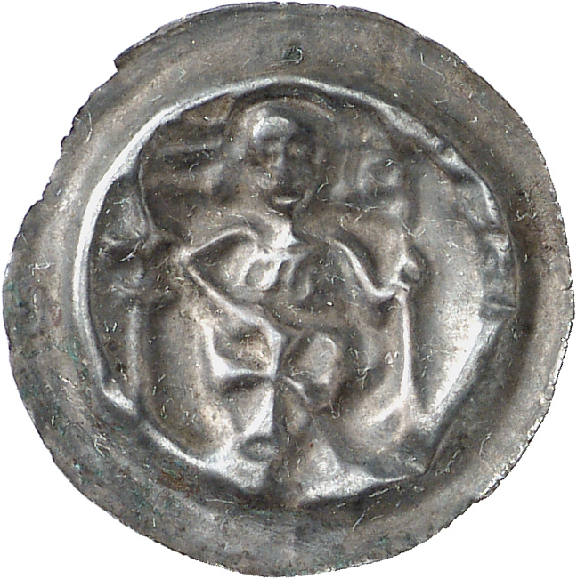</td>
  </tr>
  <tr>
    <th>Opis awersu</th>
    <td>Stojący rycerz trzymający przed sobą tarczę w prawej ręce i flagę w lewej ręce</td>
  </tr>
  <tr>
    <th>Rewers</th>
    <td>brak zdjęcia</td>
  </tr>
  <tr>
    <th>Opis rewersu</th>
    <td>Negatyw awersu</td>
  </tr>
  <tr>
    <th>Literatura</th>
    <td>E. Waschinski, Brakteaten und Denare des Deutschen Ordens (1934) Nr. 11</td>
  </tr>
  <tr>
    <th>Uwagi</th>
    <td></td>
  </tr>
  <tr>
    <th>Źródło</th>
    <td><a href="https://ikmk.smb.museum/object?lang=en&id=18206607">Bode</a></td>
  </tr>
</table>

[Powrót](https://numizmatyka.satola.net)