[Powrót](https://numizmatyka.satola.net)

# Mennictwo bizantyjskie (491-1453)

## Spis treści

- [Wstęp](#rys)
- [Geneza bizantyjskiego systemu monetarnego](#sm)
- [Pięć okresów bizantyjskiego systemu monetarnego](#po)
- [Zewnętrzne cechy monet](#zcm)

XXXXXXXXXXXXXXXXXXXXXXX str. 28

## Wstęp

W III wieku podupadł autorytet cesarzy rzymskich, wynoszonych na tron i obalanych przez armię (większość władców tego okresu została zamordowana). Napotkali oni coraz większe trudności w rządach nad rozległym Imperium. Pod koniec III wieku cesarz Dioklecjan (284-305) wprowadził współrządy czterech cesarzy, jednak system ten przetrwał zaledwie do początków IV stulecia. Trwały - jak się później okazało - podział cesarstwa nastąpił dopiero w 395 roku. (MBS. 1)

Umierając w 395 roku, cesarz Teodozjusz I (379-395) pozostawił władzę nad imperium swoim synom: Arkadiuszowi (395-408) i Honoriuszowi (395-423). Pierwszy rządził odtąd z Konstantynopola prowincjami wschodnimi, drugi z Mediolanu i Rawenny zachodnimi. <a href="https://pl.wikipedia.org/wiki/Konstantynopol">Konstantynopol</a> został założony przez Konstantyna I Wielkiego (306-337) - w latach 330–395 był stolicą Cesarstwa Rzymskiego, w latach 395–1453 stolicą Cesarstwa Bizantyńskiego i Cesarstwa Łacińskiego (1204–1261), stolicą Imperium Osmańskiego w latach 1453–1922. Od 1930 miasto nazywa się Stambuł.

Cesarstwo zachodniorzymskie przeżywało stopniowy rozkład, osłabiane Wielką wędrówką ludów i najazdami Hunów oraz Wandalów, aż w końcu przestało istnieć, kiedy w roku 476 barbarzyński wódz Odoaker obalił młodocianego cesarza Romulusa Augustulusa (475-476), władcę Rzymu i Rawenny.

W 498 roku Anastazjusz I (491-518) przeprowadził gruntowną reformę mennictwa brązowego, które załamało się w trakcje inwazji barbarzyńców. Stworzyło to podstawy funkcjonowania stabilnego bizantyjskiego systemu monetarnego. Za początek cesarstwa bizantyjskiego przyjmuje się więc rok 395, a mennictwa bizantyjskiego rok 491 (początek rządów Anastazjusza I). (MBS. 8)

<a href="https://www.doaks.org/resources/coins">Dumbarton Oaks Online Catalogue of Byzantine Coins</a>

## Geneza bizantyjskiego systemu monetarnego
Ekonomika bizantyjska wyrastwa z wielowiekowej tradycji gospodarki rzymskiej, w której pieniądz odgrywał ważną rolę środka wymiany towarów (powszechnego ekwiwalentu), a także środka tezauryzacji. (MBS. 17)

### Moneta złota
W III wieku rzymski system monetarny przeżył ciężki kryzys (inflacja i dewaluacja pieniądza), który udało się przełamać dopiero cesarzowi Dioklecjanowi (284-305). W 294 roku władca ten przeprowadził reformę, w wyniku której podstawą systemu stał się pieniądz złoty, a nie jak dotąd srebrny. Podstawowym nominałem miał być odtąd **aureus** bity wg stopy 1/60 funta. Dioklecjan wprowadził też tzw. **folis** - posrebrzaną monetę brązową o wadze poczatkowo 9,7 g, później stale redukowanej. W V wieku w państwie rzymskim emitowano tylko niewielkie monetki brązowe o wadze ok. 1 g, które nie zaspokajały potrzeb rynku.

Gromadząc pełnię władzy w swoim ręku, Konstantyn I (306–337) ok. 313 roku w prowincjach zachodnich, a w 324 roku we wschodnich wprowadził monetę o 2/6 lżejszą od aureusa, zwaną **solidem** (_solidus_, po grecku _nomisma_) i bitą wg stopy 1/72 funta. Solid ważył ok. 4,54 g, tj. **24 karaty** (w rzeczywistości ok. 23,5 karata). Aureusy emitowano odtąd jedynie okolicznościowo do czasów Justyniana I (527-565), zaś podstawowym nominałem złotym stał się solid. (MCBS. 2)

Oprócz solida, bito także kilka mniejszych nominałów:
- 1 **semissis** (2,27 g) = 1/2 solida
- 1 **tremissis** (1,51 g) = 1/3 solida
- 1/6 solida (0,76 g) emitowane tylko okresowo w VII w.

Waga solida nie uległa w zasadzie zmianom - jego stabilność zadecydowała o odrodzeniu późnorzymskiej i bizantyjskiej gospodarki pieniężnej. Nie osłabiło pozycji solida puszczenie w obieg przez Justyniana I (527–565) ok. 538 roku tzw. **solidów lżejszych** o wadze 22 karatów, później także 20 i 23 karatów. Monety te posiadały oficjalny niższy kurs i służyły jedynie ułatwieniu operacji technicznych przeliczania sum w pieniądzu złotym na brązowy. Lżejsze solidy przestano emitować za Konstantyna IV (668-685).

### Moneta srebrna
Karat (0,189 g) był zbyt małą jednostką wagową, aby można go było bić w złocie, ale nadawał się jako jednostka wagi w przypadku monet srebrnych. (BCPG. 3) I tak Cesarz Konstantyn I (306-337), prawie 150 lat przed upadkiem Cesarstwa zachodniorzymskiego, wprowadził do obiegu tzw. **miliaresion** (_miliarense_, podwójny karat, 1/12 solida) i **silikwę** (łac. karat), monety bite z czystego srebra oraz ich odmiany, lekką i ciężką. Monety srebrne wymieniano na złote wg stałej proporcji określonej w 397 roku jako 14,4 do 1:
- 1 miliaresion lekkie = 2 silikwy lekkie = 1/14,4 solida
- 1 miliaresion lekkie = 5/6 miliaresion ciężkiego
- 1 miliaresion ciężkie = 2 silikwy ciężkie = 1/12 solida

Monety srebrne miały uzupełniać w obiegu pieniężnym monety złote, które posiadały dużą siłę nabywczą, ale do VII w. nie były emitowane zbyt licznie i nie odebrały większej roli.

### Moneta miedziana
W 498 roku Anastazjusz I (491-518) ustalił trwały system nominałów brązowych. Dotychczas emitowane monetki brązowe zostały zrównane co do wartości z najmniejszą jednostką tego systemu **nummus-minimus** bitą wg stopy 1/288 funta (1,13 g). Podstawowym nominałem był jednak nie nummus lecz **nowy follis**. Stopa mennicza, wg której bito follisy, ulegała zmianom - w 498 roku wynosiła 1/36 funta (9,10 g), w 512 roku 1/18 funta (18,19 g), w 538 roku 1/13,25 funta (24,95 g). Emitowano także inne nominały brązowe, głównie:
- 1 **follis** = 40 **nummi*
- 1 **półfollis** = 20 **nummi**
- 1 **dekanumion** = 10 **nummi**
- 1 **pentanumion** = 5 **nummi**

Zreformowanie systemu nominałów brązowych wobec istnienia stabilnego, opartego na solidzie, mennictwa złotego, pozwoliło na pomyślny rozwój gospodarki pieniężno-towarowej w państwie wczesnobizantyjskim (koniec V-VI w.). Liczne mennice (w Konstantynopolu, Tessalonice, Antiochii, Kartaginie, Rawennie, Rzymie i wielu innych ośrodkach) zapewniały nasycenie rynku pieniężnego. Mennictwo nowych państw, które plemiona barbarzyńskie tworzyły na terenie zdobytych przez siebie prowincji (np. Wizygoci, Frankowie), wzorowało sie na bizantyjskim. Monety Wandali i Ostrogotów zaliczane są nawet do mennictwa bizantyjskiego. Także na terenach należacych dziś do Polski, odkryto skarby zawierające monety biznatyjskie (najczęściej na Pomorzu, datowane do pocz. VI w.). (MCBS. 3)

brąz? stop miedzi?
W starożytności brąz był stopem miedzi w stosunku 90% miedzi do 10% cyny,
https://pl.wikipedia.org/wiki/Br%C4%85zy

## Pięć okresów bizantyjskiego systemu monetarnego
Pięc okresów mennictwa bizantyjskiego odzwieciedla ówczesną kondycję finasową i gospodarczą imperium.
- Okres pierwszy charakteryzuje się silną pozycją gospodarczą zachwianą przez inwazję Persów i Arabów w VII w.
- Okres drugi odzwierciedla braki w dostępie do nowych zasobów kruszczu oraz zmniejszoną, w porównaniu z okresem poprzednim, wymianę handlową.
- Okres trzeci początkowo charakteryzował się wzrostem ludności i dostępu do zasobów, którego złote monety zachowały wiele ze swojego dawnego międzynarodowego prestiżu, pomimo fazy poważnej degradacji w połowie XI wieku. Ten prestiż przetrwał katastrofę w 1204 roku, ale od tego dnia imperium było jedynie cieniem dawnego siebie, pomimo odzyskania Konstantynopola w 1261 roku.
- Okres czwarty charakteryzuje się kontynuacją bicia złotych monet, ale dewaluowane przez cesarzy monety bizantyjskie są coraz bardziej wypierane z dotychczasowej strefy wpływów cesarstwa wschodniego przez pieniądz Europy zachodniej.
- Okres piąty odzwierciedla kurczącą się od wielu lat gospodarkę Bizancjum, postępującą dewaluację monety złotej oraz problemy z utrzymaniem stałej relacji wartości złota do srebra skutkujących przejściem na monetę srebrną.

### Mennice Cesarstwa Bizantyjskiego
-- mennice bizantyjskie
pdf mapa mennic  w 6 i 7 w str. 4, przybywało ich gdy rozrastało się imperium
They all shared in the minting of
copper, but silver was rarely struck outside Ravenna and Carthage, and gold was
normally limited to these mints and to Constantinople, whose output far exceeded
that of the western mints. Formal mint marks, abbreviated from place
names (e.g., CON for Constantinople, NIKO for Nicomedia), were limited to
the copper coinage (Figs. 29, 35) and often omitted, especially from the lower
denominations. Solidi struck in the capital had CONOB on them (Fig. 4), that
is, the first syllable of Constantinopolis joined to OB, which was both the abbreviation
of the word obryzum (“refined gold”) and the Greek numeral 72. Gold
coins struck at Ravenna and Carthage can only be differentiated when they
display well-marked local characteristics—normally, a high, annular border at
Ravenna (Fig. 2) and small, thick flans at Carthage (Fig. 3). Many mints were
subdivided into officinae, or workshops, which were normally indicated by
Greek numerals: alpha = 1; beta = 2, etc. (Fig. 32).

In the seventh century the number of mints was greatly reduced, initially as
a result of an administrative reorganization in 629 but more permanently as a
consequence of the loss of much of the Balkans to the Slavs, of half of Italy to
the Lombards, and of Syria, Egypt, and eventually the whole of North Africa to
the Arabs. Constantinople was left as the only surviving mint in the east, while
provincial mints survived in the west for only as long as the provinces they
served remained in Byzantine hands. The last survivor was Syracuse, the capital
of Sicily, which was captured by the Arabs in 878. The use of mint marks was
abandoned, and for much of the middle Byzantine period Constantinople was
the only mint in the empire. The mint at Thessalonica was revived in the eleventh
century and became of great importance in the last days of the empire, but
its products are not specifically marked and can usually be identified only on
the evidence of style and find spots.
-- koniec

### Wizerunki na monetach
!!!! dla kazdej monety wyszukac w griersonie Fig. <numer>, zeby dowiedziec się wiecej o wyobrazeniu na monecie
    
Coin types are too varied to be categorized in any very exact fashion. Most
of those current in Byzantium fall into one of three groups: ruler representations,
religious images, and “functional” types consisting mainly of marks of
value.
    
Pictorial types in the literal sense, such as objects or images taken from
nature or representations of public buildings and events, play almost no role at
all, making Byzantine coinage in this respect much less interesting than that of
ancient Greece and Rome
    
Marks of value, in the form of a large
Greek or Latin numeral, are confined to the copper and only used for about
three and a half centuries, from their introduction by Anastasius I in 498 to
their disappearance in the ninth century
    
Na co zwracac uwage? 
Przedstawienia władców
    - Ile jest postaci, czy są one współrządzącymi, aktualnie rządzącym i następcą lub poprzednikiem.
    - Jak wygląda ubiór imperatora
    

    
=========================

### Okres I: Od końca V (495) do połowy VIII w.

- 3 złote nominały fig 4, 6, 7 - sredn. 20mm

VIw
    - solidus fig4
        - awers: władca zwykle w zbroi
        - rewers: Wiktoria lub archanioł wspierający krzyż lub 
            - Justin II (565–578): siedząca personifikacja Konstantynopolu (fig 60)
            - Tiberius II (578–582) chose a cross on steps (Fig. 5) which is believed to represent the great jeweled cross erected on Golgotha
    - semissis f6
        - awers: semissis and tremissis have on the obverse the emperor’s bust, but shown in profile rather than facing
        - rewers: seated Victory inscribing a numeral on a shield This numeral had originally referred to the “vows” repeated by the emperor at five-year intervals, but in the course of time it had become merely a formula
    - tremissis f7
        - awers: semissis and tremissis have on the obverse the emperor’s bust, but shown in profile rather than facing
        - rewers: Victory bearing a wreath and an orb surmounted by a cross
    
VIIw
obverse: 
The seventh century saw great changes in the iconography of these coins.
Portraiture was introduced under Phocas (602–610; Fig. 53), and from Heraclius
(610–641) onward coinage reflected changes both in the emperor’s appearance and
in the arrangements he made for his succession. Thus, Constans II (641–668)
and Justinian II (685–695; 705–711; Fig. 55) are shown as young boys on their
earliest coins; Heraclius and Constans II (Fig. 8) acquire enormous beards and
mustaches in the course of their issues. In order to assure the succession, emperors
associated their sons with them as co-emperors, and the coinage was
intended to advertise the dynasty; thus, Heraclius Constantine and later
Heraclonas accompany their father Heraclius, and no fewer than three sons
appear on the reverse under Constans II (Fig. 8).

reverses:
frequently a cross whose form indicates the denomination, the solidus having a
cross on steps (Fig. 5), the semissis a cross on a globe, and the tremissis a
simple cross

When Justinian II (685–695; 705–711) placed a bust of Christ on his coins he removed
himself to the reverse, where, on the gold, he is shown holding the type of cross
appropriate to the denomination (Fig. 9; cover illustrations)

VIIIw - Iconoclast emperors
3 zmiany
First, the treatment of the imperial bust becomes purely linear and every
vestige of portraiture disappears, with older emperors being differentiated from
their junior colleagues only by their larger sizes and by faint traces of a beard
and mustache, whether or not they wore such in real life

Second, the traditional
cross on the reverse is replaced by the effigy of another emperor, initially
the emperor’s son and intended successor, but subsequently one or more of his
ancestors, with the emperor’s son then being placed beside his father on the obverse
(Fig. 10). Thus the coinage represented the whole dynastic lineage in order
of birth

And, finally, the semissis and tremissis are eliminated
they
were issued only in small quantities and for ceremonial distribution on particular
occasions
at the mint of Syracuse, they continued to be struck until
the city’s loss to the Arabs in 878

SILVER
- with, from 615 onward, one denomination of silver as well (Fig. 19)

It was the emperor Heraclius who in 615 revived an effective silver coinage,
drawing the metal for his abundant issues mostly from the secularization of
church plate during the crisis of the Persian war. The new coins were known as
hexagrams (Fig. 19), since they weighed 6 grammata (6.84 grams), a weight
higher than any used for regular coinage during the entire period of the Roman
Empire. Hexagrams continued to be struck on a substantial scale under Constans
II and Constantine IV (668–685), but their volume trailed off in the 680s,
and by the end of the century the empire was back on the gold-copper basis
that had been in effect under Anastasius I and Justinian I.

silver
coins, which would have bridged the rather large gap between the follis and
the tremissis, were not issued, presumably because of the fluctuations in that
metal’s value against gold

- four (sometimes five) of copper (Figs. 29–31, 33, 34)

The introduction of the large copper follis, worth 40 nummi, had been the
great innovation of Anastasius I in 498. The coin was marked with the
Greek letter M (Fig. 29), which as a numeral stood for “40,” and it was initially
accompanied by only two fractions, a half-follis marked with K (= 20; Fig. 30)
and a decanummium marked with I (= 10; Fig. 31). In 512 the weights of these
coins were doubled (Fig. 32), and a further denomination of 5 nummi, marked
with E (Fig. 33), was added; moreover, the minting of nummi (Fig. 34), apparently
suspended in 498, was resumed

VI
Justinian I, in his twelfth year (538/9), further increased the weight of the
follis to about 25 grams. Moreover, he improved its appearance and altered its
iconography by substituting a facing bust for the traditional profile portrait on
the obverse and by adding a date on the reverse (Fig. 35), thus applying to coins
the provisions of his Novel 47 (537) for the dating of all official documents by
regnal years. This coin, however, was too heavy for convenience, and the weight
was reduced to about 22 grams in 541/2. Further reductions took place at intervals
over the remainder of the century, so that ultimately the minting of nummi
had to be abandoned, and a new unit of 30 nummi, marked with L or XXX,
was inserted into the system. Yet even to the end of the century the follis remained
a handsome, massive coin whose weight and size must have given its
users solid assurance of its value.

VII
The seventh century saw the decline of the follis. The designs of the coins,
which show changing combinations of rulers, remain of interest, but their
weights were repeatedly reduced and their execution became increasingly slovenly.
Folles of Constans II average only about 3 grams, in contrast to the 25 grams
of a century earlier, and while their iconography is quite varied, their fabric is
abominable (Fig. 36). They were by then so small that the half-follis could not
easily be minted and lower denominations virtually disappeared. The empire
was at that time in desperate political straits, with its richest provinces, Egypt
and Syria, lost forever to the Arabs and much of the Balkans occupied by the
Slavs. These circumstances only aggravated the decline of the purchasing power
of the subsidiary coinage that had begun already in the second half of the sixth
century, and it is not surprising that the copper coins of this period were the
worst struck in the entire Byzantine series.

The later years of the seventh century saw sporadic attempts at improvement,
often with initial issues of heavy coins at imperial accessions; but none of
these efforts proved permanent. 

- This wide range of coins was made possible by the use of three metals, and in this respect it is comparable to modern coinage

Od drugiej połowy VI w. waga monet brązowych zaczyna spadać, stają się one monetą kredytową. Ograniczono liczbę mennic lokalnych, właściwie do VIII w. bimetaliczne (złoto, brąz) mennictwo bizantyjskie stało się monometaliczne, oparte przede wszystkim o złoto. Cesarz Herakliusz (610-641) zwiększył ok. 614/615 roku znaczenie srebra wprowadzając nowy nominał **heksagram** bity wg stopy 1/48 funta (6,82 g), jednak ograniczenie zapasów kruszcu pod koniec VII w. spowodowało zawieszenie tej emisji. (MCBS. 4)

ratio monet brązowych do złotych podłegało ciągłym zmianom, tabelka str. 43-45 i nie do końca jest to rozeznany temat

### Okres II: Od połowy VIII do końca XI w.
- the simplification of this pattern to only three denominations, one in each metal: 
    - the nomisma (Fig. 11), 
    - a silver coin known as a miliaresion (Fig. 20), 
    - and the follis (Fig. 38)
    
nomisma?
nomisma [gr. nómisma ‘moneta’], złota moneta cesarstwa bizant. od IX w., waga ok. 4,4 g, kontynuująca tradycję solida, na Zachodzie zw. bezant;
Nicefor II Fokas wprowadził obok n. ciężkich, 23-karatowych (histamenon), także n. lekkie, 22-karatowe (tetarteron, 4,17 g); po znacznej dewaluacji w XI w. Aleksy I Komnen przywrócił 1092 pierwotny standard wagowy solida (n. hyperpyron, 4,55 g); po ponownej dewaluacji zaniechano emisji n. w połowie XIV w.
https://encyklopedia.pwn.pl/haslo/nomisma;3948147.html

Not until the mid-ninth century does a fresh series of changes occur. After
image worship was restored in 843, Michael III’s (842–867) guardians placed
on his nomismata a bust of Christ copied from that of Justinian II’s coins
(Figs. 9, 11). Thereafter either a bust or a seated figure of Christ became a
regular feature of the nomisma.

Leo VI (886–912) struck some nomismata
bearing a true portrait instead of an undifferentiated imperial figure, as did
his son Constantine VII Porphyrogenitus (913–959; Fig. 12). Subsequently the
use of portraiture became common, so that coins of many eleventh-century
emperors can be recognized at once from the ruler’s appearance.

Much more fundamental than these alterations in the external appearance
of post-Iconoclastic coinage were changes in their weights and fineness (purity).
The emperor Nicephorus II Phocas (963–969), apparently for fiscal reasons,
struck a new class of nomismata slightly lighter in weight, which came to
be called tetartera (literally, coins lacking a “quarter”), in contrast to those of
full weight, which were named histamena
These light coins—the weight reduction
was really much less than a quarter, but the term tetarton could have the
same lack of precision that “quarter” can have in English, as in the “quarter” of a
city—were not at first differentiated in appearance from those of full weight,
but under Basil II (976–1025) the histamena were made larger and thinner
(Fig. 13), and the tetartera smaller and thicker (Fig. 14). Both, however, were
still technically nomismata, and their differing values were sometimes taken
into account by having payments expressed in nomismata settled half-and-half
in each.

A new and more lasting return to silver was made in 720, when Leo III, in
association with his son Constantine V (720–741), introduced a coin known as
a miliaresion (Fig. 20). It was much thinner and broader than the hexagram
and drew its inspiration from the Islamic dirham, which was itself derived from
the earlier Sasanian drachma. Like the Islamic coin, the miliaresion had no ruler
representations, being ornamented instead with only a cross and the joint emperors’
names and titles. For the first century of its existence there were no coins in the
name of a single emperor, apparently because they represented ceremonial issues,
struck for the public distributions that were customary when a co-emperor was
appointed. Not until the reign of Theophilus (829–842) did silver coin become
a regular part of the currency, struck by each ruler from his accession onward

The weight of the miliaresion was modified several times over the next two
hundred years, but virtually no change was made in its design, and only one significant
change occurred in its wording. Michael I (811–813) added the word
Romaion (“of the Romans”; Fig. 21) to the simple basileis (“emperors”) of his
predecessors in order to distinguish the “Roman” Empire of Byzantium from
that ruled by Charlemagne, who had assumed the imperial title at Rome in 800.

In the tenth century, with the Macedonian Renaissance, attempts were made to
render the coin more attractive. Initially a bust of Christ, and subsequently one
of the emperor (Fig. 22), was inserted at the intersection of the arms of the
cross that formed the reverse type. The cross itself was made more elaborate,
and on one anonymous issue of the tenth century the icon of the Virgin
Nikopoios, which was believed to have given victory to Basil II at the battle of
Abydos in 989, took the place of the cross (Fig. 23).

Braz

Under the Isaurian emperors (717–797) copper
coinage began to undergo the same process of simplification as had the gold.
Decanummia and pentanummia were last struck in the middle years of the
reign of Constantine V (741–775), and half-folles with the value mark K under
Leo IV (775–780); the half-folles of Constantine VI (780–797) were half the
size of his folles but of the same design, despite the obvious inappropriateness
of the numeral M. Dating had been abandoned earlier in the century, with a
meaningless XXX NNN having substituted for the ANNO and a numeral (Fig.
37). As for the officina marks, the letter A was uniformly retained to fill the vacant
space beneath the M. Since nummi had long since ceased to be minted,
the concept of “40” was meaningless, and Theophilus finally abandoned the M
in favor of an inscription in several lines that filled the field.

Under Theophilus’ father, Michael II (820–829), the weight of the follis
was increased to about 8 grams; this broad, heavy piece was to become the characteristic
copper coin of the middle Byzantine period. The normal design, from
the reign of Theophilus onward, consisted of an imperial figure or figures on
one side, and an inscription giving the emperor’s name and title, and perhaps
some laudatory epithet like eusebes, “pious,” or pistos, “faithful,” on the other
(Fig. 38). Under the emperor John I Tzimisces (969–976) a bust of Christ was
substituted for the imperial figure, and the inscription “Jesus Christ, king of
those who rule,” for the imperial name and title. Thus was initiated the series of
so-called anonymous folles (Fig. 39), which were to continue, with a variety of
designs, until 1092.

    
Od pierwszej połowy IX w. cesarze Michał II (820-829) i Teofil (829-842) zdołali ponownie wprowadzić do obiegu i utrzymać follis o podniesionej wadze (7,7 g). Teofil wprowadził też srebrne **miliaresion**, który był wymieniany w relacji 1/12 solida. W latach kolejnych rosła waga folisów, aż do ok. 18 g na początlu XI w. (powrót do systemu bimetalicznego).

Cesarz Nikefor II Fokas (963-969) zróżnicował wagę solidów na cięższe **histamena** (24 karaty) i lżejsze **tetaretra** (22 karaty). Oba gatunki miały identyczny wygląd, dlatego przyjmuje się, że Nikeforowi chodziło o uzyskanie dodatkowego zysku z mennicy. Zmiana to nie podważyła jednak zaufania do solida. Cesarz Bazyli II (976-1025) nadał zróżnicowany wygląd obu odmianom i odtąd ich użytkownicy mogli wymieniać je zgodnie z ich rzeczywistą wartością kruszcową bez obawy poniesienia straty.

W IX-XI w. Bizancjum miało zatem dwa nominały złote (histamena, tetaretra) oraz dwa srebrne (cięższe i lżejsze miliaresion). W zachodniej Europie wysoko ceniono złotą monetę bizantyjską, zwaną tu **bezantem**. Monety bizantyjskie wzorowały się emisje wielu krajów europejskich i azjatyckich. W Polsce srebrne miliaresia uczestniczyły w obiegu, np. tzw. "ruskie" denary Bolesława Chrobrego z napisem cyrylicznym i wyobrażeniami wzorowanymi na typach miliaresion z przełomu X/XI w. (MCBS. 5)

Okres stabilizacji bizantyjskiego systemu monetarnego zakończył się ok. połowy XI w. Za czasów Konstantyna X Monomacha (1042-1055) mennica cesarska zaczęła po raz pierwszy na szerwszą skalę stosować proceder obniżania zawartości złota w stopie aż do ok. 80% zlota (19 karatów). Była to zmiana trudno zauważalna dla użytkowników, ale cesarzowi przynosiła zysk. W latach 70-tych XI w., podczas walki z naporem Turków seldżuckich, zawartość złota w monetach spadła do ok. 40% (9,5 karata), co spowodowało załamanie się zaufania do pieniądza. Podobnie zmniejszyła się zawartość srebra w miliaresion i waga brązowego follisa. Bizantyjski system monetarny uległ w 2 połowie XI w. zupełnemu załamaniu. (MCBS. 6)

A more serious change was the decline of the nomisma in fineness. For
seven centuries, from its creation by Constantine I the Great until the fourth
decade of the eleventh century, the nomisma as struck at Constantinople remained
a coin of pure gold. Michael IV (1034–41), who had been a moneychanger
in early life and who was believed to have dabbled in counterfeiting,
issued some of his nomismata in debased metal. During the middle years of the
century the debasement continued at intervals, until in the decade following the
disastrous Byzantine defeat at Manzikert (1071) the fineness of the nomisma
declined to about 8 carats. Then, in the 1080s, when Alexius I was compelled to
melt down imperial plate in order to pay his troops, the amount of gold in the
nomisma fell to virtually nothing. This debasement was accompanied by the
introduction, under Constantine IX (1042–55), of a concave fabric for the
histamenon (Fig. 15)—by now a thin coin some 26 millimeters in diameter—
apparently with the intention of making it stronger and less easily bent.

The last issues of anonymous folles in the 1080s were poorly struck coins
weighing generally no more than 6 grams.

### Okres III: Od 1092 do końca XIII w.
- from the monetary reform carried out by the emperor Alexius I Comnenus (1081–1118) in 1092
- use of several denominations of debased metal (called trachea by contemporaries) that were strikingly different from normal coins in being concave instead of flat (Fig. 15)
- The highest denomination was a coin of slightly base gold known as a hyperpyron (Fig. 16), which replaced the old nomisma of pure gold
- A coin of much baser gold (Fig. 17) revived the functions of the long-defunct tremissis, while small change was provided by trachea of very base silver (Fig. 25), which eventually became copper, and by two denominations of small flat coins that were copper (Fig. 40), one briefly becoming lead.

A monetary reform carried out by Alexius I in 1092 saw a return to
nomismata of good-quality gold, although, due to the constraints of the recycling
of earlier debased coins, the fineness was set at only 20 1/2 carats instead
of the traditional 24 (Fig. 16). These new coins were called hyperpyra, that is,
“super-refined,” which they no doubt were in comparison to their immediate
predecessors; they were also all of the higher weight of the traditional nomisma.

Accompanying them were coins between 6 and 7 carats fine, corresponding in
value both to the old tremissis and to the histamenon of the 1070s, in which
many values had been expressed. They seem not to have had a special name, but
were often nicknamed according to their types, for example, trikephala, “threeheaders,”
or hagiogeorgata, “Saint Georges” (Fig. 17).

The obverse types (i.e.,
those on the convex faces of the coins) are usually some representation of
Christ or the Virgin, while the reverses normally show a standing emperor accompanied
by Christ, the Virgin, or one of the saints.

Although the hyperpyron survived the disaster of 1204, when Constantinople
became the seat of the short-lived Latin Empire (1204–61), coins struck
by the exiled “emperors of Nicaea” at Magnesia in Asia Minor were little by
little debased, falling to 18 carats under John III (1222–54). Moreover, the

former electrum coins that had accompanied them were by now of virtually
pure silver. After Michael VIII Palaeologus (1259–82) recovered Constantinople
in 1261, the hyperpyron was reduced to 15 carats, and then fell further to
12 carats during the long reign of his son Andronicus II (1282–1328). At the
same time the striking of the coins became increasingly slovenly, and their
weights very irregular (Fig. 18). These coins were evidently valued by weight, as
gold coins have always been where large sums have been involved, rather than
by number.

The last hyperpyra of the traditional pattern, which effectively mark
the end of Byzantine gold coinage, were struck by John V in association with
John VI (1347–52). This suspension, coming a full century before the fall of
Constantinople to the Turks, is at first sight paradoxical, since at that very time
several countries in western Europe were beginning to mint gold on a substantial
scale. Yet it may well have been the demand for gold in Latin Christen-dom
that forced Byzantium to abandon it in favor of silver.

SILVER
In the eleventh century,
fractions of the miliaresion began to be struck, and a variety of types—standing
figures of the Virgin (Fig. 24) and the emperor, the bust of the Virgin or of
Christ, or a seated figure of Christ—began to appear.

The silver miliaresion shared the fate of the gold nomisma in the 1080s,
and was not replaced in the reform of 1092. Instead there appeared a concave
coin (Fig. 25) of low-grade billon (about 7 percent silver) that was initially
worth a quarter of the old miliaresion, being reckoned 48 to the hyperpyron

The government seems to have felt no obligation to maintain the quality of this
relatively poor billon trachy; by the end of Andronicus I’s reign (1183–85) its
fineness had fallen to about 2 percent silver, and it was reckoned at 120 to the
hyperpyron. Analyses of thirteenth-century specimens show that by that time it
had become a copper coin, although the retention of a concave fabric indicates
the continued pretense of a slight silver content—a pretense that allowed its
overvaluation against the gold coinage.

BRAZ

In 1092 Alexius I abolished the denomination
and replaced it with a small copper coin that, unlike all the higher
denominations, was flat instead of concave. Since it was about the same size as
the former gold tetarteron, resembled it in general appearance, and was possibly
worth a quarter of the final follis of the 1080s, it was in turn called a tetarteron
or tetarton. Tetartera were struck in profusion during the twelfth century at
Constantinople and Thessalonica, with a great variety of designs: busts or
standing figures of the emperors, representations of Christ, the Virgin (Fig. 40),
and saints, and imperial or other monograms. There are sometimes halftetartera,
and one issue of Alexius I was, most unusually, of lead, which allowed
for a larger coin than a copper one would have been. In the thirteenth century
the denomination became appreciably rarer, no doubt because of the declining
value of the billon trachy, which by then had itself degenerated into a copper
coin.

In the late thirteenth century the tetarteron-like copper coins disappeared,
to be replaced by thinner and slightly broader coins that were known by the old
Roman name of assaria (Fig. 41). Under Andronicus II and Andronicus III
(1328–41) their designs were probably changed annually, and are consequently
extraordinarily varied, but the slovenly striking and poor preservation of most
specimens make their details difficult to reconstruct. Paucity of hoard evidence
also leaves their precise dating uncertain. When the heavy silver stavraton was
introduced in 1367, the assaria were replaced by two copper denominations, one
called a tournesion (tornese in Italian), since some of the coins were modeled on
the denier tournois of Frankish Greece, and the other called a follaro, a tiny
piece less than 1 gram in weight, which had only its name in common with the
old follis (Fig. 42).

Aleksy I Komnenos (1081-1118) dokonał w 1092 roku próby reformy systemu monetarnego opierając go na czterech (a nie jak dotąd na trzech) metalach: złoto, elektron (stop złota i srebra), bilon (stop srebra i miedzi), brąz. Podstawowym nominałem było złote **hyperperon** o wadze 1/72 funta (4,54 g) i stosunkowo wysokiej zawartości złota - 21 karatów. System ten miał znaczenie raczej lokalne i nie przywrócił monecie bizantyjskiej znaczenia poza granicami.

Po zdobyciu Konstantynopola przez IV Wyprawę Krzyżową w 1204 roku poszczególne państwa roszczące sobie prawa do sukcesji po cesarstwie (<a href="https://pl.wikipedia.org/wiki/Cesarstwo_Nicejskie#/media/Plik:Cesarstwo_%C5%81aci%C5%84skie1204.png">Cesarstwo Łacinskie, Cesarstwo Nicejskie, Despotat Epiru, Cesarstwo Trapezuntu</a>), emitowały niezależnie od siebie monetę luźno opartą o system monetarny Aleksego I.

### Okres IV: Pierwsza połowa XIV w.
- lasting from soon after 1300 to the mid-fourteenth century, saw the introduction of a silver coin, the basilicon (Fig. 26), modeled on the silver ducat of Venice, and a small copper coin known as an assarion (Fig. 41)

The fourteenth century saw a return to silver on a massive scale. Soon after
1300, Andronicus II introduced the so-called basilicon (sc., “imperial” coin; Fig.
26), whose types copied those of the silver ducat (sc., coin “of the doge”) of
Venice and which was of a comparably high purity. Since it was of pure silver, it
was made flat and not concave, and as 1/12 of the hyperpyron it corresponded
to the old miliaresion and thus fitted easily into the system of account (see table
V, p. 45). In the 1330s and 1340s, however, its weight was significantly reduced—
much of Europe was then suffering from an acute silver shortage—and
after the mid-century it was no longer struck. Instead there appeared a new silver
coin known as a stavraton (Fig. 27), so called for the cross (stavros in Greek)
that had been a prominent feature of a Neapolitan or Provençal double gigliato,
which apparently provided the model for its issue. Since the stavraton was taking
over the functions previously fulfilled by the now-abandoned gold coinage,
it had to be made heavier than any silver coin previously used in Byzantium,
and indeed heavier than any silver coin used in Europe at that time, but even
so, at an initial weight between 8 and 9 grams, it had the value of only half the
hyperpyron. Fractions of a half (Fig. 28) and an eighth were also struck, but no
quarters, since this role was filled by the silver ducats of Venice. The stavraton
and its fractions were struck up to the last years of the empire, but the complete
series of the last emperor, Constantine XI (1449–53), has been known only
since 1990, when a hoard containing ninety specimens appeared on the market.
It had long been recognized that such coins were referred to in contemporary
narratives of the siege of Constantinople, but their existence had been doubted
for a long time, for until 1974, when two half-stavrata were published, not a
single coin of Constantine XI appeared to have survived

Po odzyskaniu Konstantynopola w 1261 roku przez władcę Nicei, Michała VIII Paleologa (1259-1282) utrzymano istniejący od 1092 system monetarny, jednak sukcesywnie zmniejszano zawartość kruszcu w hyperperonie, aż do 11 karatów w XIV w. Jego zasięg kurczył się coraz bardziej, aż w końcu coraz większą rolę zaczęły odgrywać emisje państw sąsiednich, m.in. państw utworzonych przez krzyżowców w Grecji oraz emisje napływające z Europy zachodniej. (MCBS. 7)

### Okres V: Od drugiej połowy XIV do połowy XV w. 
- do upadku cesarstwa w 1453
- complete disappearance of gold coins and a return to ones of pure silver (Figs. 27, 28)
- the main denomination of which was larger and heavier than any previously used in the empire

===

## Zewnętrzne cechy monet

Monety bizantyjskie przeszły w ciągu tysiącletniej historii istnienia Cesarstwa powolną ewolucję, w trakcie której najpierw oddaliły się od swych wzorców antycznych, a następnie rozwinęły charakterystyczny dla siebie zespół wyobrażeń, w którym dominują elementy związane z władzą cesarską i religią chrześcijańską. Rola władzy cesarskiej i Kościoła była bowiem w dizejach ideologii Bizancjum dominująca. (MCBS. 17)

W okresie wczesnobizantyjskim (V-VI w.) moneta emitowana w Cesarstwie Wschodnim niewiele się różniła od pieniądza rzymskiego. Dominującym wyobrażeniem awersów było popiersie władcy, traktowane nie jako realistyczny portret, lecz uosobienie władzy cesarskiej w ogóle. 

Na awersach mniejszych nominałów złotych i rewersach monet srebrnych często pojawia się profil władcy (podobnie jak na na monetach rzymskich).

XXXX 4-7

Na monetach złotych przeważa frontalne wyobrażenie cesarza, gdzie ważniejsze wydaje się uwidocznienie jego atrybutów władzy, niż jego indywidualnych rysów. Najważniejszym atrybutem monarchy był diadem - opaska wieńcząca jego głowę i związana z tyłu (na monetach wyobrażony jako podwójny sznur pereł ozdobiony z przodu szlachetnym kamieniem lub krzyżem). 

XXXXX diadem 8 kamien, 9 krzyż

Z czasem diadem ustąpił miejsca koronie - stemma - wykonanej z metalu i ozdobionej kamieniami szlachetnymi i perłami. Na monetach VII-VIII w. trudno jest zwykle określić, kiedy głowę zdobi diadem, a kiedy stemma. Dopiero od IX w. zarys korony jest całkiem wyraźny.

XXXXX korona 17

Od VI w. korony cesarzowych dekorowane są ozdobami w kształcie trójkąta.

XXXXX 13, 16

rys 1. Portret władcy jako wodza - odzianego w pancerz, z plaszczem (paludamunt) na ramionach w ozodobnym diademem hełmie z pióropuszem. W lewej ręce trzyma tarczę, w prawej włócznię (rys 2. kulę - symbol władzy nad całą ziemią zwieńczoną krzyżem, rys. 3 mała postać bogini zwycięstwa Victoria

rys 1. Portret władcy jako wodza - odzianego w pancerz, z plaszczem (paludamunt) na ramionach w ozodobnym diademem hełmie z pióropuszem. W lewej ręce trzyma tarczę, w prawej włócznię

VI-VII
odchodzenie od wzorów antycznych na rzecz symboliki chrześcijańskiej (krzyż, Chrystus Pankrator) str. 11

od VII
zanika postac cesarza-wojownika, cywilna wersja portretu

viii-ix
cesarze przodkowie
legendy w pełni greckie

xiii
swieci patroni miast

XXXXXXXXX

--------------------------------------

## Spis treści

- [Rys historyczny](#rys)
- [Monety krzyżackie (1226-1466)](#mon)
- [Lenne monety krzyżackie (1466-1525)](#len)
- [Systemy rachunkowo-pieniężne państwa krzyżackiego](#sys)
- [Emitenci monet chronologicznie](#emi)
- [Przykładowe typy monet (okres I)](#m1)
    - [Fenigi (beznapisowe brakteaty) z lat 1466-1525](#m1-1)
    - [Winrych von Kniprode (1351-1382)](#m1-2)
    - [Konrad I Zöllner von Rothenstein (1382-1390)](#m1-3)
    - [Konrad III von Jungingen (1393-1407)](#m1-4)
    - [Ulryk von Jungingen (1407-1410)](#m1-5)
    - [Henryk von Plauen (1410-1413)](#m1-6)
    - [Herman Gans, zarządca (1413-1414)](#m1-7)
    - [Michał I Küchmeister von Sternberg (1414–1422)](#m1-8)
    - [Paweł von Russdorf (1422-1441)](#m1-9)
- [Przykładowe typy monet (okres II)](#m2)
    - [Fenigi (beznapisowe brakteaty) z lat 1466-1525](#m2-1)
    - [Ludwik von Erlichshausen (1450-1467)](#m2-2)
    - [Henryk Reuss von Plauen (1467-1470)](#m2-3)
    - [Henryk Reffle von Richtenberg (1470-1477)](#m2-4)
    - [Marcin Truchsess von Wetzhausen (1477–1489)](#m2-5)
    - [Jan von Tiefen (1489-1497)](#m2-6)
    - [Fryderyk Saski (1498-1510)](#m2-7)
    - [Albrecht von Hohenzollern ks. brandenburski (1511-1525)](#m2-8)

## Rys historyczny
Terytorium późniejszych Prus przed podbojem krzyżackim zamieszkiwały ludy bałtyjskie, spokrewnione z zamieszkującym dalej na północ Litwinami, Kurami, Zemgalami, Zelami i Łetgalami. Liczebność plemion pruskich ocenia się na ok. 170 tys., co daje siłę wojskową rzędu 17 tys. wojowników. Aż do podboju Prus przez krzyżaków Prusowie wykształcili jedynie szczątkowe formy państwowości, swą organizację opierając na ustroju wiecowym.

Na początku XIII wieku polscy książęta dzielnicowi prowadzili akcję chrystianizacyjną na terenach Prus. Akcję misyjną prowadził opat zakonu cystersów w Łeknie i zakon rycerski braci dobrzyńskich, powołany w tym celu przez księcia Konrada mazowieckiego (1241-1243). Akcje nie przyniosły jednak spodziewanych efektów. Wielkie zaangażowanie w chrystianizację Prus książąt polskich – Konrada mazowieckiego i Henryka Brodatego – inspirowane było przez papieża, który chciał założyć w Prusach państwo kościelne. Cel ten chciał osiągnąć z pomocą cystersów i księcia gdańskiego Świętopełka, popierając go w jego dążeniach uniezależnienia się od Polski.

W 1226 r. książę mazowiecki Konrad zaprosił za namową Jadwigi Śląskiej zakon na swoje ziemie, przyznając mu w 1228 r. w dzierżawę ziemię chełmińską oraz ziemię michałowską. Pomimo tego Konrad zachował całość swoich prerogatyw książęcych. Ziemia chełmińska i michałowska miała stanowić dla zakonu bazę do rozpoczęcia walk z plemionami Prusów, które zagrażały północnym rubieżom Mazowsza. Od 1230 do 1249 r. zakon, dzięki stale napływającemu wsparciu i posiłkom przysyłanym przez Fryderyka II, zdołał całkowicie zająć i spacyfikować dawne tereny Prusów aż do rzeki Pasłęki (Pomezania). System walki Krzyżaków polegał na stopniowym eliminowaniu rozproszonych gniazd oporu Prusów i umacnianiu dopiero co zdobytej władzy terrorem prowadzonym z systemu błyskawicznie budowanych fortyfikacji.

W 1308 r. książę Władysław Łokietek wezwał na pomoc Krzyżaków w celu odparcia ataku Brandenburczyków na Pomorze Gdańskie. Ci pomocy udzielili, ale Pomorza i Gdańska nie opuścili. Po wymordowaniu polskiej załogi i rzezi w mieście zajęli także kolejne grody pomorskie i odkupili od Brandenburczyków prawa do Pomorza. Wkrótce Zakon sprzymierzył się z księciem Janem Luksemburskim oraz władcą Meklemburgii i w 1327 r. zaatakował Kujawy oraz Wielkopolskę, przeprowadzając wiele łupieżczych najazdów, terroryzując mieszkańców, paląc wsie i mordując ludność. Wtedy stoczono w 1331 r. nierozstrzygniętą bitwę pod Płowcami, która mimo że nie zmusiła zakonu do oddania Pomorza, obaliła mit, o niezwyciężonych Krzyżakach. 

Działania dyplomatyczne Kazimierza Wielkiego (1333-1370) rozbijające w czasie zjazdu w Wyszehradzie w 1335 r. ich sojusz z Czechami (i pozywając ich przed polubowny sąd papieski w Warszawie w 1339 r.), chcąc też zająć tereny Rusi Czerwonej, skłoniły Zakon do podpisania pokoju w Kaliszu w 1343 r., w którym zakon zwrócił Kujawy i ziemię dobrzyńską, zaś warunkowo jako jałmużnę zatrzymywał Pomorze, ziemię chełmińską i michałowską. Pomimo trzech kolejnych wyroków sądu papieskiego, nakazujących zwrot Pomorza, zakon nie oddał nigdy dobrowolnie zasądzonej ziemi. Pokój w Kaliszu zmusił zakon do zaprzestania ataków na Polskę. Wtedy zakon skierował siły przeciw Litwie, zajmując częściowo Żmudź. Zmusiło to księcia litewskiego Jagiełłę do przyjęcia chrztu, na którym otrzymał imię Władysław oraz ożenku z córką Ludwika Węgierskiego – Jadwigą Andegaweńską, zapoczątkowując unię polsko-litewską (1386).

Władysław Jagiełło (1386-1434) wskutek ciągłych walk podjazdowych na Kujawach i na Litwie prowadzonych przez zakon, zdecydował się ostatecznie na rozpoczęcie wielkiej wojny (1409–1411), której kulminacyjnym momentem była bitwa pod Grunwaldem, a uwieńczeniem pokój w Toruniu (1411). Pokój ten został mimo zwycięskiej kampanii wojskowej wymuszony na Jagielle ogólną sytuacją polityczną Polski, gdyż w obronie zakonu stanęła koalicja władców z dynastii Luksemburskiej – Jana, ks. zgorzeleckiego, Wacława, króla Czech oraz króla Węgier Zygmunta. Pokój ten ponownie nie przyznał Polsce Pomorza Gdańskiego ani ziemi chełmińskiej, zmusił jednak zakon do zaprzestania ataków na Litwę i Polskę. Zakon zaczął od tego czasu tracić na sile, a jego sytuacja ekonomiczna pogorszyła się na skutek blokady wymiany handlowej, którą zastosowała strona polsko-litewska.

6 lutego 1454 wybuchło wewnątrz państwa zakonnego powstanie mieszczan, które wsparł król Kazimierz Jagiellończyk (1447-1492), stosując przeciw zakonowi taktykę wojen podjazdowych, którą prowadził niegdyś sam Zakon. Wojna ta przyniosła w efekcie kolejny II pokój toruński (19 października 1466 roku) kończący zwycięską dla Polski trzynastoletnią wojnę z Zakonem Krzyżackim. W jego wyniku Pomorze Gdańskie, ziemia chełmińska i michałowska, oraz Warmia z Malborkiem i Elblągiem zostały wcielone bezpośrednio do Polski. Prusy Wschodnie z Królewcem pozostały we władaniu Zakonu jako lenno, z zastrzeżeniem wieczystego hołdu dla Korony Polskiej, z którą Zakon wraz ze wszystkimi swymi ziemiami i poddanymi miał odtąd tworzyć jedno nierozdzielne ciało. Wielki mistrz otrzymał miejsce w senacie między panami polskimi, dostojnicy zakonu zostali także dopuszczeni do rady królewskiej. Bez zgody króla polskiego, Zakon nie mógł zawierać traktatów i przymierzy. W każdej potrzebie wojennej Zakon miał wspierać Polskę militarnie.

Spośród siedmiu panujących od tego momentu wielkich mistrzów Zakonu, tylko Fryderyk ks. saski (1498-1510), drogą chytrych wybiegów i przy sprzyjającej sytuacji politycznej, zdołał się uchylić od złożenia hołdu królowi polskiemu. (LMK. 3) Ostatni z wielkich mistrzów, Albrecht von Hohenzollern ks. brandenburski (1511-1525), usiłując naśladować swego poprzednika doprowadził do wojny polsko-krzyżackiej (1519-1521). Po przegranej wojnie, zmuszony przez koneksje rodzinne oraz dla zachowania pokoju wewnętrznego, Albrecht przeszedł na luteranizm, co położyło kres istnieniu państwa zakonnego. Państwo zarządzane przez Albrechta, mimo że wciąż dość silne militarnie, znalazło się w próżni politycznej, co wykorzystał jego wuj, król polski Zygmunt I Stary i zmusił go do hołdu lennego w 1525, jako wieczystego lennika Królestwa Polskiego.

Przez cały okres istnienia państwa zakon krzyżacki podlegał bezpośrednio papiestwu, a jako zbrojne ramię Świętemu Cesarstwu Rzymskiemu. Wielki mistrz uznawał nad sobą władzę cesarzy, będąc zaliczonym w poczet książąt Rzeszy. [więcej](https://pl.wikipedia.org/wiki/Pa%C5%84stwo_zakonu_krzy%C5%BCackiego)

Mennictwo krzyżackie z punktu widzenia numizmatyki polskiej można podzielić na dwa okresy (LMK. 13):
- **Monety krzyżackie** - od powstania państwa zakonnego w 1228 roku do zawarcia II traktatu toruńskiego w 1466 r. Monety tego okresu powinny być traktowane jako monety obcego państwa znajdujące się w obiegu na ziemiach polskich.
- **Lenne monety krzyżackie** - od roku 1466 gdy Zakon został lennikiem króla polskiego do jego sekularyzacji w 1525 r. Monety tego okresu należą do jednego z systemów monetarnych państwa polskiego, obok monet koronnych, litewskich, a później także księstw pruskiego i kurlandzkiego.

## Monety krzyżackie (1226-1466)
System monetarny krzyżaków był dopasowany do systemu zachodnio- (opartego na grzywnie kolońskiej) i wschodnioniemieckiego (opartego na grzywnie chełmińskiej o wadze 190-195 gramów, podobnej do polskiej (stopa mennicza ustalona w akcie lokacji Chemłna w 1233 roku - GumP. 44)). Wg tego systemu, pięć zakonnych brakteatów (fenigów, denarów) ważyło tyle samo ile ważył jeden denar koloński, czyli niespełna 1,4 grama. Monety bito w kilku mennicach, z którch najważniejsza umiejscowiona była w Toruniu. Łamliwe brakteaty były wymieniane na nowe co 10 lat w stosunku 14 starych za 12 nowych. Stabilna moneta krzyżacka zadomowiła się też na ziemiach polskich sąsiadujących z zakonnymi, głównie na Mazowszu i Kujawach gdzie nazywano ją monetą "toruńską" lub "niemiecką". (PG. 293)

Brakteaty krzyżackie podlegały stopniowym zmianom pod względem wielkości, kształtu i rodzaju wyobrażeń. Te ostatnie przedstawiały zazwyczaj motywy religijne lub związane z Zakonem: chorągiew, tarczę krzyżacką, krzyż w różnych odmianach i z reguły nie posiadały napisów. W XIV w. ich średnica uległa zmniejszeniu. Przybrały one kształt "guziczkowaty". (PG. 293)

Gdy pojawiła się w Europie moneta gruba, a wraz z nią grosze praskie (od 1300 roku) płacono za nie w zależności od okresu 20-24 denary zakonne (w Polsce płacono za grosze praskie 16 denarów koronnych). Jednak to nie wystarczało, i w czasie gdy wielkim mistrzem krzyżackim był Winrych von Kniprode (1351-1382) pojawiły się nowe gatunki monet. Najprawdopodobniej już w latach 60-tych wprowadzono półskojce (Halbschotter, skojec to 1/24 grzywny lub 30 denarów) oraz ćwiartki (Vierchen, kwartnik, 1/4 półskojca). Niewykluczone, iż były one dopasowane do systemu polskiego (reformowanego mniej więcej w tym samym czasie przez Kazimierza Wielkiego) - półskojec, zamiast zamiast 15 denarów wyceniony został na 16 (1/45 grzywny chełmińskiej). Być może zabieg ten miał ułatwiać rozliczenia między Zakonem a Polską, gdzie grosz także równał się 16 denarom. Zmiana ta pozwoliła też na łatwiejsze wprowadzenie kwartnika, który był wart 4 denary (15/4 nie daje liczby całkowitej). Półskojce były mniejsze i zawierały mniej kruszcu niż grosze praskie czy krakowskie (a także w stosunku do swojej nominalnej wartości) i niechętnie przyjmowane poza granizami państwa krzyżackiego nie odegrały wiekszej roli. Ćwiartki, mające swoją analogię w ćwierćgroszach Kazimierza Wielkiego, odpowiadały swojej nominalnej wartości (średnio 0,77 grama), ale raczej nie pojawiają się w skarbach odnalezionych poza granicami państwa zakonnego, więc raczej nie były chętnie i masowo przyjmowane. (PG. 293)

W 1380 roku Winrych wprowadził na masową skalę szelągi (solid, Schilling), będące jednostką pośrednią między półskojcem a kwartnikiem. Szelągi zostały bardzo dobrze przyjęte przez ludność i stały się podstawową monetą Zakonu. Odpowiadały polskim kwartnikom, a później półgroszom (pod względem koncepcji w systemie monetarnym, gdyż wartość miały różną). Na awersie krzyżackie szelągi miały tarczę wielkiego mistrza (w polu białym krzyż czarny, a na nim złoty krzyż jerozolimski z tarczą pośrodku, na której widniał w złotym polu czarny orzeł cesarski), a na rewersie tarczę zakonną. W legendzie otokowej pojawiło się imię wielkiego mistrza wraz z tytułem i liczbą porządkową (ale trzeba uważać, gdyż nie zawsze numeracja była podawana prawidłowo). (VNM. 33, PG. 293)

Od 1416 roku na niektórych szelągach pojawia się też tzw. długi krzyż, dzielący pole stempla na cztery części. Poza tą zmianą, szelągi przetrwały w prawie niezmienionej formie do końca XV wieku. Długi krzyż umieszczany był na szelągach o większej zawartości krzuszcu (monety takie powstały jako próba reformy monetarnej). Wytworzyło to monetarny chaos wywołany współobiegiem różnowartościowych monet oraz wychwytywaniem egzemplarzy lepszych i przebijaniem ich na nowe, pogorszony istnieniem różnorodnych kursów wymiennych. Sytuacja ta, dokuczliwa szczególnie dla kupców, była jedną z przesłanek opozycji miast, doprowadzając do powstania Związku Pruskiego i w konsekwencji do wybuchu wojny trzynastoletniej. Sytuację monetarną miała poprawić dopiero reforma groszowa Jana von Tiefen (1489-1497) w 1492 roku. (PG. 293)

Pod koniec XIV wieku za rządów Konrada von Jungingen (1393-1407), pojawia się złota moneta krzyżacka. Niewiele o niej wiadomo (do dzisiaj nie zachował się żaden egzemplarz, a jedynie wzmianka z 1394 roku o mincerzu gdańskim (Dietzu Mynlein CNG. 23) bijącym monety srebrne i złote z wizerunkiem Madonny). Złoty gulden krzyżacki posiadał wizerunek Matki Boskiej i odpowiadał standardowi węgierskiego florena (ok. 3,5 grama czystego złota). (VNM. 33, PG. 293) Zakon krzyżacki, opierając swą potęge militarną na najemnikach, których usługi musiał opłacać złotem, wystarał się u przychylnego mu stale cesarza Zygmunta Luksemburskiego (1411-1437) o zgodę na wybijanie wiernych imitacji florenów węgierskich. Do produkcji tych monet jednak nie doszło, być może dlatego, że wtedy właśnie doszło do bitwy pod Grunwaldem (1410) i sytuacja Zakonu diametrialnie się zmieniła. Rok później, nowo wybrany wielki mistrz Henryk von Plauen (1410-1413) wrócił do bicia guldenów w celu opłacenia wojsk zaciężnych. Monety takie wybito w Gdańsku. Na stronie głównej miały postać wielkiego mistrza w stroju rycerskim, z orłem na piersi, z mieczem i tarczą w rękach. Na stronie odwrotnej miały Madonnę. Było to pierwsze w jedyne wyobrażenie wielkiego mistrza na monetach krzyżackich. Znane są pojedyncze egzemplarze tej monety. Kolejne próby miały miejsce w 1439 roku, ale do bicia złotych monet na większa skalę nie doszło. (PG. 293)

## Lenne monety krzyżackie (1466-1525)
Monety wybijane przez Zakon od 1466 roku powinny być traktowane jako monety lenne państwa polskiego (mimo, że nie było na nich symboli podległości lennej, jak polskie herby czy inicjały króla, a ich stopa mennicza nie była zgodną z polską). (LMK. 12) Po zakończeniu wojny trzynastoletniej, Kazimierz Jagiellończyk próbował przeprowadzić unię monetarną między Polską, Zakonem a Litwą. Mimo, iż monety bite przez króla i miasta pruskie dla Prus oraz monety bite przez krzyżaków miały podobną zawartość kruszcu, po obu stronach istniała nieufność co do jakości pieniądza. Przez lata (już od przegranej bitwy pod Grunwaldem w 1410 roku), kolejni wielcy mistrzowie obniżali zawartość kruszcu w szelągach (z początkowych 4 do 3 łutów srebra) oraz wprowadzając różnorodne pod względem wartości szelągi. Po śmierci króla Kazimierza w 1492 roku, wielki mistrz Jan von Tiefen (1489-1497), nie oglądając się na stronę polską przeprowadził reformę groszową. W 1492 roku wstrzymał produkcję szelągów i wprowadził do obiegu grosze krzyżackie o wartości 3 dotychczasowych szelągów (były bite w jedynej mennicy zakonnej w Królewcu). Grosze te pod względem zawartości kruszczu odpowiadały szelągom wybijanym przez Winryha von Kniprode nieco ponad 100 lat wcześniej. Reforma ta skomplikowała jeszcze bardziej polsko-krzyżackie relacje monetarne. Jan von Tiefen był ostatnim wielkim mistrzem za którego rządów bito szelągi. (VNM. 33, PG. 293)

## Systemy rachunkowo-pieniężne państwa krzyżackiego
Tabele zaczerpnięte z [Kop9-4](./Literatura.html).

### System rachunkowo-pieniężny krzyżacki z 1233 roku
Grzywna, wiardunek, skojec i szeląg były jednostkami obrachunkowymi. W postaci monetarnej pojawiały się tylko fenigi (denary brakteatowe).

### System rachunkowo-pieniężny krzyżacki z końca XIV w.
Grzywna, wiardunek i skojec były jednostkami obrachunkowymi. Oprócz fenigów, w postaci monetarnej pojawiły się półskojce, kwartniki, a następnie szelągi.

### System rachunkowo-pieniężny krzyżacki z 1456 roku

### System rachunkowo-pieniężny krzyżacki Jana von Tiefen (1489-1497) z 1492 roku

### System rachunkowo-pieniężny krzyżacki Fryderyka Saskiego (1498-1510)

### System rachunkowo-pieniężny krzyżacki Albrechta von Hohenzollern Brandenburskiego (1511-1525)

## Emitenci monet chronologicznie
Poniżej znajduje się poczet tych wielkich mistrzów i zarządców, którzy emitowali monety Zakonu wraz z przykładowymi zapisami ich imienia (oczywiście istnieje wiele odmian). Zapis imienia emitenta na szelągach zawsze poprzedza słowo MAGISTER, występujące w różnych formach, czasami skróceniach, czy przeinaczeniach typu MAGIST, MAGS, MGR... W przypadku groszy (od 1492 roku), zmienia się też formuła napisów otokowych (zob. opisy monet poniżej), a od 1513 roku na monetach pojawia się data umożliwiająca jednoznaczną identyfikację pana menniczego [więcej](https://marciniakaukcje.pl/szelagi-zakonu-krzyzackiego/):
- Winrych von Kniprode (1351-1382) … WYNRICVS PRIMVS
- Konrad I Zöllner von Rothenstein (1382-1390) … CORADVS PRIM9
- Konrad III von Jungingen (1393-1407) … CORADVS TERCI
- Ulryk von Jungingen (1407-1410) … VLRICVS PRIMVS
- Henryk von Plauen (1410-1413) … hINRICVS PRIM
- Herman Gans, zarządca (1413-1414) MAGISTER GENERALIS
- Michał Kuchmeister von Sternberg (1414-1422) … MIChAEL PRIM
- Paweł von Russdorf (1422-1441) … PAVLVS PRIM
- Konrad von Erlichshausen (1441-1449) … CORADVS QVIN
- Ludwik von Erlichshausen (1450-1467) … LVDWIC DEPRIM
- Henryk Reuss von Plauen, zarządca (1467-1469) hINRICVS LOCVTENES M
- Henryk Reuss von Plauen (1469-1470) … hINRICVS PRI
- Henryk Reffle von Richtenberg (1470-1477) … hINRICVS QVA
- Marcin Truchsess von Wetzhausen (1477-1489) … MARTINV PRIM
- Jan von Tiefen (1489-1497) … IOhISP
- Fryderyk ks. saski (1498-1510) … FRID IKVS
- Albrecht von Hohenzollern ks. brandenburski (1511-1525) ALBERTVS DG M GNERALIS …

## Przykładowe typy monet (okres I)

### Fenigi (beznapisowe brakteaty) z lat 1226-1466

<table class="center">
  <tr>
    <th>Rok</th>
    <td>brak</td>
  </tr>
  <tr>
    <th>Lata emisji</th>
    <td>1236-1248</td>
  </tr>
  <tr>
    <th>Nominał</th>
    <td>Fenig (brakteat beznapisowy)</td>
  </tr>
  <tr>
    <th>Mennica</th>
    <td>Toruń</td>
  </tr>
  <tr>
    <th>Materiał</th>
    <td>Ag</td>
  </tr>
  <tr>
    <th>Waga [g]</th>
    <td>0,27</td>
  </tr>
  <tr>
    <th>Średnica [mm]</th>
    <td>19</td>
  </tr>
  <tr>
    <th>Awers</th>
    <td></td>
  </tr>
  <tr>
    <th>Opis awersu</th>
    <td>Stojący rycerz trzymający przed sobą tarczę w prawej ręce i flagę w lewej ręce</td>
  </tr>
  <tr>
    <th>Rewers</th>
    <td>brak zdjęcia</td>
  </tr>
  <tr>
    <th>Opis rewersu</th>
    <td>Negatyw awersu</td>
  </tr>
  <tr>
    <th>Literatura</th>
    <td>E. Waschinski, Brakteaten und Denare des Deutschen Ordens (1934) Nr. 11</td>
  </tr>
  <tr>
    <th>Uwagi</th>
    <td></td>
  </tr>
  <tr>
    <th>Źródło</th>
    <td><a href="https://ikmk.smb.museum/object?lang=en&id=18206607">Bode</a></td>
  </tr>
</table>

<table class="center">
  <tr>
    <th>Rok</th>
    <td>brak</td>
  </tr>
  <tr>
    <th>Lata emisji</th>
    <td>1236-1248</td>
  </tr>
  <tr>
    <th>Nominał</th>
    <td>Fenig (brakteat beznapisowy)</td>
  </tr>
  <tr>
    <th>Mennica</th>
    <td>Toruń</td>
  </tr>
  <tr>
    <th>Materiał</th>
    <td>Ag</td>
  </tr>
  <tr>
    <th>Waga [g]</th>
    <td>0,22</td>
  </tr>
  <tr>
    <th>Średnica [mm]</th>
    <td>21</td>
  </tr>
  <tr>
    <th>Awers</th>
    <td>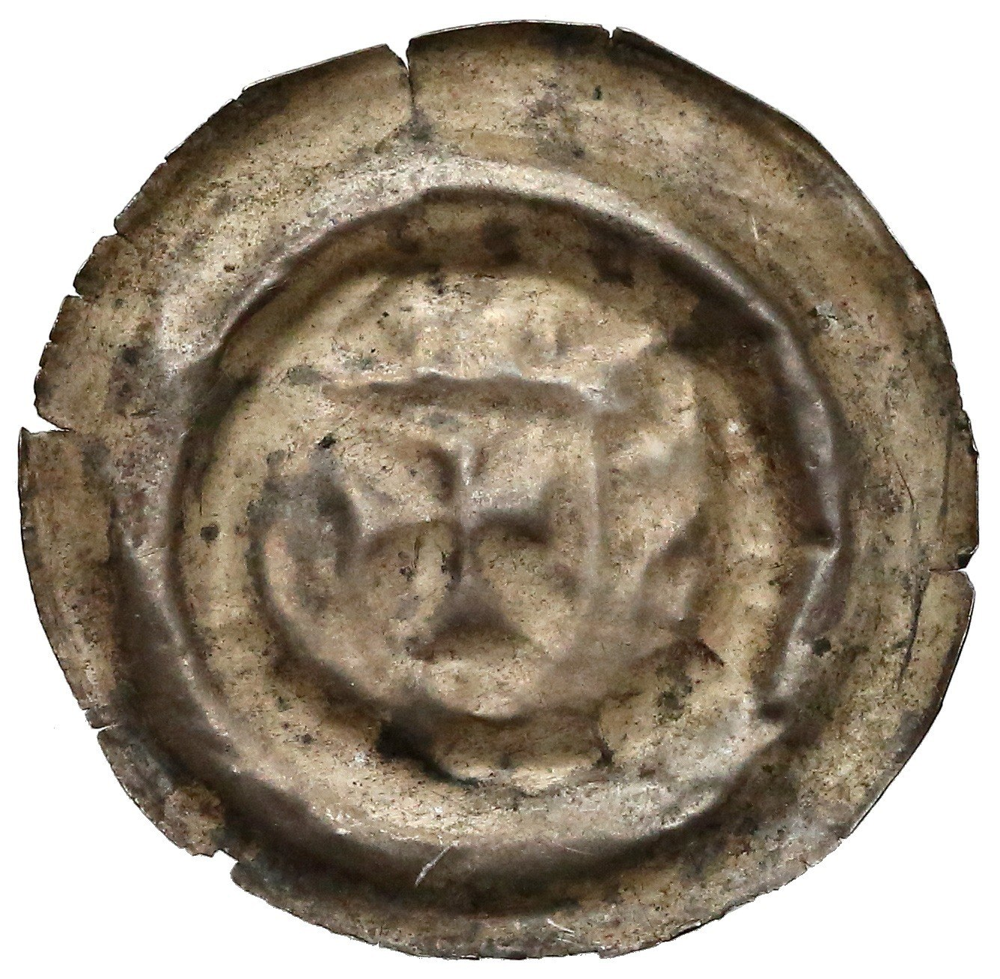</td>
  </tr>
  <tr>
    <th>Opis awersu</th>
    <td>Krzyż kawalerski otoczony przez ramię z proporcem, z drzewcem z lewej, a obok drzewca kule</td>
  </tr>
  <tr>
    <th>Rewers</th>
    <td>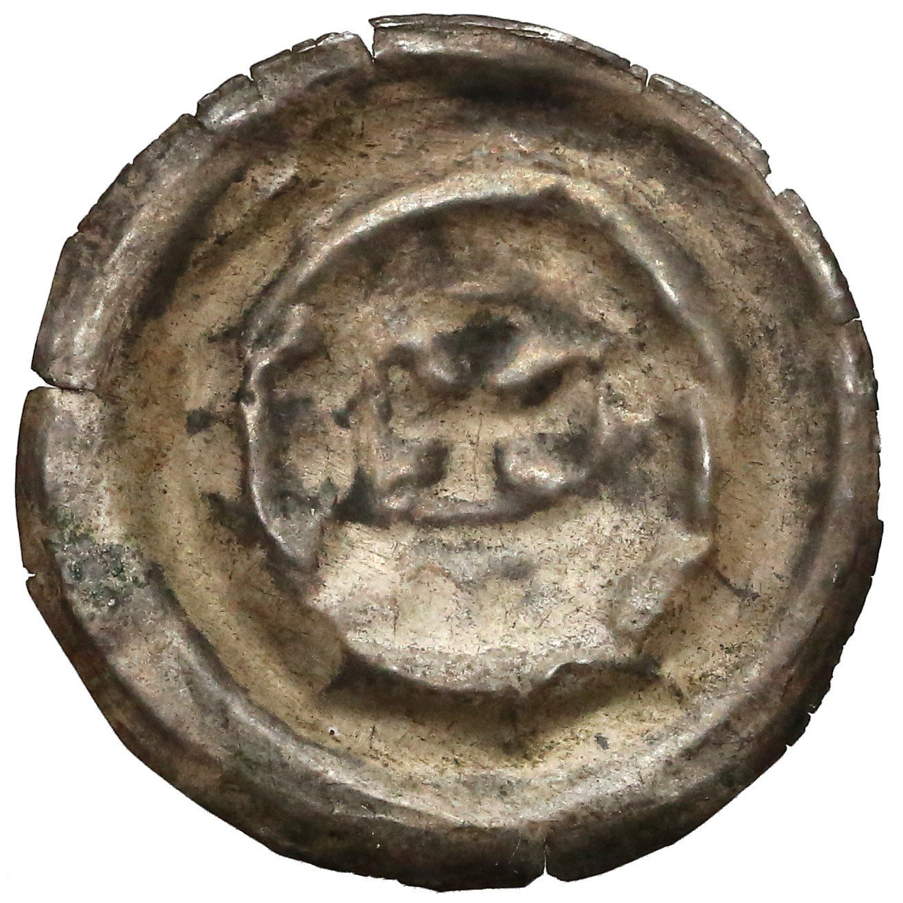</td>
  </tr>
  <tr>
    <th>Opis rewersu</th>
    <td>Negatyw awersu</td>
  </tr>
  <tr>
    <th>Literatura</th>
    <td>Kop. 8983 (R6); Paszkiewicz T1</td>
  </tr>
  <tr>
    <th>Uwagi</th>
    <td></td>
  </tr>
  <tr>
    <th>Źródło</th>
    <td><a href="https://onebid.pl/pl/monety-zakon-krzyzacki-brakteat-szeroki-ramie-z-proporcem-1236-1248-rzadki/345262">Marciniak</a></td>
  </tr>
</table>

<table class="center">
  <tr>
    <th>Rok</th>
    <td>brak</td>
  </tr>
  <tr>
    <th>Lata emisji</th>
    <td>1267-1278</td>
  </tr>
  <tr>
    <th>Nominał</th>
    <td>Fenig (brakteat beznapisowy)</td>
  </tr>
  <tr>
    <th>Mennica</th>
    <td>Toruń</td>
  </tr>
  <tr>
    <th>Materiał</th>
    <td>Ag</td>
  </tr>
  <tr>
    <th>Waga [g]</th>
    <td>0,23</td>
  </tr>
  <tr>
    <th>Średnica [mm]</th>
    <td>17</td>
  </tr>
  <tr>
    <th>Awers</th>
    <td>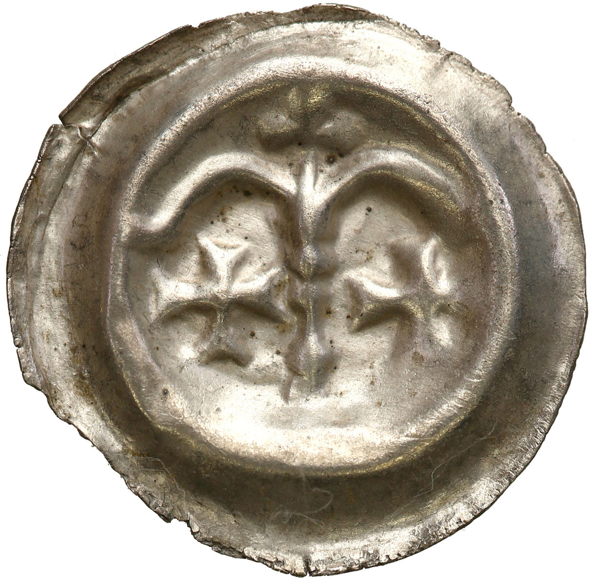</td>
  </tr>
  <tr>
    <th>Opis awersu</th>
    <td>Dwa krzyże pod arkadami</td>
  </tr>
  <tr>
    <th>Rewers</th>
    <td>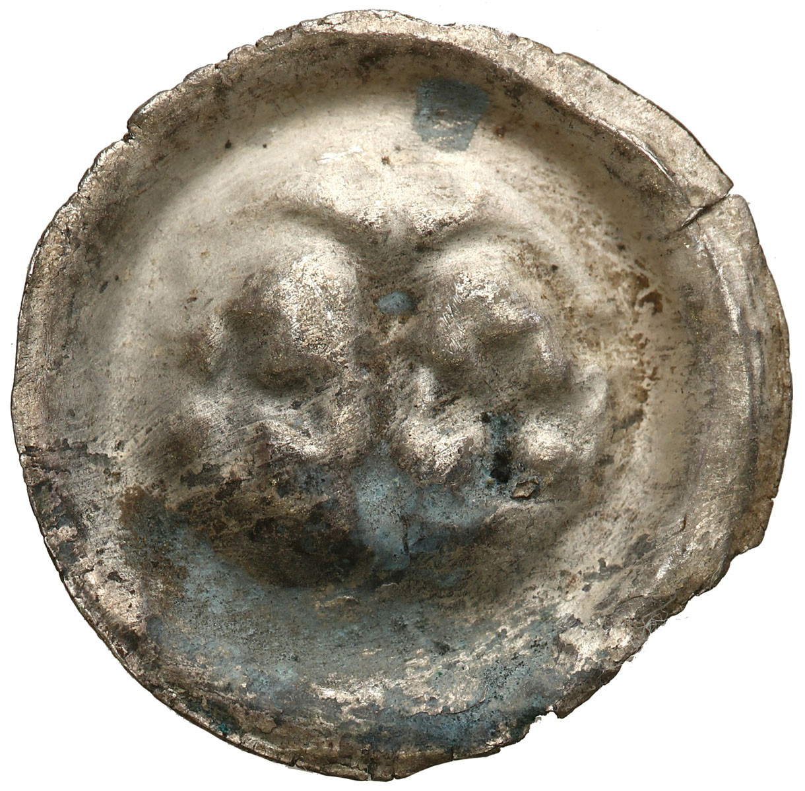</td>
  </tr>
  <tr>
    <th>Opis rewersu</th>
    <td>Negatyw awersu</td>
  </tr>
  <tr>
    <th>Literatura</th>
    <td>BRP Prusy T4; Neumann 1r</td>
  </tr>
  <tr>
    <th>Uwagi</th>
    <td></td>
  </tr>
  <tr>
    <th>Źródło</th>
    <td><a href="https://archiwum.niemczyk.pl/product/305482/zakon-krzyzacki-brakteat-1267-1278-arkady-ladny">Niemczyk</a></td>
  </tr>
</table>

<table class="center">
  <tr>
    <th>Rok</th>
    <td>brak</td>
  </tr>
  <tr>
    <th>Lata emisji</th>
    <td>1287-1298</td>
  </tr>
  <tr>
    <th>Nominał</th>
    <td>Fenig (brakteat beznapisowy)</td>
  </tr>
  <tr>
    <th>Mennica</th>
    <td>Toruń</td>
  </tr>
  <tr>
    <th>Materiał</th>
    <td>Ag</td>
  </tr>
  <tr>
    <th>Waga [g]</th>
    <td>0,17</td>
  </tr>
  <tr>
    <th>Średnica [mm]</th>
    <td>17</td>
  </tr>
  <tr>
    <th>Awers</th>
    <td>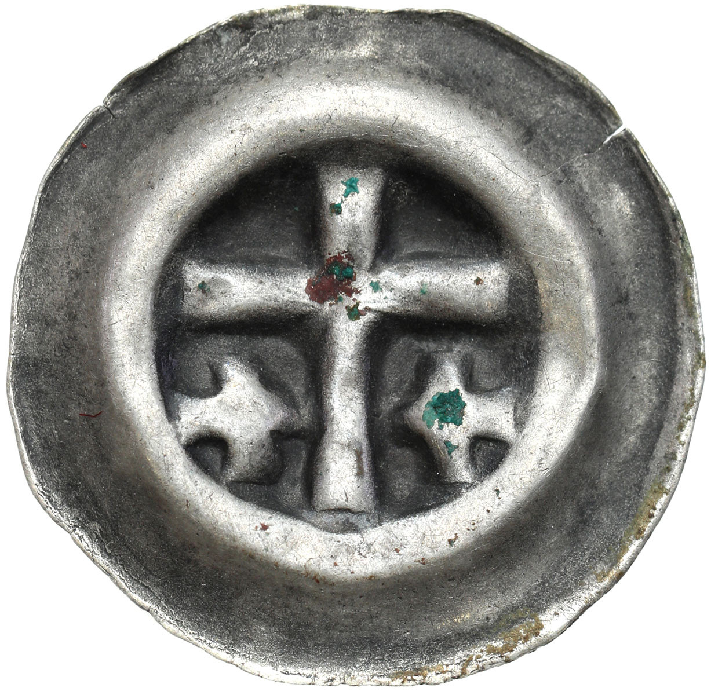</td>
  </tr>
  <tr>
    <th>Opis awersu</th>
    <td>Krzyż łaciński</td>
  </tr>
  <tr>
    <th>Rewers</th>
    <td>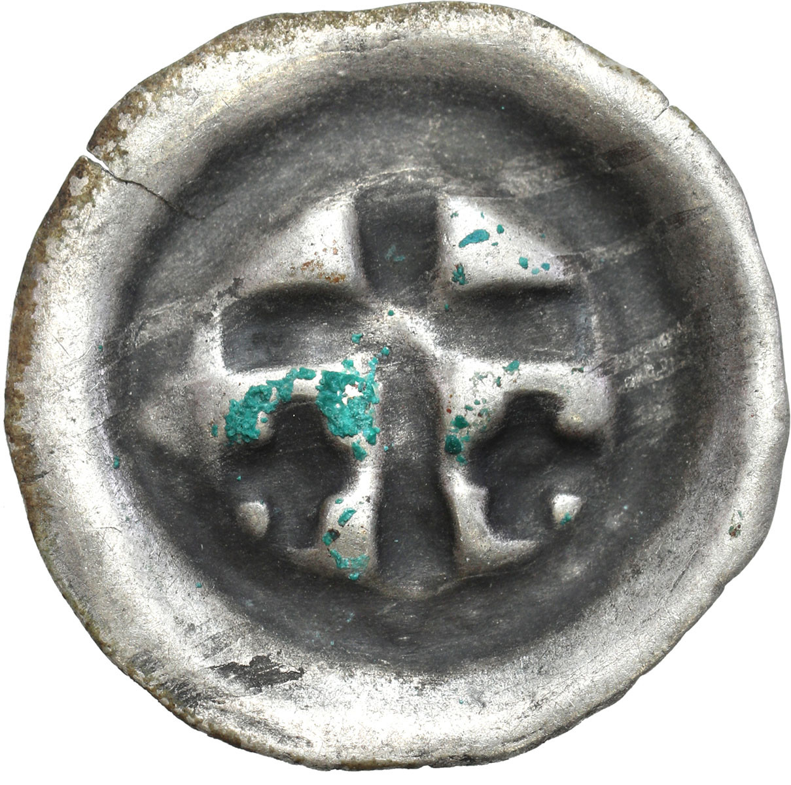</td>
  </tr>
  <tr>
    <th>Opis rewersu</th>
    <td>Negatyw awersu</td>
  </tr>
  <tr>
    <th>Literatura</th>
    <td>BRP Prusy T9</td>
  </tr>
  <tr>
    <th>Uwagi</th>
    <td></td>
  </tr>
  <tr>
    <th>Źródło</th>
    <td><a href="https://archiwum.niemczyk.pl/product/323995/zakon-krzyzacki-brakteat-1287-1298-krzyz-lacinski">Niemczyk</a></td>
  </tr>
</table>

<table class="center">
  <tr>
    <th>Rok</th>
    <td>brak</td>
  </tr>
  <tr>
    <th>Lata emisji</th>
    <td>1287-1298</td>
  </tr>
  <tr>
    <th>Nominał</th>
    <td>Fenig (brakteat beznapisowy)</td>
  </tr>
  <tr>
    <th>Mennica</th>
    <td>Toruń</td>
  </tr>
  <tr>
    <th>Materiał</th>
    <td>Ag</td>
  </tr>
  <tr>
    <th>Waga [g]</th>
    <td>0,20</td>
  </tr>
  <tr>
    <th>Średnica [mm]</th>
    <td>17</td>
  </tr>
  <tr>
    <th>Awers</th>
    <td>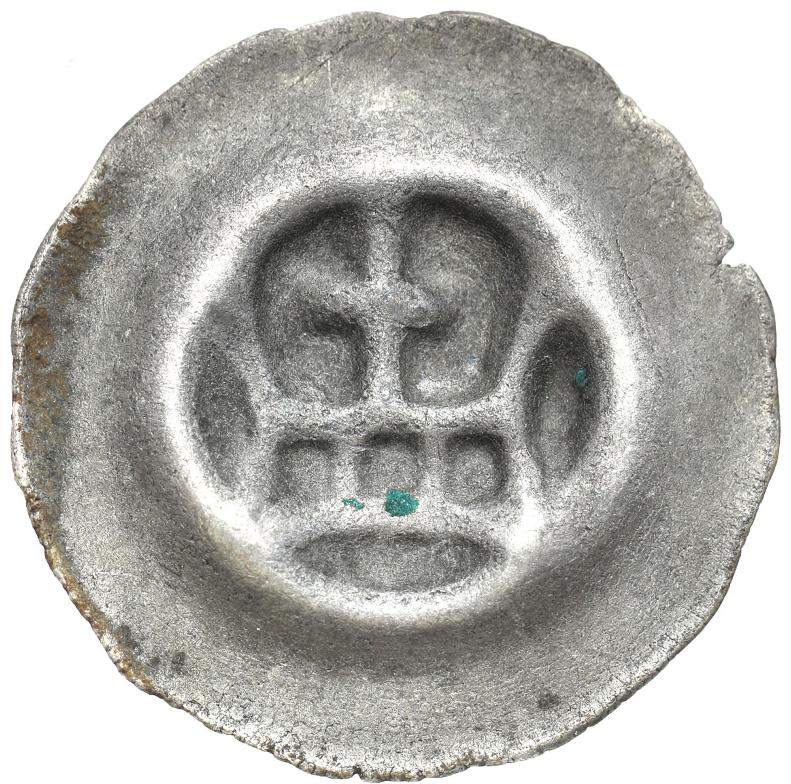</td>
  </tr>
  <tr>
    <th>Opis awersu</th>
    <td>Korona z obręczą, na szczycie środkowego fleurona krzyż</td>
  </tr>
  <tr>
    <th>Rewers</th>
    <td>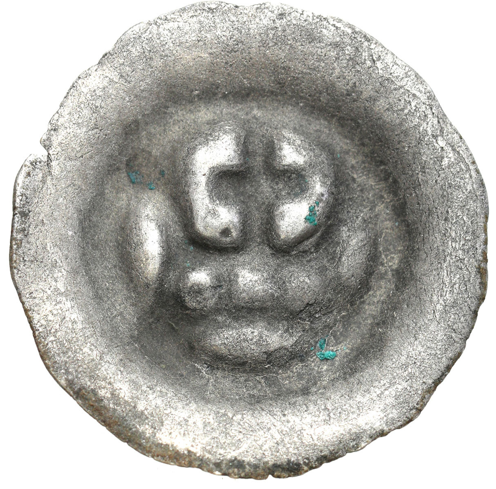</td>
  </tr>
  <tr>
    <th>Opis rewersu</th>
    <td>Negatyw awersu</td>
  </tr>
  <tr>
    <th>Literatura</th>
    <td>BRP Prusy T6</td>
  </tr>
  <tr>
    <th>Uwagi</th>
    <td></td>
  </tr>
  <tr>
    <th>Źródło</th>
    <td><a href="https://archiwum.niemczyk.pl/product/323998/zakon-krzyzacki-brakteat-1287-1298-korona">Niemczyk</a></td>
  </tr>
</table>

<table class="center">
  <tr>
    <th>Rok</th>
    <td>brak</td>
  </tr>
  <tr>
    <th>Lata emisji</th>
    <td>1307-1318</td>
  </tr>
  <tr>
    <th>Nominał</th>
    <td>Fenig (brakteat beznapisowy)</td>
  </tr>
  <tr>
    <th>Mennica</th>
    <td>Toruń</td>
  </tr>
  <tr>
    <th>Materiał</th>
    <td>Ag</td>
  </tr>
  <tr>
    <th>Waga [g]</th>
    <td>0,18</td>
  </tr>
  <tr>
    <th>Średnica [mm]</th>
    <td>17</td>
  </tr>
  <tr>
    <th>Awers</th>
    <td>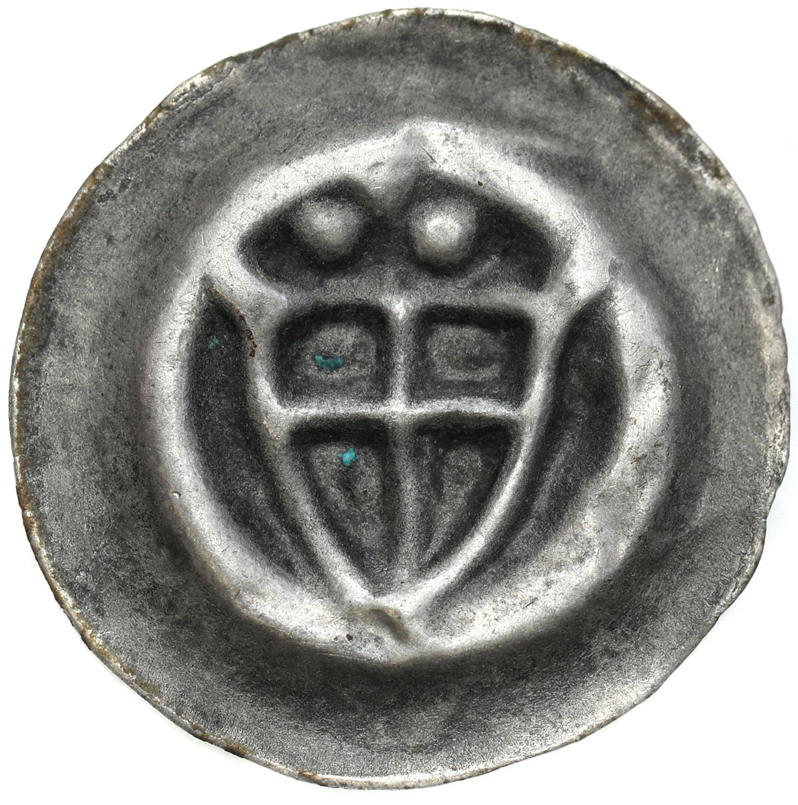</td>
  </tr>
  <tr>
    <th>Opis awersu</th>
    <td>Tarcza zakonna, powyżej dwie kule</td>
  </tr>
  <tr>
    <th>Rewers</th>
    <td>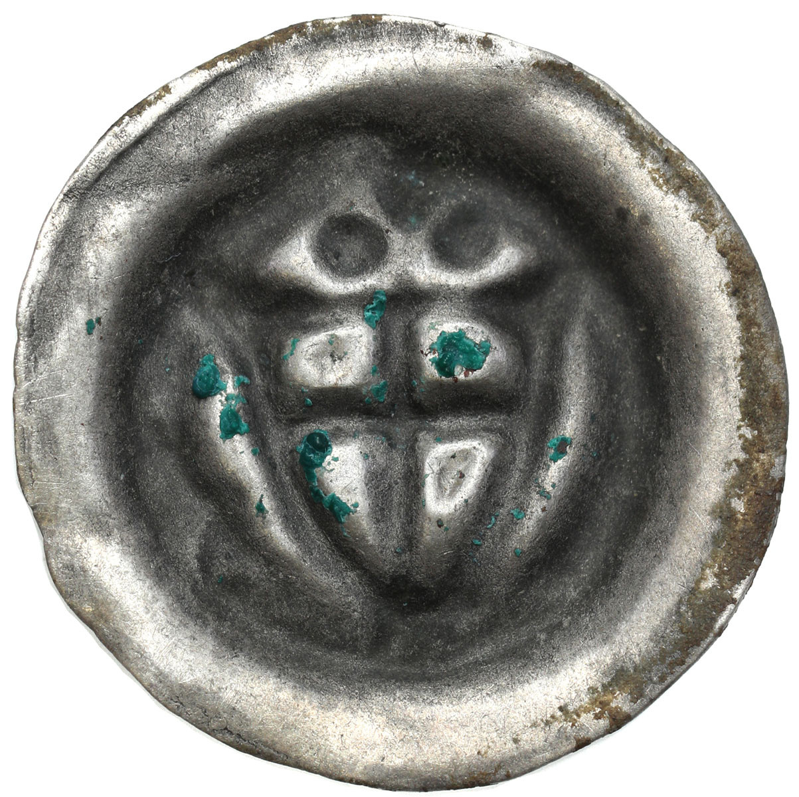</td>
  </tr>
  <tr>
    <th>Opis rewersu</th>
    <td>Negatyw awersu</td>
  </tr>
  <tr>
    <th>Literatura</th>
    <td>Kop. 8996j; Paszkiewicz T8</td>
  </tr>
  <tr>
    <th>Uwagi</th>
    <td></td>
  </tr>
  <tr>
    <th>Źródło</th>
    <td><a href="https://archiwum.niemczyk.pl/product/324002/zakon-krzyzacki-brakteat-1307-1318-tarcza-zakonna">Niemczyk</a></td>
  </tr>
</table>

### Winrych von Kniprode (1351-1382)

<table class="center">
  <tr>
    <th>Rok</th>
    <td>brak</td>
  </tr>
  <tr>
    <th>Lata emisji</th>
    <td>1360-1382</td>
  </tr>
  <tr>
    <th>Nominał</th>
    <td>Ćwiartka</td>
  </tr>
  <tr>
    <th>Mennica</th>
    <td>Toruń</td>
  </tr>
  <tr>
    <th>Materiał</th>
    <td>Ag</td>
  </tr>
  <tr>
    <th>Waga [g]</th>
    <td>0,77</td>
  </tr>
  <tr>
    <th>Średnica [mm]</th>
    <td>???</td>
  </tr>
  <tr>
    <th>Awers</th>
    <td>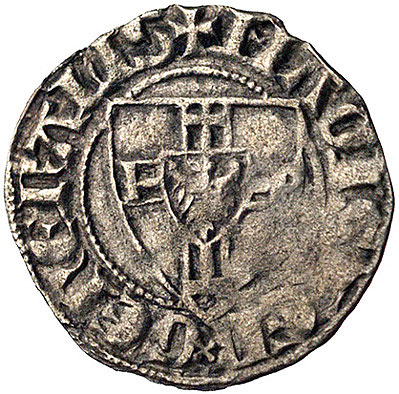</td>
  </tr>
  <tr>
    <th>Opis awersu</th>
    <td>Tarcza mistrzowska w sześciołukowej obwódce, wokół której napis: ✠ MAGISTER × GENERALIS</td>
  </tr>
  <tr>
    <th>Rewers</th>
    <td>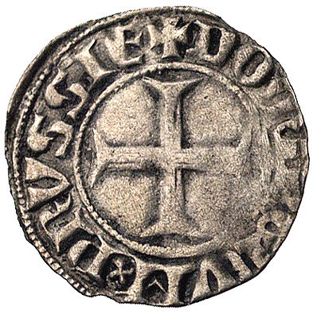</td>
  </tr>
  <tr>
    <th>Opis rewersu</th>
    <td>Krzyż kawalerski w otoku perełkowym, a w otoku napis: ✠ DOMINORVM × PRVSSIE</td>
  </tr>
  <tr>
    <th>Literatura</th>
    <td>Vossberg 120-121; Neumann 5</td>
  </tr>
  <tr>
    <th>Uwagi</th>
    <td>Wybijane krótko, podobnie jak ćwierćgrosze Kazimierza Wielkiego w Polsce nie sprawdziły się w praktyce</td>
  </tr>
  <tr>
    <th>Źródło</th>
    <td><a href="https://wcn.pl/archive/26_0131">WCN</a></td>
  </tr>
</table>

<table class="center">
  <tr>
    <th>Rok</th>
    <td>brak</td>
  </tr>
  <tr>
    <th>Lata emisji</th>
    <td>1360-1382</td>
  </tr>
  <tr>
    <th>Nominał</th>
    <td>Półskojec</td>
  </tr>
  <tr>
    <th>Mennica</th>
    <td>Toruń</td>
  </tr>
  <tr>
    <th>Materiał</th>
    <td>Ag</td>
  </tr>
  <tr>
    <th>Waga [g]</th>
    <td>2,94</td>
  </tr>
  <tr>
    <th>Średnica [mm]</th>
    <td>26</td>
  </tr>
  <tr>
    <th>Awers</th>
    <td>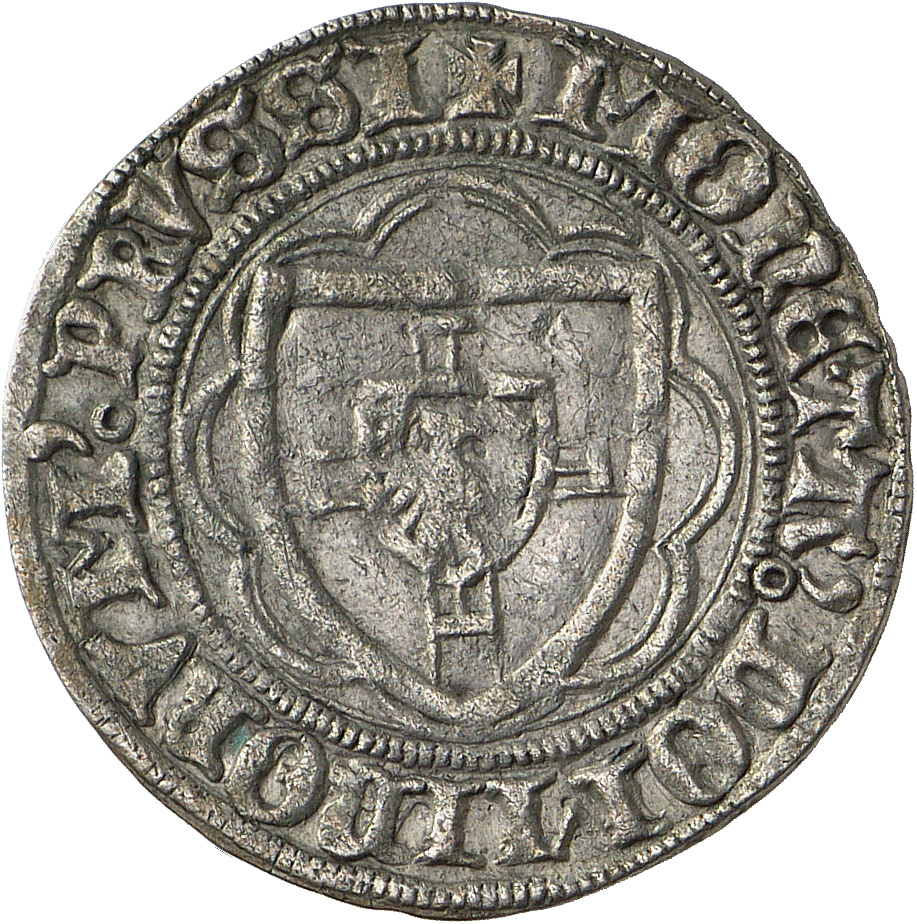</td>
  </tr>
  <tr>
    <th>Opis awersu</th>
    <td>Tarcza mistrzowska w sześciołukowej obwódce, wokół której znajdował się napis: ✠ MONETA ⦂ DOMINORVM ⦂ PRVSSIE</td>
  </tr>
  <tr>
    <th>Rewers</th>
    <td>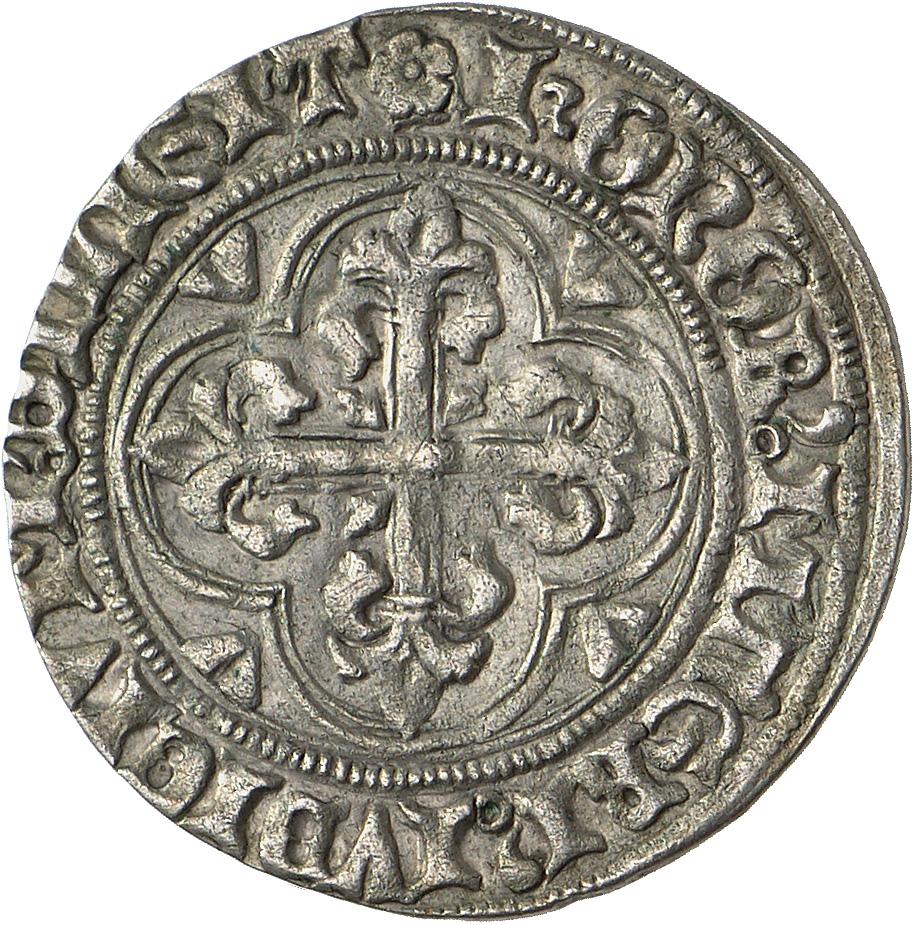</td>
  </tr>
  <tr>
    <th>Opis rewersu</th>
    <td>Krzyż z lilijkami w czteropłatkowej rozecie oraz w otoku legenda: ✠ HONOR ⦂ MAGISTRI ⦂ IVDICIVM ⦂ DILIGIT (godność mistrza miłuje sprawiedliwość)</td>
  </tr>
  <tr>
    <th>Literatura</th>
    <td>Dudik 37; Neumann’87 3; Voss. §34</td>
  </tr>
  <tr>
    <th>Uwagi</th>
    <td>Wybijane krótko, używane raczej wewnętrznie (niższa zawartość srebra w porównaniu z groszem praskim lub krakowskim)</td>
  </tr>
  <tr>
    <th>Źródło</th>
    <td><a href="https://ikmk.smb.museum/object?lang=en&id=18206610">WCN</a></td>
  </tr>
</table>

<table class="center">
  <tr>
    <th>Rok</th>
    <td>brak</td>
  </tr>
  <tr>
    <th>Lata emisji</th>
    <td>1380-1382</td>
  </tr>
  <tr>
    <th>Nominał</th>
    <td>Szeląg</td>
  </tr>
  <tr>
    <th>Mennica</th>
    <td>Toruń lub Gdańsk?</td>
  </tr>
  <tr>
    <th>Materiał</th>
    <td>Ag</td>
  </tr>
  <tr>
    <th>Waga [g]</th>
    <td>1,75</td>
  </tr>
  <tr>
    <th>Średnica [mm]</th>
    <td>20</td>
  </tr>
  <tr>
    <th>Awers</th>
    <td>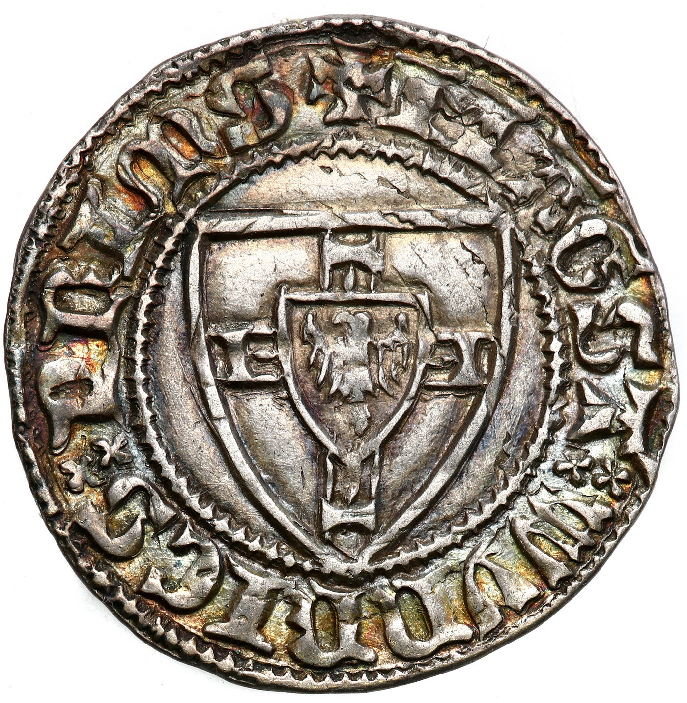</td>
  </tr>
  <tr>
    <th>Opis awersu</th>
    <td>Tarcza wielkiego mistrza, w otoku napis ✠ MAGST ⁑ WYNRICS ⁑ PRIMS [Magister Winricus Primus]</td>
  </tr>
  <tr>
    <th>Rewers</th>
    <td>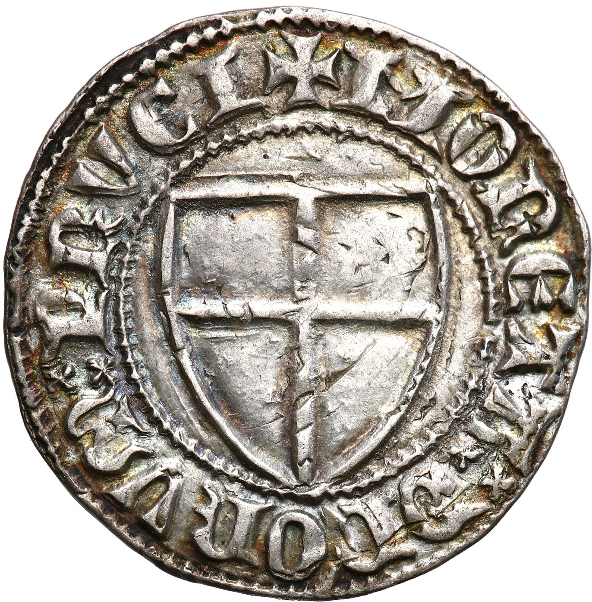</td>
  </tr>
  <tr>
    <th>Opis rewersu</th>
    <td>Tarcza krzyżacka. W otoku napis MONETA ⁑ DNORVM ⁑ PRVCI [Moneta Dominorum Prucie]</td>
  </tr>
  <tr>
    <th>Literatura</th>
    <td>Neumann 4, CNG. 15b</td>
  </tr>
  <tr>
    <th>Uwagi</th>
    <td></td>
  </tr>
  <tr>
    <th>Źródło</th>
    <td><a href="https://archiwum.niemczyk.pl/product/317780/zakon-krzyzacki-winrych-von-kniprode-1351-1382-szelag-bardzo-ladny">Niemczyk</a></td>
  </tr>
</table>

### Konrad I Zöllner von Rothenstein (1382-1390)

<table class="center">
  <tr>
    <th>Rok</th>
    <td>brak</td>
  </tr>
  <tr>
    <th>Lata emisji</th>
    <td>1382-1390</td>
  </tr>
  <tr>
    <th>Nominał</th>
    <td>Szeląg</td>
  </tr>
  <tr>
    <th>Mennica</th>
    <td>Toruń lub Gdańsk?</td>
  </tr>
  <tr>
    <th>Materiał</th>
    <td>Ag</td>
  </tr>
  <tr>
    <th>Waga [g]</th>
    <td>1,58</td>
  </tr>
  <tr>
    <th>Średnica [mm]</th>
    <td>20</td>
  </tr>
  <tr>
    <th>Awers</th>
    <td>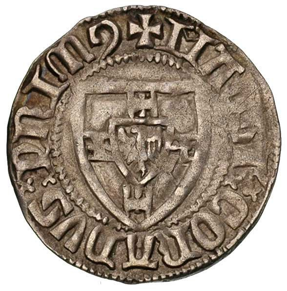</td>
  </tr>
  <tr>
    <th>Opis awersu</th>
    <td>Tarcza wielkiego mistrza, w otoku napis ✠ MAGST ⁑ CORADVS ⁑ PRIM9 [Magister Coradus Primus]</td>
  </tr>
  <tr>
    <th>Rewers</th>
    <td>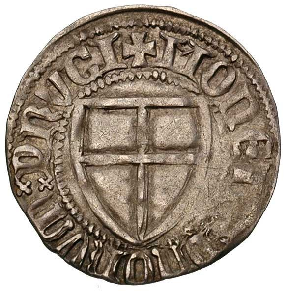</td>
  </tr>
  <tr>
    <th>Opis rewersu</th>
    <td>Tarcza krzyżacka. W otoku napis MONETA ⁑ DNORVM ⁑ PRVCI [Moneta Dominorum Prucie]</td>
  </tr>
  <tr>
    <th>Literatura</th>
    <td>Vossberg 144, CNG. 16</td>
  </tr>
  <tr>
    <th>Uwagi</th>
    <td></td>
  </tr>
  <tr>
    <th>Źródło</th>
    <td><a href="https://onebid.pl/pl/monety-szelag-aw-tarcza-wielkiego-mistrza-i-napis-rw-tarcz/401306">WCN</a></td>
  </tr>
</table>

### Konrad III von Jungingen (1393-1407)

<table class="center">
  <tr>
    <th>Rok</th>
    <td>brak</td>
  </tr>
  <tr>
    <th>Lata emisji</th>
    <td>1393-1407</td>
  </tr>
  <tr>
    <th>Nominał</th>
    <td>Szeląg</td>
  </tr>
  <tr>
    <th>Mennica</th>
    <td>Toruń</td>
  </tr>
  <tr>
    <th>Materiał</th>
    <td>Ag</td>
  </tr>
  <tr>
    <th>Waga [g]</th>
    <td>1,3</td>
  </tr>
  <tr>
    <th>Średnica [mm]</th>
    <td>20</td>
  </tr>
  <tr>
    <th>Awers</th>
    <td>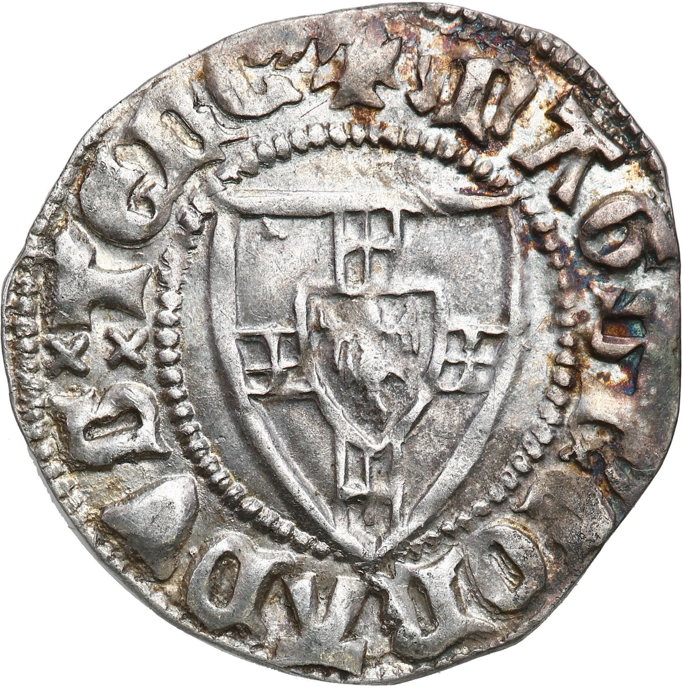</td>
  </tr>
  <tr>
    <th>Opis awersu</th>
    <td>Tarcza wielkiego mistrza, w otoku napis ✠ MAGST ⁑ CORADVS ⁑ PRIM9 [Magister Coradus Primus]</td>
  </tr>
  <tr>
    <th>Rewers</th>
    <td></td>
  </tr>
  <tr>
    <th>Opis rewersu</th>
    <td>Tarcza krzyżacka. W otoku napis MONETA ⁑ DNORVM ⁑ PRVCI [Moneta Dominorum Prucie]</td>
  </tr>
  <tr>
    <th>Literatura</th>
    <td>Neumann 7a</td>
  </tr>
  <tr>
    <th>Uwagi</th>
    <td></td>
  </tr>
  <tr>
    <th>Źródło</th>
    <td><a href="https://archiwum.niemczyk.pl/product/323263/zakon-krzyzacki-konrad-iii-von-jungingen-1393-1407-szelag-ladny">Niemczyk</a></td>
  </tr>
</table>

<table class="center">
  <tr>
    <th>Rok</th>
    <td>brak</td>
  </tr>
  <tr>
    <th>Lata emisji</th>
    <td>1393-1407</td>
  </tr>
  <tr>
    <th>Nominał</th>
    <td>Szeląg</td>
  </tr>
  <tr>
    <th>Mennica</th>
    <td>Malbork?</td>
  </tr>
  <tr>
    <th>Materiał</th>
    <td>Ag</td>
  </tr>
  <tr>
    <th>Waga [g]</th>
    <td>1,3</td>
  </tr>
  <tr>
    <th>Średnica [mm]</th>
    <td>20</td>
  </tr>
  <tr>
    <th>Awers</th>
    <td>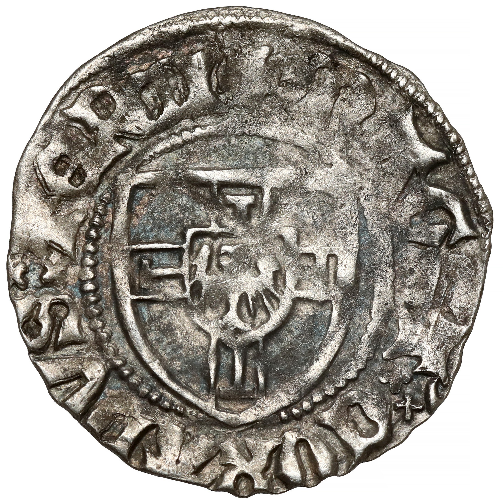</td>
  </tr>
  <tr>
    <th>Opis awersu</th>
    <td>Tarcza wielkiego mistrza, w otoku napis ✠ MAGST ⁑ CORADVS ⁑ TERCI [Magister Coradus Tercius]</td>
  </tr>
  <tr>
    <th>Rewers</th>
    <td>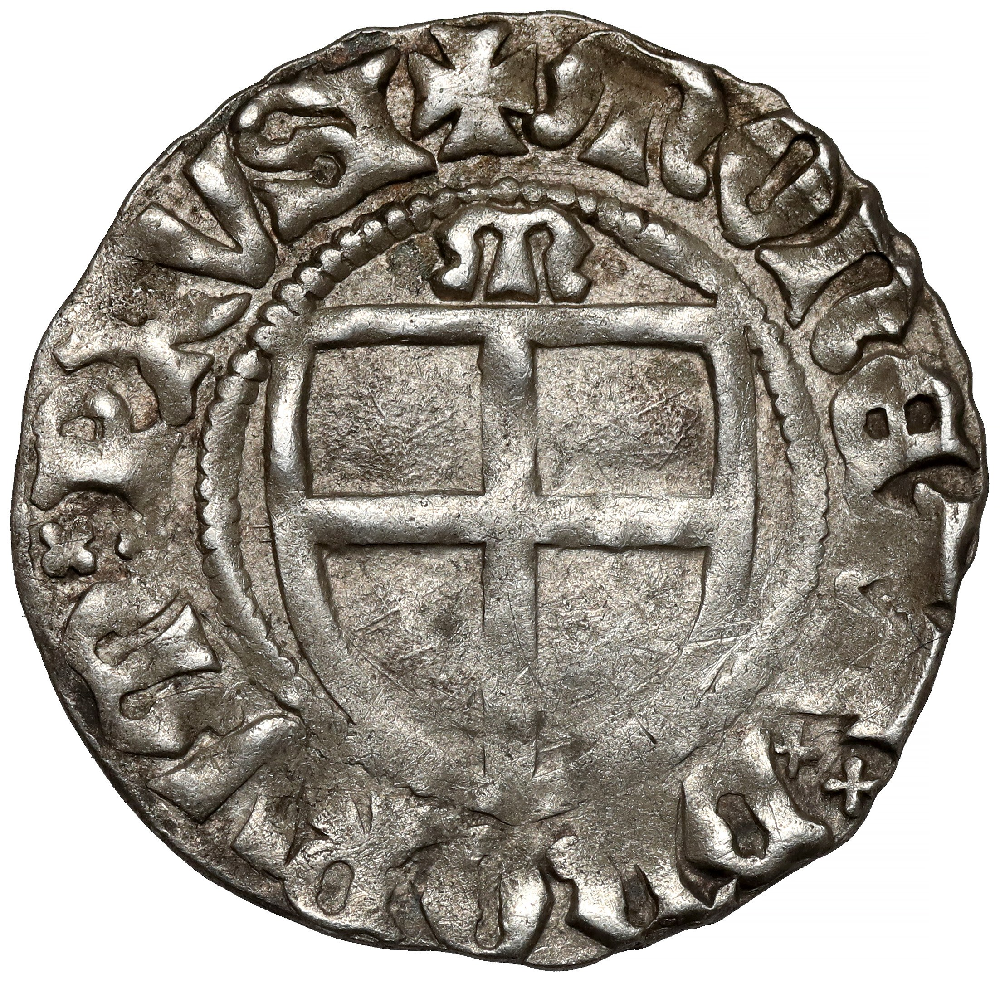</td>
  </tr>
  <tr>
    <th>Opis rewersu</th>
    <td>Tarcza krzyżacka a nad nią litera M. W otoku napis MONETA ⁑ DNORVM ⁑ PRVSI [Moneta Dominorum Prucie]</td>
  </tr>
  <tr>
    <th>Literatura</th>
    <td>Kop. 9014</td>
  </tr>
  <tr>
    <th>Uwagi</th>
    <td></td>
  </tr>
  <tr>
    <th>Źródło</th>
    <td><a href="https://onebid.pl/pl/monety-zakon-krzyzacki-konrad-iii-von-jungingen-szelag-malbork-litera-m/1818606">Marciniak</a></td>
  </tr>
</table>

### Ulryk von Jungingen (1407-1410)

<table class="center">
  <tr>
    <th>Rok</th>
    <td>brak</td>
  </tr>
  <tr>
    <th>Lata emisji</th>
    <td>1407-1410</td>
  </tr>
  <tr>
    <th>Nominał</th>
    <td>Szeląg</td>
  </tr>
  <tr>
    <th>Mennica</th>
    <td>Toruń</td>
  </tr>
  <tr>
    <th>Materiał</th>
    <td>Ag</td>
  </tr>
  <tr>
    <th>Waga [g]</th>
    <td>1,3</td>
  </tr>
  <tr>
    <th>Średnica [mm]</th>
    <td>20</td>
  </tr>
  <tr>
    <th>Awers</th>
    <td></td>
  </tr>
  <tr>
    <th>Opis awersu</th>
    <td>Tarcza wielkiego mistrza, w otoku napis +MAGST' + VLRICVS + PRIMV [Magister Ulricus Primus]</td>
  </tr>
  <tr>
    <th>Rewers</th>
    <td></td>
  </tr>
  <tr>
    <th>Opis rewersu</th>
    <td>Tarcza krzyżacka. W otoku napis + MONETA + DNORVM + PRVC [Moneta Dominorum Prucie]</td>
  </tr>
  <tr>
    <th>Literatura</th>
    <td>Kop. 9015</td>
  </tr>
  <tr>
    <th>Uwagi</th>
    <td></td>
  </tr>
  <tr>
    <th>Źródło</th>
    <td><a href="https://onebid.pl/pl/monety-zakon-krzyzacki-ulryk-von-jungingen-szelag/853284">Marciniak</a></td>
  </tr>
</table>

### Henryk von Plauen (1410-1413)

<table class="center">
  <tr>
    <th>Rok</th>
    <td>brak</td>
  </tr>
  <tr>
    <th>Lata emisji</th>
    <td>1410-1413</td>
  </tr>
  <tr>
    <th>Nominał</th>
    <td>Szeląg</td>
  </tr>
  <tr>
    <th>Mennica</th>
    <td>Toruń</td>
  </tr>
  <tr>
    <th>Materiał</th>
    <td>Ag</td>
  </tr>
  <tr>
    <th>Waga [g]</th>
    <td>1,3</td>
  </tr>
  <tr>
    <th>Średnica [mm]</th>
    <td>20</td>
  </tr>
  <tr>
    <th>Awers</th>
    <td>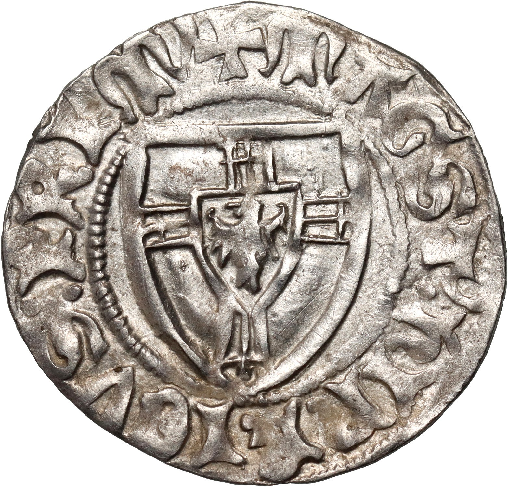</td>
  </tr>
  <tr>
    <th>Opis awersu</th>
    <td>Tarcza wielkiego mistrza, w otoku napis ✠ MAGST HINRICVS PRIM [Magister Hinricus Primus]</td>
  </tr>
  <tr>
    <th>Rewers</th>
    <td>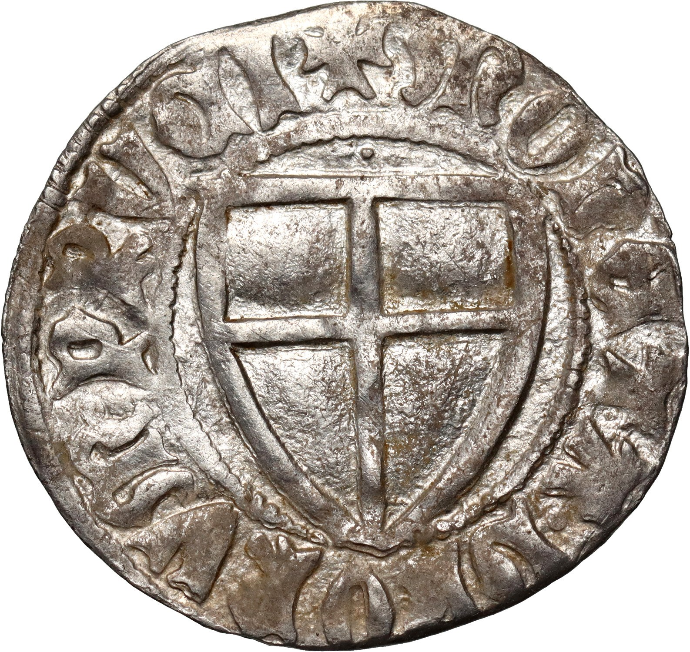</td>
  </tr>
  <tr>
    <th>Opis rewersu</th>
    <td>Tarcza krzyżacka. W otoku napis MONETA DNORVM PRVCI [Moneta Dominorum Prucie]</td>
  </tr>
  <tr>
    <th>Literatura</th>
    <td>Kop. (BN 2/2004) 298</td>
  </tr>
  <tr>
    <th>Uwagi</th>
    <td></td>
  </tr>
  <tr>
    <th>Źródło</th>
    <td><a href="https://onebid.pl/pl/monety-zakon-krzyzacki-henryk-i-von-plauen-1410-1414-szelag/1857499">Numimarket</a></td>
  </tr>
</table>

### Herman Gans, zarządca (1413-1414)

<table class="center">
  <tr>
    <th>Rok</th>
    <td>brak</td>
  </tr>
  <tr>
    <th>Lata emisji</th>
    <td>1413-1414</td>
  </tr>
  <tr>
    <th>Nominał</th>
    <td>Szeląg</td>
  </tr>
  <tr>
    <th>Mennica</th>
    <td>Toruń</td>
  </tr>
  <tr>
    <th>Materiał</th>
    <td>Ag</td>
  </tr>
  <tr>
    <th>Waga [g]</th>
    <td>1,36</td>
  </tr>
  <tr>
    <th>Średnica [mm]</th>
    <td>20</td>
  </tr>
  <tr>
    <th>Awers</th>
    <td>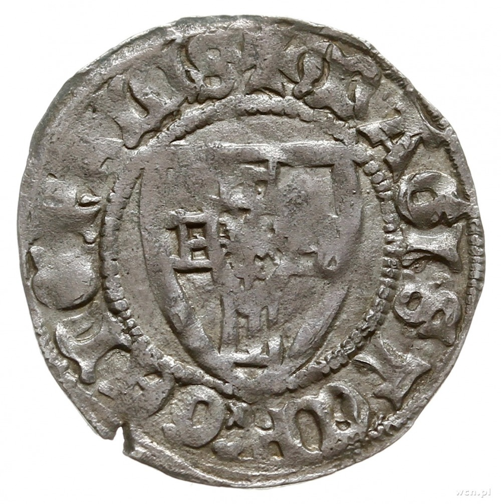</td>
  </tr>
  <tr>
    <th>Opis awersu</th>
    <td>Tarcza zarządcy, w otoku napis MAGISTER GENERALIS</td>
  </tr>
  <tr>
    <th>Rewers</th>
    <td>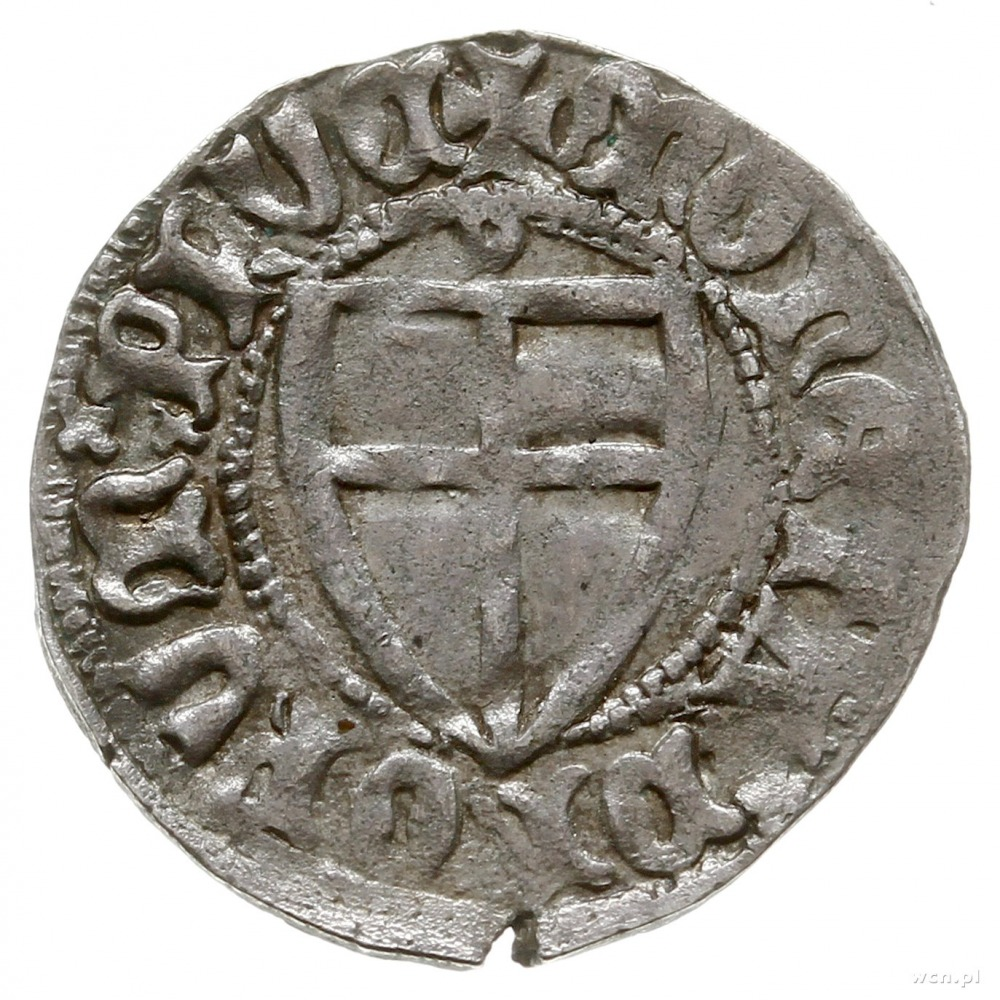</td>
  </tr>
  <tr>
    <th>Opis rewersu</th>
    <td>Tarcza krzyżacka na długim krzyżu, korona w prawym górnym rogu. W otoku napis MONE TADN ORVM PRVC [Moneta Dominorum Prucie]</td>
  </tr>
  <tr>
    <th>Literatura</th>
    <td>Neumann 13; Voss. 63</td>
  </tr>
  <tr>
    <th>Uwagi</th>
    <td></td>
  </tr>
  <tr>
    <th>Źródło</th>
    <td><a href="https://onebid.pl/pl/monety-szelag-mennica-gdansk-aw-tarcza-wielkiego-mistrza-m/173551">WCN</a></td>
  </tr>
</table>

### Michał I Küchmeister von Sternberg (1414–1422)

<table class="center">
  <tr>
    <th>Rok</th>
    <td>brak</td>
  </tr>
  <tr>
    <th>Lata emisji</th>
    <td>1414–1422</td>
  </tr>
  <tr>
    <th>Nominał</th>
    <td>Szeląg</td>
  </tr>
  <tr>
    <th>Mennica</th>
    <td>Toruń</td>
  </tr>
  <tr>
    <th>Materiał</th>
    <td>Ag</td>
  </tr>
  <tr>
    <th>Waga [g]</th>
    <td>1,3</td>
  </tr>
  <tr>
    <th>Średnica [mm]</th>
    <td>20</td>
  </tr>
  <tr>
    <th>Awers</th>
    <td>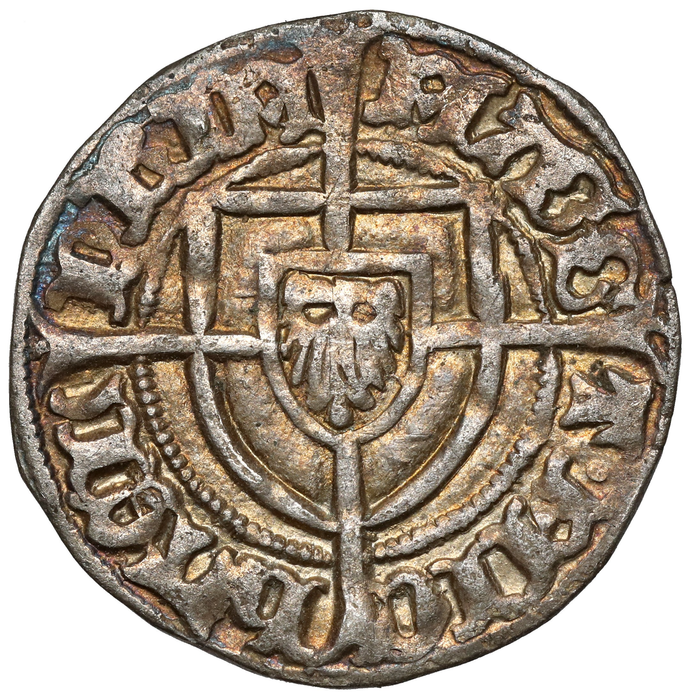</td>
  </tr>
  <tr>
    <th>Opis awersu</th>
    <td>Tarcza wielkiego mistrza na długim krzyżu, w otoku napis MAGS T ∘ MIC HAEL PRIM [Magister Michael Primus]</td>
  </tr>
  <tr>
    <th>Rewers</th>
    <td>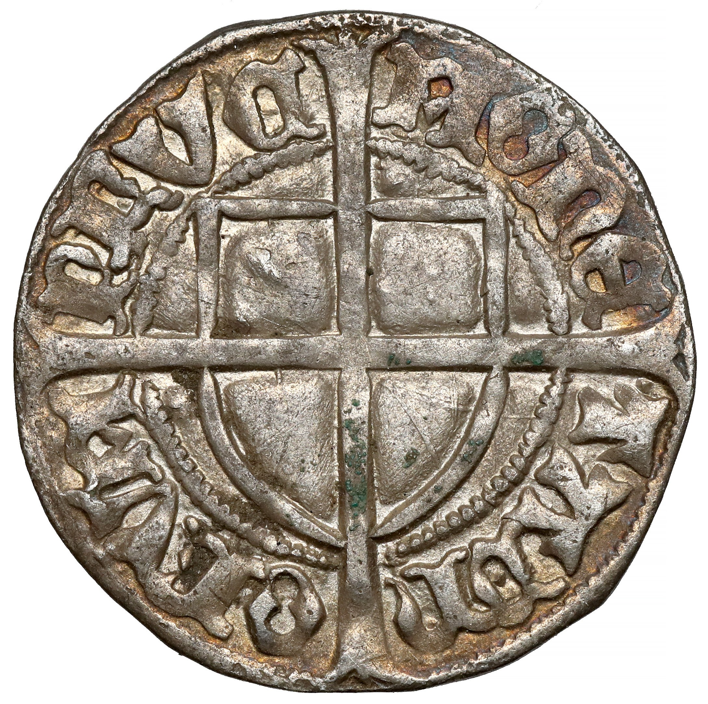</td>
  </tr>
  <tr>
    <th>Opis rewersu</th>
    <td>Tarcza krzyżacka na długim krzyżu, korona w prawym górnym rogu. W otoku napis MONE TADN ORVM PRVC [Moneta Dominorum Prucie]</td>
  </tr>
  <tr>
    <th>Literatura</th>
    <td>Kop. 9026</td>
  </tr>
  <tr>
    <th>Uwagi</th>
    <td></td>
  </tr>
  <tr>
    <th>Źródło</th>
    <td><a href="https://onebid.pl/pl/monety-zakon-krzyzacki-michal-kuchmeister-szelag-piekny/1851083">Marciniak</a></td>
  </tr>
</table>

### Paweł von Russdorf (1422-1441)

<table class="center">
  <tr>
    <th>Rok</th>
    <td>brak</td>
  </tr>
  <tr>
    <th>Lata emisji</th>
    <td>1422-1441</td>
  </tr>
  <tr>
    <th>Nominał</th>
    <td>Szeląg</td>
  </tr>
  <tr>
    <th>Mennica</th>
    <td>Toruń</td>
  </tr>
  <tr>
    <th>Materiał</th>
    <td>Ag</td>
  </tr>
  <tr>
    <th>Waga [g]</th>
    <td>1,3</td>
  </tr>
  <tr>
    <th>Średnica [mm]</th>
    <td>20</td>
  </tr>
  <tr>
    <th>Awers</th>
    <td>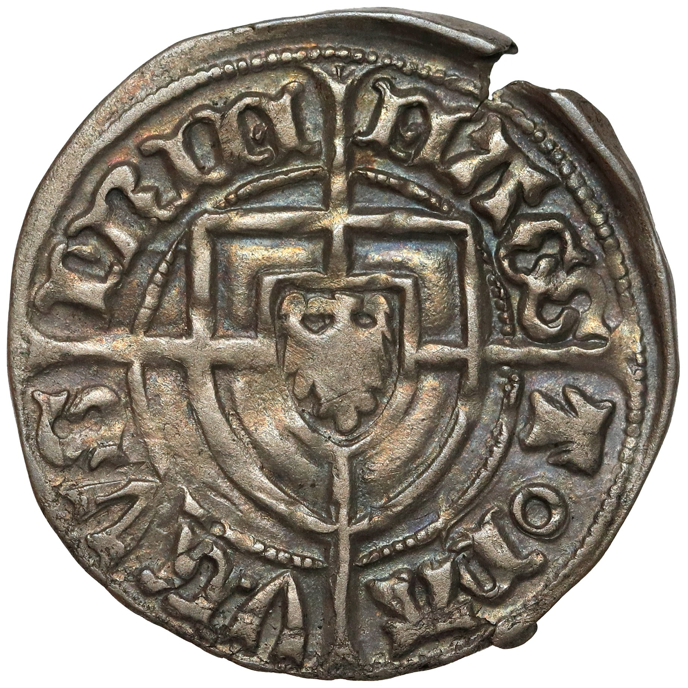</td>
  </tr>
  <tr>
    <th>Opis awersu</th>
    <td>Tarcza wielkiego mistrza na długim krzyżu, w otoku napis MAGS T ∘ PA VLVS PRIM [Magister Paulus Primus]</td>
  </tr>
  <tr>
    <th>Rewers</th>
    <td>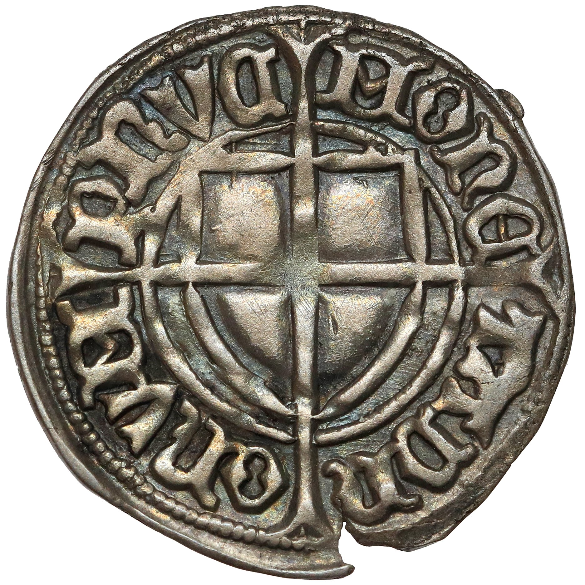</td>
  </tr>
  <tr>
    <th>Opis rewersu</th>
    <td>Tarcza krzyżacka na długim krzyżu, korona w prawym górnym rogu. W otoku napis MONE TADN ORVM PRVC [Moneta Dominorum Prucie]</td>
  </tr>
  <tr>
    <th>Literatura</th>
    <td>Kop. 9028</td>
  </tr>
  <tr>
    <th>Uwagi</th>
    <td></td>
  </tr>
  <tr>
    <th>Źródło</th>
    <td><a href="https://onebid.pl/pl/monety-zakon-krzyzacki-pawel-von-russdorf-szelag/854132">Marciniak</a></td>
  </tr>
</table>

## Przykładowe typy monet (okres II)

### Fenigi (beznapisowe brakteaty) z lat 1466-1525

<table class="center">
  <tr>
    <th>Rok</th>
    <td>brak</td>
  </tr>
  <tr>
    <th>Lata emisji</th>
    <td>1466-1525</td>
  </tr>
  <tr>
    <th>Nominał</th>
    <td>Fenig (brakteat beznapisowy)</td>
  </tr>
  <tr>
    <th>Mennica</th>
    <td>Toruń</td>
  </tr>
  <tr>
    <th>Materiał</th>
    <td>Ag</td>
  </tr>
  <tr>
    <th>Waga [g]</th>
    <td>0,2</td>
  </tr>
  <tr>
    <th>Średnica [mm]</th>
    <td>12-16</td>
  </tr>
  <tr>
    <th>Awers</th>
    <td>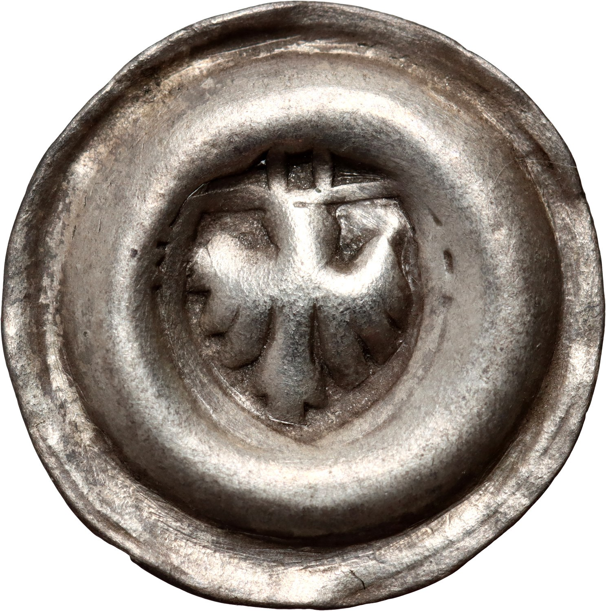</td>
  </tr>
  <tr>
    <th>Opis awersu</th>
    <td>Tarcza krzyżacka</td>
  </tr>
  <tr>
    <th>Rewers</th>
    <td>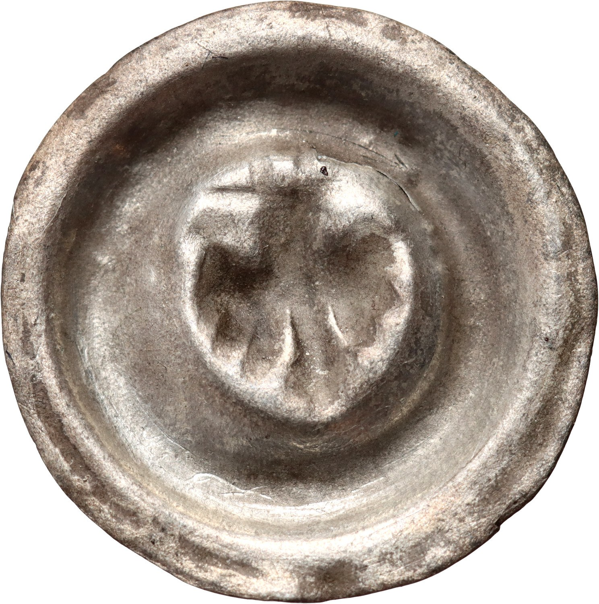</td>
  </tr>
  <tr>
    <th>Opis rewersu</th>
    <td>Negatyw awersu</td>
  </tr>
  <tr>
    <th>Literatura</th>
    <td>Kop. 9001</td>
  </tr>
  <tr>
    <th>Uwagi</th>
    <td></td>
  </tr>
  <tr>
    <th>Źródło</th>
    <td><a href="https://onebid.pl/pl/monety-zakon-krzyzacki-brakteat-orzel-w-tarczy/1902240">Numimarket</a></td>
  </tr>
</table>

### Ludwik von Erlichshausen (1450-1467)

<table class="center">
  <tr>
    <th>Rok</th>
    <td>brak</td>
  </tr>
  <tr>
    <th>Lata emisji</th>
    <td>1450-1456</td>
  </tr>
  <tr>
    <th>Nominał</th>
    <td>Szeląg</td>
  </tr>
  <tr>
    <th>Mennica</th>
    <td>Toruń</td>
  </tr>
  <tr>
    <th>Materiał</th>
    <td>Ag</td>
  </tr>
  <tr>
    <th>Waga [g]</th>
    <td>1,37</td>
  </tr>
  <tr>
    <th>Średnica [mm]</th>
    <td>20</td>
  </tr>
  <tr>
    <th>Awers</th>
    <td>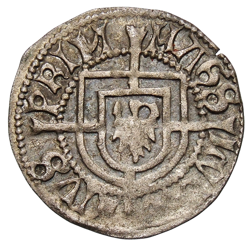</td>
  </tr>
  <tr>
    <th>Opis awersu</th>
    <td>Tarcza wielkiego mistrza, w otoku napis MAGS - LVDW - ICVS - PRIM [Magister Ludewicus Primus]</td>
  </tr>
  <tr>
    <th>Rewers</th>
    <td></td>
  </tr>
  <tr>
    <th>Opis rewersu</th>
    <td>Tarcza krzyżacka na długim krzyżu, korona w prawym górnym rogu. W otoku napis MONE-TA DN-ORVM - PRVC [Moneta Dominorum Prucie]</td>
  </tr>
  <tr>
    <th>Literatura</th>
    <td>Vossberg 883-886; Bahrfeldt 774-780; Neumann 24b</td>
  </tr>
  <tr>
    <th>Uwagi</th>
    <td></td>
  </tr>
  <tr>
    <th>Źródło</th>
    <td><a href="https://ikmk.smb.museum/object?lang=en&id=18227840">Bode</a></td>
  </tr>
</table>

### Henryk Reuss von Plauen (1467-1470)

<table class="center">
  <tr>
    <th>Rok</th>
    <td>brak</td>
  </tr>
  <tr>
    <th>Lata emisji</th>
    <td>1467-1470</td>
  </tr>
  <tr>
    <th>Nominał</th>
    <td>Szeląg</td>
  </tr>
  <tr>
    <th>Mennica</th>
    <td>Królewiec</td>
  </tr>
  <tr>
    <th>Materiał</th>
    <td>Ag</td>
  </tr>
  <tr>
    <th>Waga [g]</th>
    <td>1,27</td>
  </tr>
  <tr>
    <th>Średnica [mm]</th>
    <td>20</td>
  </tr>
  <tr>
    <th>Awers</th>
    <td>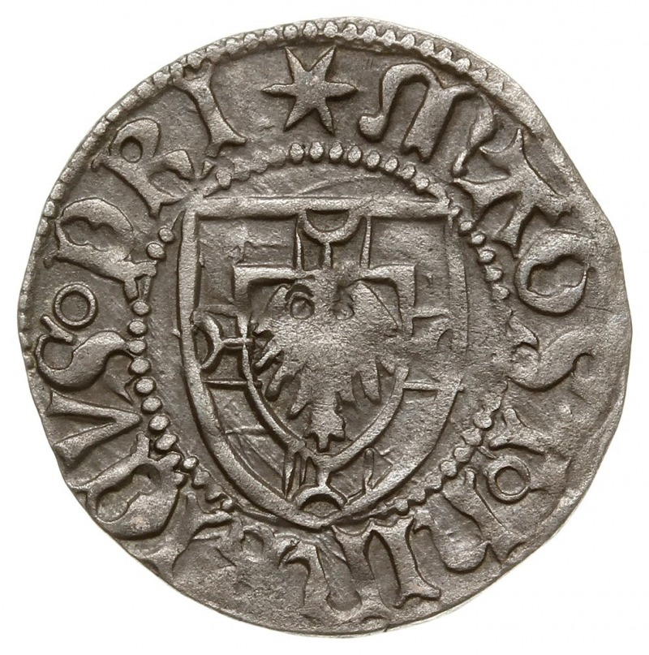</td>
  </tr>
  <tr>
    <th>Opis awersu</th>
    <td>Tarcza wielkiego mistrza, w otoku napis ★ MAGST ∘ HINRICVS ∘ PRI [Magister Hinricus Primus]</td>
  </tr>
  <tr>
    <th>Rewers</th>
    <td>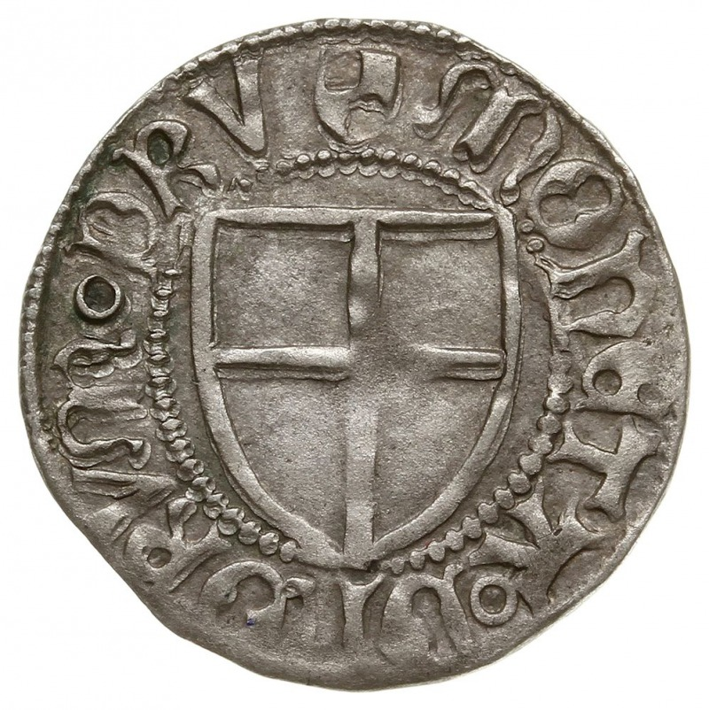</td>
  </tr>
  <tr>
    <th>Opis rewersu</th>
    <td>W polu tarcza krzyżacka. W otoku napis MONETA ∘ DNORVM ∘ PRV [Moneta Dominorum Prucie]</td>
  </tr>
  <tr>
    <th>Literatura</th>
    <td>Vossberg 90; Neumann 28</td>
  </tr>
  <tr>
    <th>Uwagi</th>
    <td></td>
  </tr>
  <tr>
    <th>Źródło</th>
    <td><a href="https://wcn.onebid.pl/pl/monety-szelag-magst-hinricvs-pri-moneta-dnorvm-prv-neumann/6708">WCN</a></td>
  </tr>
</table>

### Henryk Reffle von Richtenberg (1470-1477)

<table class="center">
  <tr>
    <th>Rok</th>
    <td>brak</td>
  </tr>
  <tr>
    <th>Lata emisji</th>
    <td>1470-1477</td>
  </tr>
  <tr>
    <th>Nominał</th>
    <td>Szeląg</td>
  </tr>
  <tr>
    <th>Mennica</th>
    <td>Królewiec</td>
  </tr>
  <tr>
    <th>Materiał</th>
    <td>Ag</td>
  </tr>
  <tr>
    <th>Waga [g]</th>
    <td>1,47</td>
  </tr>
  <tr>
    <th>Średnica [mm]</th>
    <td>20</td>
  </tr>
  <tr>
    <th>Awers</th>
    <td>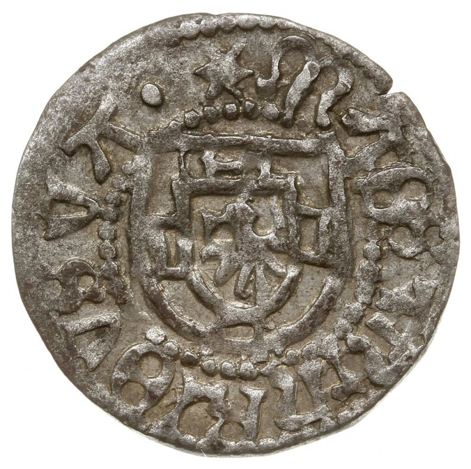</td>
  </tr>
  <tr>
    <th>Opis awersu</th>
    <td>Tarcza wielkiego mistrza, w otoku napis ★ MAGST HINRICVS VA •</td>
  </tr>
  <tr>
    <th>Rewers</th>
    <td>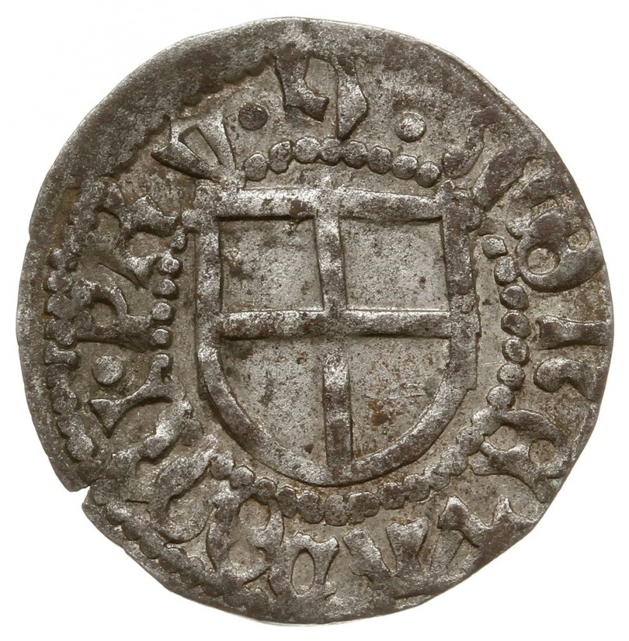</td>
  </tr>
  <tr>
    <th>Opis rewersu</th>
    <td>W polu tarcza krzyżacka. W otoku napis MONETA • DOMI • PRV [Moneta Dominorum Prucie]</td>
  </tr>
  <tr>
    <th>Literatura</th>
    <td>Vossberg 93; Neumann 29</td>
  </tr>
  <tr>
    <th>Uwagi</th>
    <td></td>
  </tr>
  <tr>
    <th>Źródło</th>
    <td><a href="https://wcn.onebid.pl/pl/monety-szelag-magst-hinriovs-va-moneta-domi-prv-neumann-29/6709">WCN</a></td>
  </tr>
</table>

### Marcin Truchsess von Wetzhausen (1477–1489)

<table class="center">
  <tr>
    <th>Rok</th>
    <td>brak</td>
  </tr>
  <tr>
    <th>Lata emisji</th>
    <td>1477–1489</td>
  </tr>
  <tr>
    <th>Nominał</th>
    <td>Szeląg</td>
  </tr>
  <tr>
    <th>Mennica</th>
    <td>Królewiec</td>
  </tr>
  <tr>
    <th>Materiał</th>
    <td>Ag</td>
  </tr>
  <tr>
    <th>Waga [g]</th>
    <td>1,16</td>
  </tr>
  <tr>
    <th>Średnica [mm]</th>
    <td>20</td>
  </tr>
  <tr>
    <th>Awers</th>
    <td>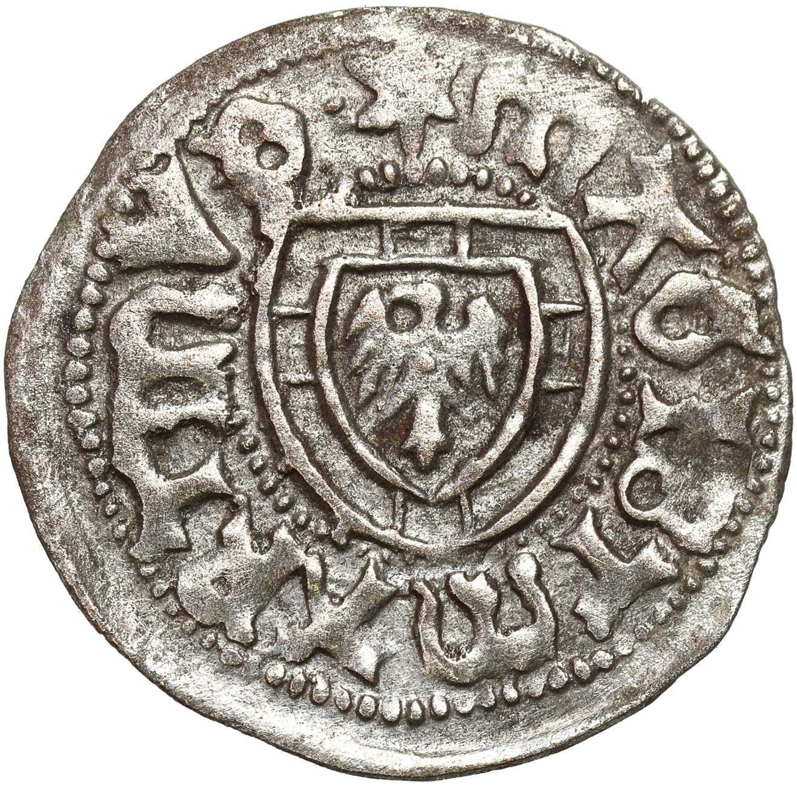</td>
  </tr>
  <tr>
    <th>Opis awersu</th>
    <td>Tarcza wielkiego mistrza, w otoku napis ★ MAGST MARTINV P</td>
  </tr>
  <tr>
    <th>Rewers</th>
    <td>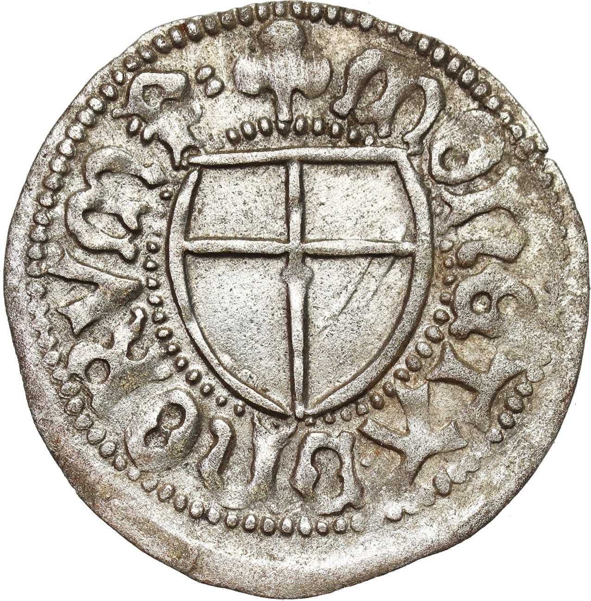</td>
  </tr>
  <tr>
    <th>Opis rewersu</th>
    <td>W polu tarcza krzyżacka. W otoku napis ♣ MONETA DNORVM P [Moneta Dominorum Prucie]</td>
  </tr>
  <tr>
    <th>Literatura</th>
    <td>Neumann 29a</td>
  </tr>
  <tr>
    <th>Uwagi</th>
    <td></td>
  </tr>
  <tr>
    <th>Źródło</th>
    <td><a href="https://archiwum.niemczyk.pl/product/343647/zakon-krzyzacki-marcin-truchsess-1477-1489-szelag-ladny">Niemczyk</a></td>
  </tr>
</table>

### Jan von Tiefen (1489-1497)

<table class="center">
  <tr>
    <th>Rok</th>
    <td>brak</td>
  </tr>
  <tr>
    <th>Lata emisji</th>
    <td>1489-1497</td>
  </tr>
  <tr>
    <th>Nominał</th>
    <td>Szeląg</td>
  </tr>
  <tr>
    <th>Mennica</th>
    <td>Królewiec</td>
  </tr>
  <tr>
    <th>Materiał</th>
    <td>Ag</td>
  </tr>
  <tr>
    <th>Waga [g]</th>
    <td>1,29</td>
  </tr>
  <tr>
    <th>Średnica [mm]</th>
    <td>20</td>
  </tr>
  <tr>
    <th>Awers</th>
    <td>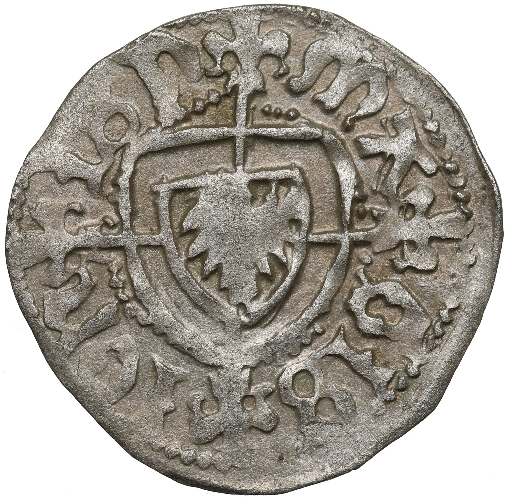</td>
  </tr>
  <tr>
    <th>Opis awersu</th>
    <td>Tarcza wielkiego mistrza z długim krzyżem zakonczonym liliami, w otoku napis ♣ MA ♣ GIS ♣ ION ♣ ISP</td>
  </tr>
  <tr>
    <th>Rewers</th>
    <td>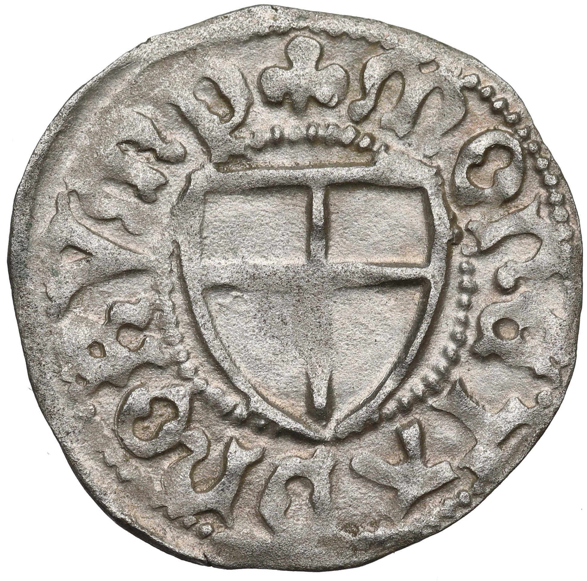</td>
  </tr>
  <tr>
    <th>Opis rewersu</th>
    <td>W polu tarcza krzyżacka. W otoku napis ♣ MONETA DNORVM P [Moneta Dominorum Prucie]</td>
  </tr>
  <tr>
    <th>Literatura</th>
    <td></td>
  </tr>
  <tr>
    <th>Uwagi</th>
    <td></td>
  </tr>
  <tr>
    <th>Źródło</th>
    <td><a href="https://onebid.pl/pl/monety-zakon-krzyzacki-jan-von-tiefen-szelag-nieopisany/1591486">RDA</a></td>
  </tr>
</table>

<table class="center">
  <tr>
    <th>Rok</th>
    <td>brak</td>
  </tr>
  <tr>
    <th>Lata emisji</th>
    <td>1489-1497</td>
  </tr>
  <tr>
    <th>Nominał</th>
    <td>Grosz</td>
  </tr>
  <tr>
    <th>Mennica</th>
    <td>Królewiec</td>
  </tr>
  <tr>
    <th>Materiał</th>
    <td>Ag</td>
  </tr>
  <tr>
    <th>Waga [g]</th>
    <td>1,58</td>
  </tr>
  <tr>
    <th>Średnica [mm]</th>
    <td>20</td>
  </tr>
  <tr>
    <th>Awers</th>
    <td>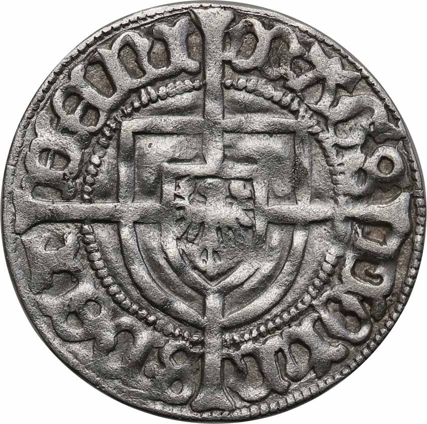</td>
  </tr>
  <tr>
    <th>Opis awersu</th>
    <td>Tarcza wielkiego mistrza z długim krzyżem, w otoku napis MAGST IOHNS DE TIFENI</td>
  </tr>
  <tr>
    <th>Rewers</th>
    <td>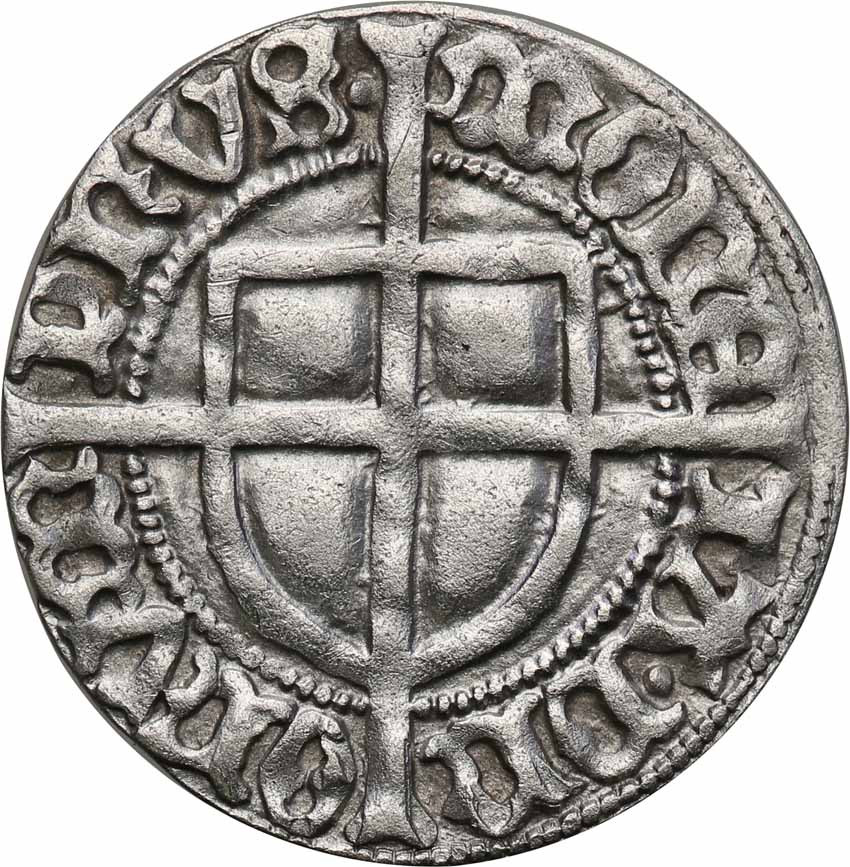</td>
  </tr>
  <tr>
    <th>Opis rewersu</th>
    <td>W polu tarcza krzyżacka na długim krzyżu. W otoku napis MONETA DNORVM PVS [Moneta Dominorum Prucie]</td>
  </tr>
  <tr>
    <th>Literatura</th>
    <td>Kop. 9046; Neumann 32</td>
  </tr>
  <tr>
    <th>Uwagi</th>
    <td>Odpowiednik kwartnika polskiego (półgrosza), stał się u schyłki XIV w. podstawową monetą Zakonu</td>
  </tr>
  <tr>
    <th>Źródło</th>
    <td><a href="https://archiwum.niemczyk.pl/product/153180/zakon-krzyzacki-johann-v-tiefen-1489-1497-grosz-bez-daty-krolewiec-r4">Niemczyk</a></td>
  </tr>
</table>

### Fryderyk Saski (1498-1510)

<table class="center">
  <tr>
    <th>Rok</th>
    <td>brak</td>
  </tr>
  <tr>
    <th>Lata emisji</th>
    <td>1498-1510</td>
  </tr>
  <tr>
    <th>Nominał</th>
    <td>Grosz</td>
  </tr>
  <tr>
    <th>Mennica</th>
    <td>Królewiec</td>
  </tr>
  <tr>
    <th>Materiał</th>
    <td>Ag</td>
  </tr>
  <tr>
    <th>Waga [g]</th>
    <td>1,45</td>
  </tr>
  <tr>
    <th>Średnica [mm]</th>
    <td>25</td>
  </tr>
  <tr>
    <th>Awers</th>
    <td>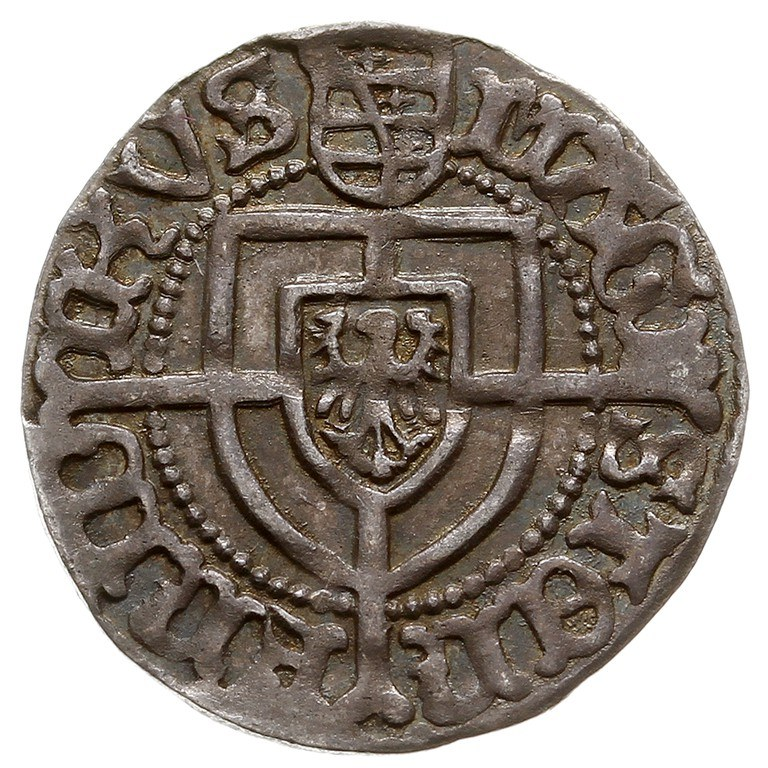</td>
  </tr>
  <tr>
    <th>Opis awersu</th>
    <td>Tarcza wielkiego mistrza z długim krzyżem, w otoku napis MAGI STER FRID IKVS</td>
  </tr>
  <tr>
    <th>Rewers</th>
    <td>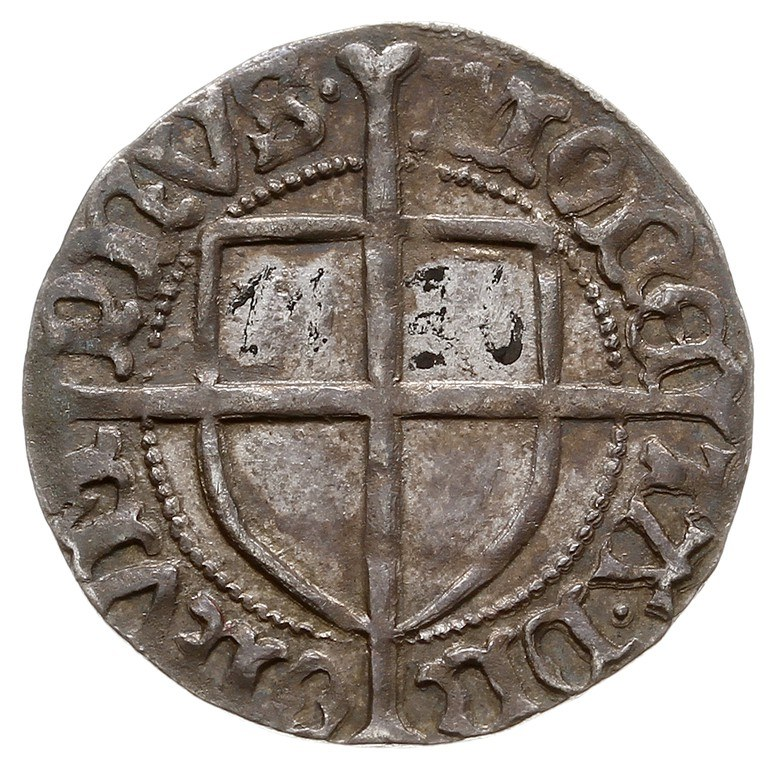</td>
  </tr>
  <tr>
    <th>Opis rewersu</th>
    <td>W polu tarcza krzyżacka na długim krzyżu. W otoku napis MONE TADN ORVM PRVS [Moneta Dominorum Prucie]</td>
  </tr>
  <tr>
    <th>Literatura</th>
    <td>Vossberg 1137</td>
  </tr>
  <tr>
    <th>Uwagi</th>
    <td></td>
  </tr>
  <tr>
    <th>Źródło</th>
    <td><a href="https://onebid.pl/pl/monety-fryderyk-saski-1498-1510-grosz-magi-ster-frid-ikvs/422162">WCN</a></td>
  </tr>
</table>

### Albrecht von Hohenzollern ks. brandenburski (1511-1525)

<table class="center">
  <tr>
    <th>Rok</th>
    <td>1513</td>
  </tr>
  <tr>
    <th>Lata emisji</th>
    <td>1513-1525</td>
  </tr>
  <tr>
    <th>Nominał</th>
    <td>Grosz</td>
  </tr>
  <tr>
    <th>Mennica</th>
    <td>Królewiec</td>
  </tr>
  <tr>
    <th>Materiał</th>
    <td>Ag</td>
  </tr>
  <tr>
    <th>Waga [g]</th>
    <td>1,45</td>
  </tr>
  <tr>
    <th>Średnica [mm]</th>
    <td>25</td>
  </tr>
  <tr>
    <th>Awers</th>
    <td>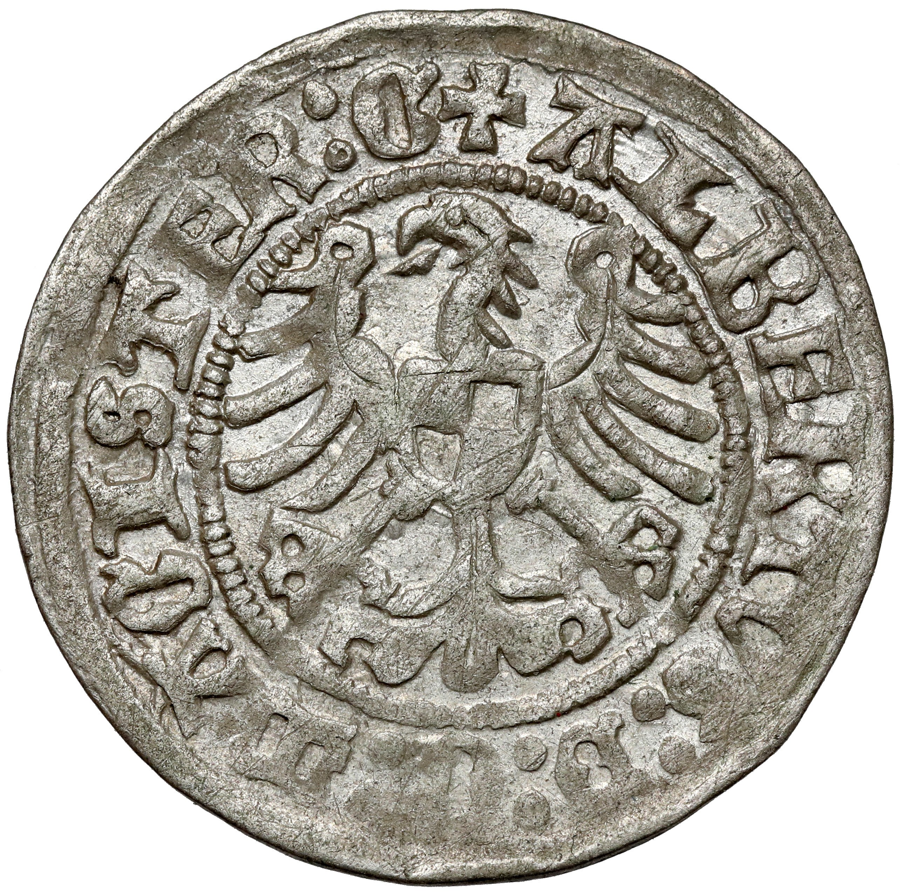</td>
  </tr>
  <tr>
    <th>Opis awersu</th>
    <td>W polu orzeł brandenburski, w otoku napis ✠ ALBERTVS ⦂ D ⦂ G ⦂ MAGISTER G</td>
  </tr>
  <tr>
    <th>Rewers</th>
    <td></td>
  </tr>
  <tr>
    <th>Opis rewersu</th>
    <td>Tarcza wielkiego mistrza z długim krzyżem, w otoku napis SALVA ⦂ NOS ⦂ DOMIN A ⦂ 1513</td>
  </tr>
  <tr>
    <th>Literatura</th>
    <td>Kop. 9052; Vossberg 1144</td>
  </tr>
  <tr>
    <th>Uwagi</th>
    <td></td>
  </tr>
  <tr>
    <th>Źródło</th>
    <td><a href="https://onebid.pl/pl/monety-zakon-krzyzacki-albrecht-hohenzollern-grosz-krolewiec-1513-piekny/1798770">Marciniak</a></td>
  </tr>
</table>

<table class="center">
  <tr>
    <th>Rok</th>
    <td>1515</td>
  </tr>
  <tr>
    <th>Lata emisji</th>
    <td>1513-1525</td>
  </tr>
  <tr>
    <th>Nominał</th>
    <td>Grosz</td>
  </tr>
  <tr>
    <th>Mennica</th>
    <td>Królewiec</td>
  </tr>
  <tr>
    <th>Materiał</th>
    <td>Ag</td>
  </tr>
  <tr>
    <th>Waga [g]</th>
    <td>1,53</td>
  </tr>
  <tr>
    <th>Średnica [mm]</th>
    <td>20</td>
  </tr>
  <tr>
    <th>Awers</th>
    <td>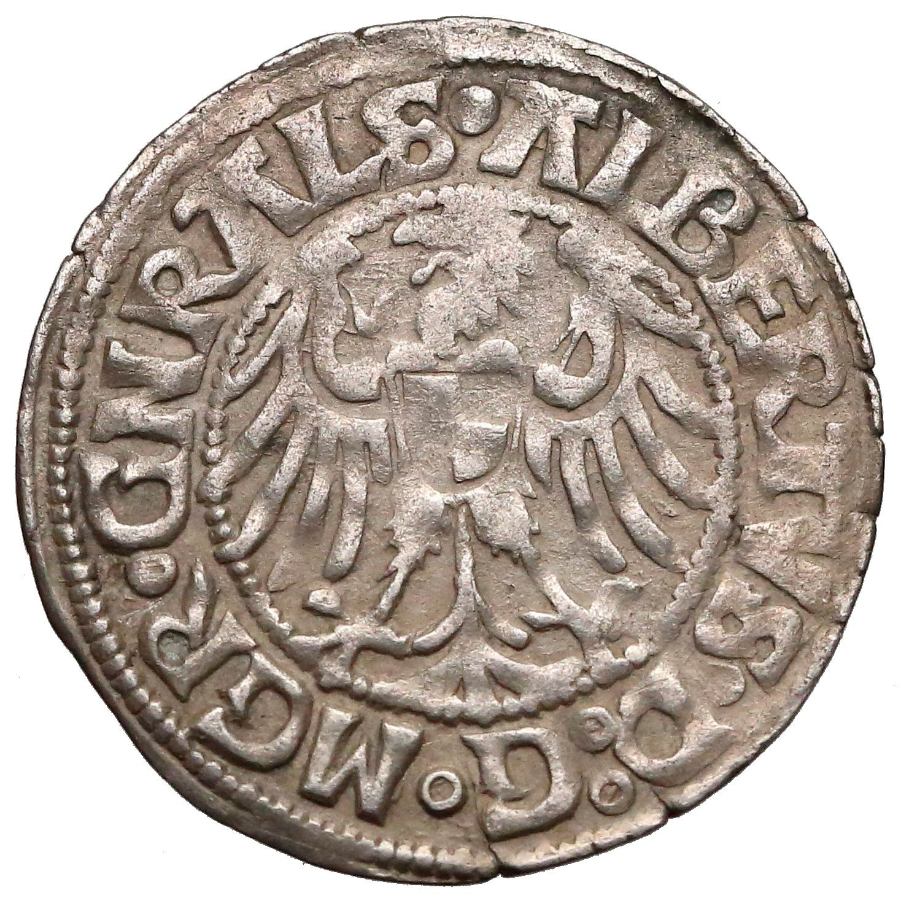</td>
  </tr>
  <tr>
    <th>Opis awersu</th>
    <td>W polu orzeł brandenburski, w otoku napis • ALBERTVS ∘ D ⦂ G ∘ MAGR ∘ GNRALS</td>
  </tr>
  <tr>
    <th>Rewers</th>
    <td>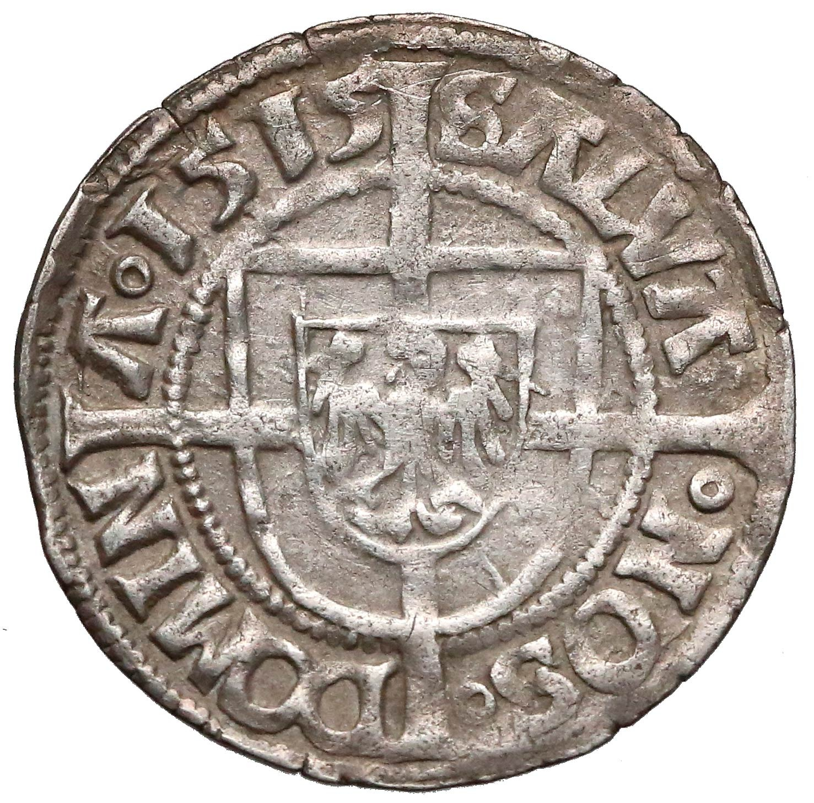</td>
  </tr>
  <tr>
    <th>Opis rewersu</th>
    <td>Tarcza wielkiego mistrza z długim krzyżem, w otoku napis SALVA ∘ NOS ∘ DOMIN A ∘ 1515</td>
  </tr>
  <tr>
    <th>Literatura</th>
    <td>Kop. 9054</td>
  </tr>
  <tr>
    <th>Uwagi</th>
    <td>Napisy renesansowe</td>
  </tr>
  <tr>
    <th>Źródło</th>
    <td><a href="https://onebid.pl/pl/monety-albrecht-hohenzollern-1511-1525-grosz-1515/199834">Marciniak</a></td>
  </tr>
</table>

<table class="center">
  <tr>
    <th>Rok</th>
    <td>1517</td>
  </tr>
  <tr>
    <th>Lata emisji</th>
    <td>1513-1525</td>
  </tr>
  <tr>
    <th>Nominał</th>
    <td>Grosz</td>
  </tr>
  <tr>
    <th>Mennica</th>
    <td>Królewiec</td>
  </tr>
  <tr>
    <th>Materiał</th>
    <td>Ag</td>
  </tr>
  <tr>
    <th>Waga [g]</th>
    <td>1,31</td>
  </tr>
  <tr>
    <th>Średnica [mm]</th>
    <td>20</td>
  </tr>
  <tr>
    <th>Awers</th>
    <td>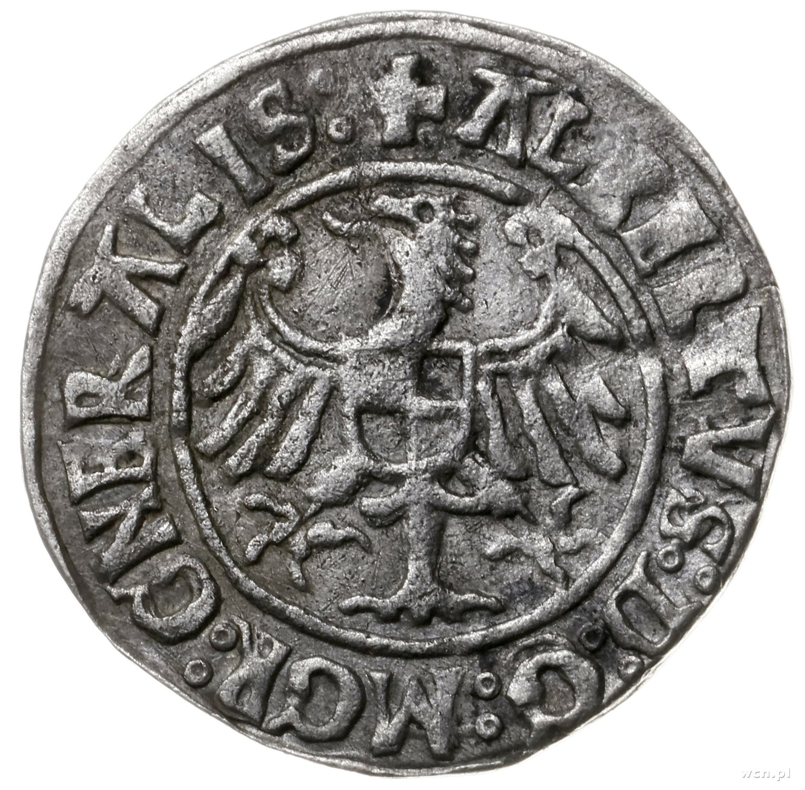</td>
  </tr>
  <tr>
    <th>Opis awersu</th>
    <td>W polu orzeł brandenburski, w otoku napis ✠ ALBERTVS ⦂ D ⦂ G ⦂ MAGR ⦂ GNERALIS ⦂</td>
  </tr>
  <tr>
    <th>Rewers</th>
    <td>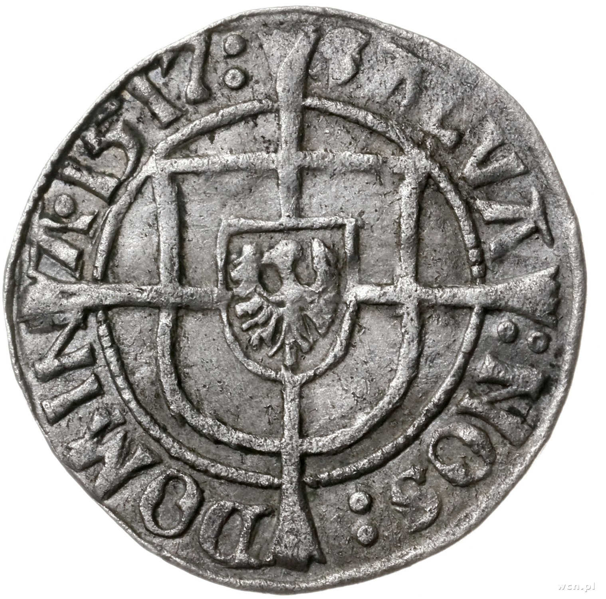</td>
  </tr>
  <tr>
    <th>Opis rewersu</th>
    <td>Tarcza wielkiego mistrza z długim krzyżem, w otoku napis SALVA ⦂ NOS ⦂ DOMIN A ∘ 1517 ⦂</td>
  </tr>
  <tr>
    <th>Literatura</th>
    <td>Kop. 9054; Vossberg 108; Neumann 34</td>
  </tr>
  <tr>
    <th>Uwagi</th>
    <td>Napisy renesansowe</td>
  </tr>
  <tr>
    <th>Źródło</th>
    <td><a href="https://onebid.pl/pl/monety-grosz-1517-krolewiec-aw-orzel-brandenburski-z-tarcz/286186">WCN</a></td>
  </tr>
</table>

<table class="center">
  <tr>
    <th>Rok</th>
    <td>1518</td>
  </tr>
  <tr>
    <th>Lata emisji</th>
    <td>1513-1525</td>
  </tr>
  <tr>
    <th>Nominał</th>
    <td>Grosz</td>
  </tr>
  <tr>
    <th>Mennica</th>
    <td>Królewiec</td>
  </tr>
  <tr>
    <th>Materiał</th>
    <td>Ag</td>
  </tr>
  <tr>
    <th>Waga [g]</th>
    <td>1,03</td>
  </tr>
  <tr>
    <th>Średnica [mm]</th>
    <td>20</td>
  </tr>
  <tr>
    <th>Awers</th>
    <td>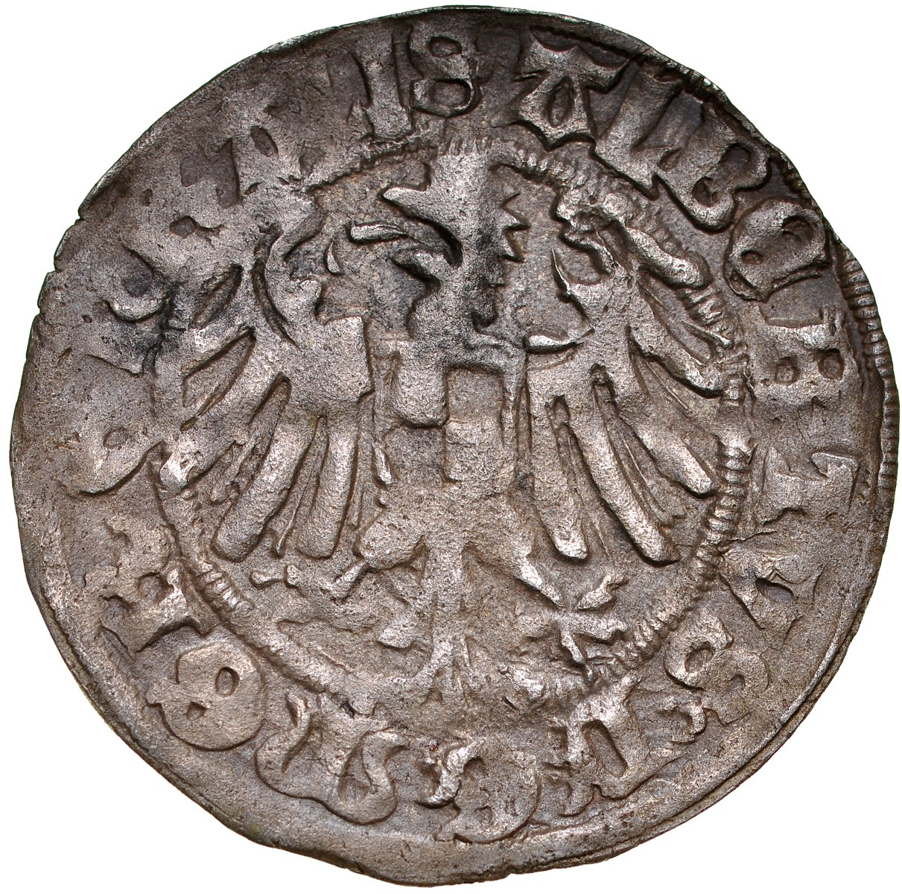</td>
  </tr>
  <tr>
    <th>Opis awersu</th>
    <td>W polu orzeł brandenburski, w otoku napis ALBERTVS DG M GNERALIS ⦂</td>
  </tr>
  <tr>
    <th>Rewers</th>
    <td>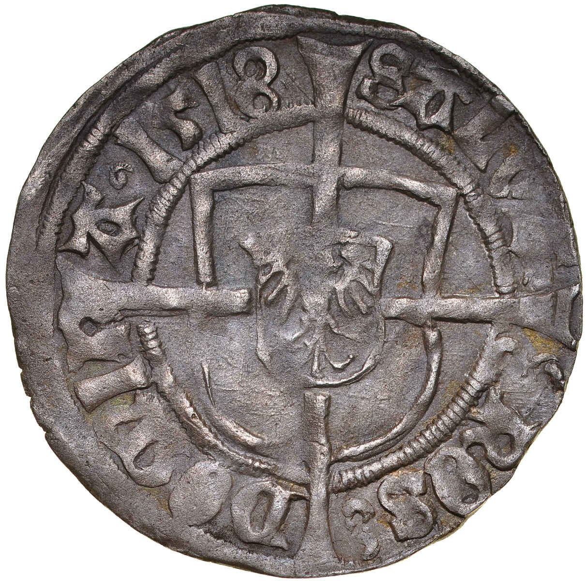</td>
  </tr>
  <tr>
    <th>Opis rewersu</th>
    <td>Tarcza wielkiego mistrza z długim krzyżem, w otoku napis SALVA ⦂ NOS ⦂ DOMIN A ∘ 1518</td>
  </tr>
  <tr>
    <th>Literatura</th>
    <td>Kop. 9057</td>
  </tr>
  <tr>
    <th>Uwagi</th>
    <td>Napisy gotyckie</td>
  </tr>
  <tr>
    <th>Źródło</th>
    <td><a href="https://onebid.pl/pl/monety-albrecht-von-hohenzollern-1511-1525-grosz-1518-krolewiec/1564488">PDA</a></td>
  </tr>
</table>

<table class="center">
  <tr>
    <th>Rok</th>
    <td>1519</td>
  </tr>
  <tr>
    <th>Lata emisji</th>
    <td>1513-1525</td>
  </tr>
  <tr>
    <th>Nominał</th>
    <td>Grosz</td>
  </tr>
  <tr>
    <th>Mennica</th>
    <td>Królewiec</td>
  </tr>
  <tr>
    <th>Materiał</th>
    <td>Ag</td>
  </tr>
  <tr>
    <th>Waga [g]</th>
    <td>1,03</td>
  </tr>
  <tr>
    <th>Średnica [mm]</th>
    <td>20</td>
  </tr>
  <tr>
    <th>Awers</th>
    <td>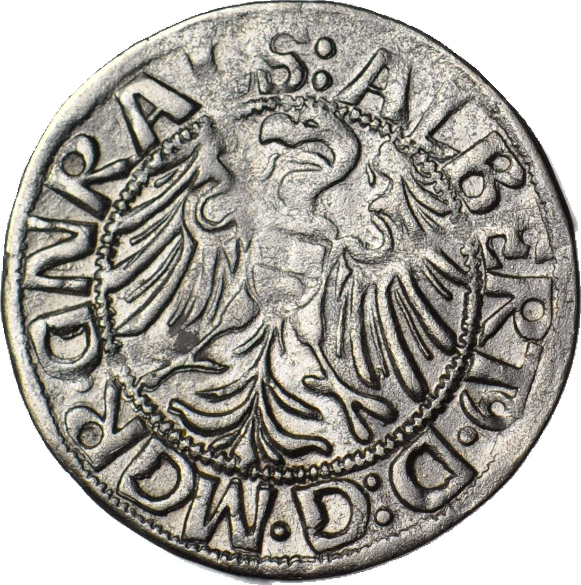</td>
  </tr>
  <tr>
    <th>Opis awersu</th>
    <td>W polu orzeł brandenburski, w otoku napis : ALBERT9 • D : G • MGR • GNRALS</td>
  </tr>
  <tr>
    <th>Rewers</th>
    <td>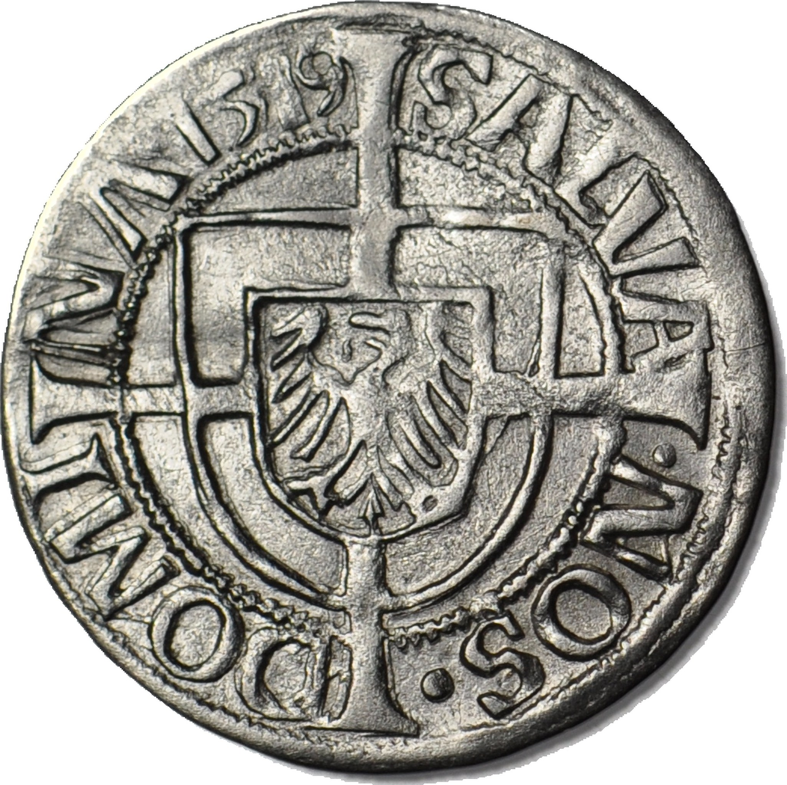</td>
  </tr>
  <tr>
    <th>Opis rewersu</th>
    <td>Tarcza wielkiego mistrza z długim krzyżem, w otoku napis SALVA • NOS • DOMI NA • 1519</td>
  </tr>
  <tr>
    <th>Literatura</th>
    <td>Kop. 9058</td>
  </tr>
  <tr>
    <th>Uwagi</th>
    <td>Napisy renesansowe</td>
  </tr>
  <tr>
    <th>Źródło</th>
    <td><a href="https://onebid.pl/pl/monety-rr-zakon-krzyzacki-albrecht-hohenzollern-grosz-1519-krolewiec/1488041">WDA</a></td>
  </tr>
</table>

<table class="center">
  <tr>
    <th>Rok</th>
    <td>1520</td>
  </tr>
  <tr>
    <th>Lata emisji</th>
    <td>1513-1525</td>
  </tr>
  <tr>
    <th>Nominał</th>
    <td>Grosz</td>
  </tr>
  <tr>
    <th>Mennica</th>
    <td>Królewiec</td>
  </tr>
  <tr>
    <th>Materiał</th>
    <td>Ag</td>
  </tr>
  <tr>
    <th>Waga [g]</th>
    <td>1,35</td>
  </tr>
  <tr>
    <th>Średnica [mm]</th>
    <td>20</td>
  </tr>
  <tr>
    <th>Awers</th>
    <td>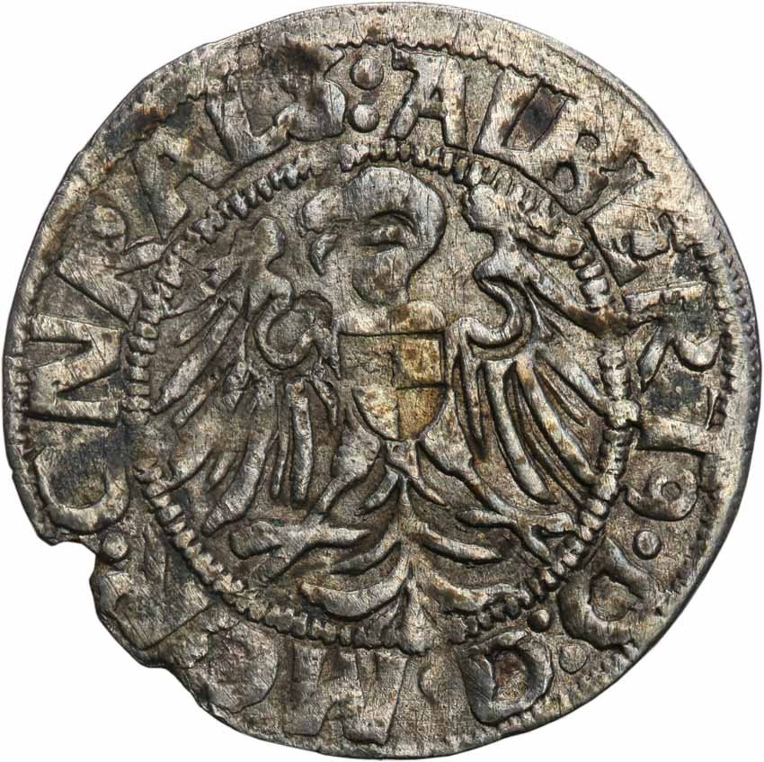</td>
  </tr>
  <tr>
    <th>Opis awersu</th>
    <td>W polu orzeł brandenburski, w otoku napis :ALBERT9 • D : G • MGR • GNRALS</td>
  </tr>
  <tr>
    <th>Rewers</th>
    <td></td>
  </tr>
  <tr>
    <th>Opis rewersu</th>
    <td>Tarcza wielkiego mistrza z długim krzyżem, w otoku napis SALVA • NOS • DOMI NA • 1520</td>
  </tr>
  <tr>
    <th>Literatura</th>
    <td>Neumann 34</td>
  </tr>
  <tr>
    <th>Uwagi</th>
    <td>Napisy renesansowe</td>
  </tr>
  <tr>
    <th>Źródło</th>
    <td><a href="https://archiwum.niemczyk.pl/product/157815/zakon-krzyzacki-albrecht-grosz-1520-krolewiec-st3">Niemczyk</a></td>
  </tr>
</table>

<table class="center">
  <tr>
    <th>Rok</th>
    <td>1521</td>
  </tr>
  <tr>
    <th>Lata emisji</th>
    <td>1520-1521</td>
  </tr>
  <tr>
    <th>Nominał</th>
    <td>Klipa grosza</td>
  </tr>
  <tr>
    <th>Mennica</th>
    <td>Królewiec</td>
  </tr>
  <tr>
    <th>Materiał</th>
    <td>Ag</td>
  </tr>
  <tr>
    <th>Waga [g]</th>
    <td>1,42</td>
  </tr>
  <tr>
    <th>Średnica [mm]</th>
    <td>15</td>
  </tr>
  <tr>
    <th>Awers</th>
    <td>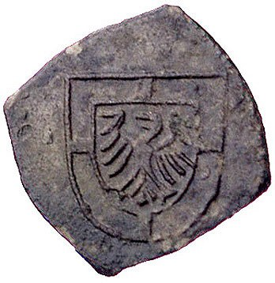</td>
  </tr>
  <tr>
    <th>Opis awersu</th>
    <td>Tarcza wielkiego mistrza</td>
  </tr>
  <tr>
    <th>Rewers</th>
    <td>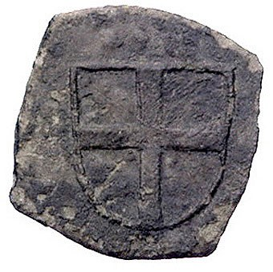</td>
  </tr>
  <tr>
    <th>Opis rewersu</th>
    <td>Tarcza zakonna</td>
  </tr>
  <tr>
    <th>Literatura</th>
    <td>Vossenberg 1243</td>
  </tr>
  <tr>
    <th>Uwagi</th>
    <td></td>
  </tr>
  <tr>
    <th>Źródło</th>
    <td><a href="https://onebid.pl/pl/monety-albrecht-von-hohenzollern-1511-1525-klipa-grosza-1521/394771">WCN</a></td>
  </tr>
</table>

<table class="center">
  <tr>
    <th>Rok</th>
    <td>1520</td>
  </tr>
  <tr>
    <th>Lata emisji</th>
    <td>1520-1521</td>
  </tr>
  <tr>
    <th>Nominał</th>
    <td>Ćwierćtalar (Viertel-Taler = Achtgroschen)</td>
  </tr>
  <tr>
    <th>Mennica</th>
    <td>Królewiec</td>
  </tr>
  <tr>
    <th>Materiał</th>
    <td>Ag</td>
  </tr>
  <tr>
    <th>Waga [g]</th>
    <td>5,06</td>
  </tr>
  <tr>
    <th>Średnica [mm]</th>
    <td>31</td>
  </tr>
  <tr>
    <th>Awers</th>
    <td>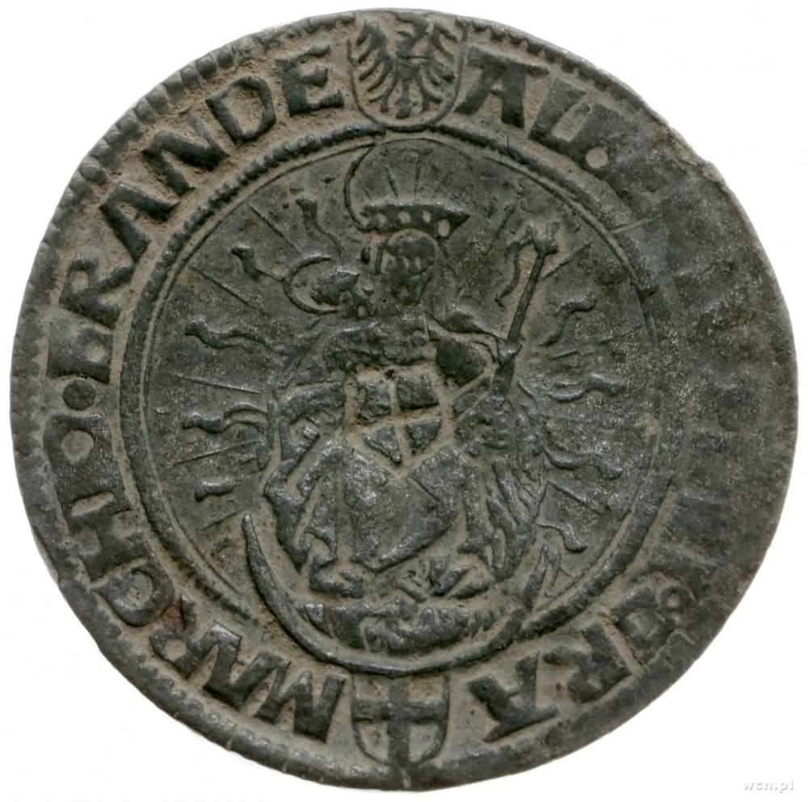</td>
  </tr>
  <tr>
    <th>Opis awersu</th>
    <td>Matka Boska z dzieciątkiem na półksiężycu otoczona promieniami, ALBERTV DEI GRA MARCHIO BRAND</td>
  </tr>
  <tr>
    <th>Rewers</th>
    <td>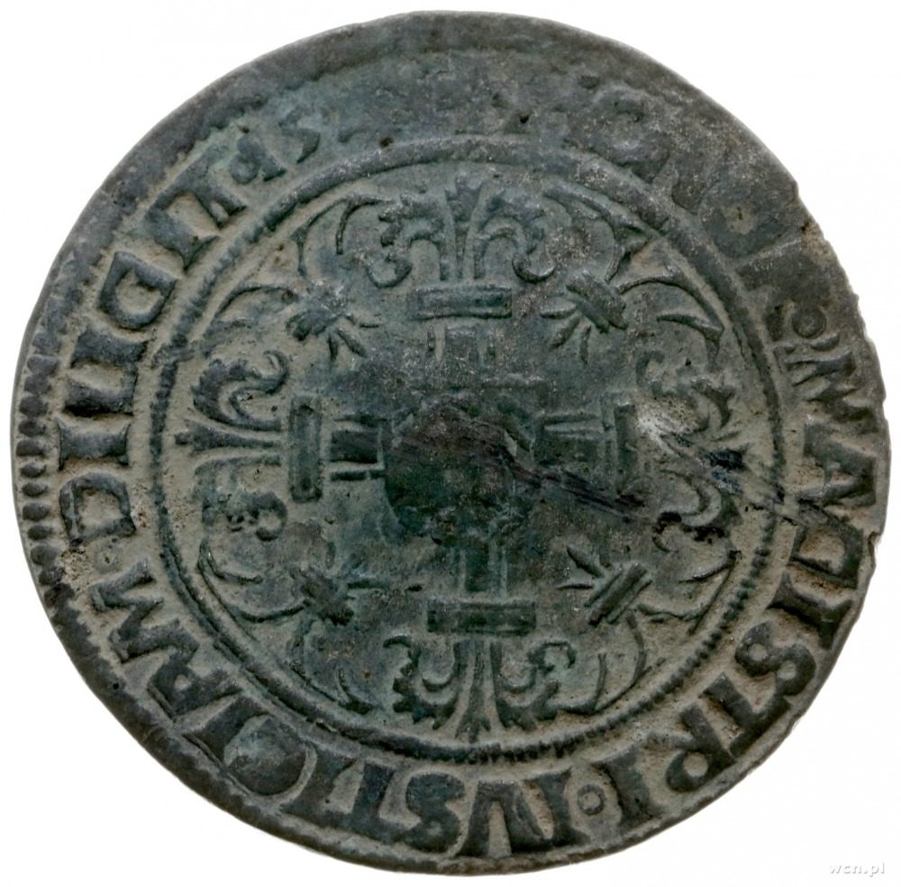</td>
  </tr>
  <tr>
    <th>Opis rewersu</th>
    <td>Orzeł pruski w tarczy na tle ozdobnego krzyża w rozecie, HONOR MAGISTRI IVSTICIAM DILIGIT 15Z[0]</td>
  </tr>
  <tr>
    <th>Literatura</th>
    <td>Neumann 37; Vossenberg 1227; Kop. 9070</td>
  </tr>
  <tr>
    <th>Uwagi</th>
    <td>Na monecie widnieje kontrmarka (tarcza z krzyżem), którą nabijano na wybitych monetach w celu obniżenia oficjalnej wartości z ośmiu do sześciu groszy</td>
  </tr>
  <tr>
    <th>Źródło</th>
    <td><a href="https://onebid.pl/pl/monety-cwierctalar-viertel-taler-achtgroschen-1520-krolew/183267">WCN</a></td>
  </tr>
</table>

<table class="center">
  <tr>
    <th>Rok</th>
    <td>1521</td>
  </tr>
  <tr>
    <th>Lata emisji</th>
    <td>1520-1521</td>
  </tr>
  <tr>
    <th>Nominał</th>
    <td>Klipa ćwierćtalarowa (8 groszy)</td>
  </tr>
  <tr>
    <th>Mennica</th>
    <td>Królewiec</td>
  </tr>
  <tr>
    <th>Materiał</th>
    <td>Ag</td>
  </tr>
  <tr>
    <th>Waga [g]</th>
    <td>5,06</td>
  </tr>
  <tr>
    <th>Średnica [mm]</th>
    <td>24</td>
  </tr>
  <tr>
    <th>Awers</th>
    <td>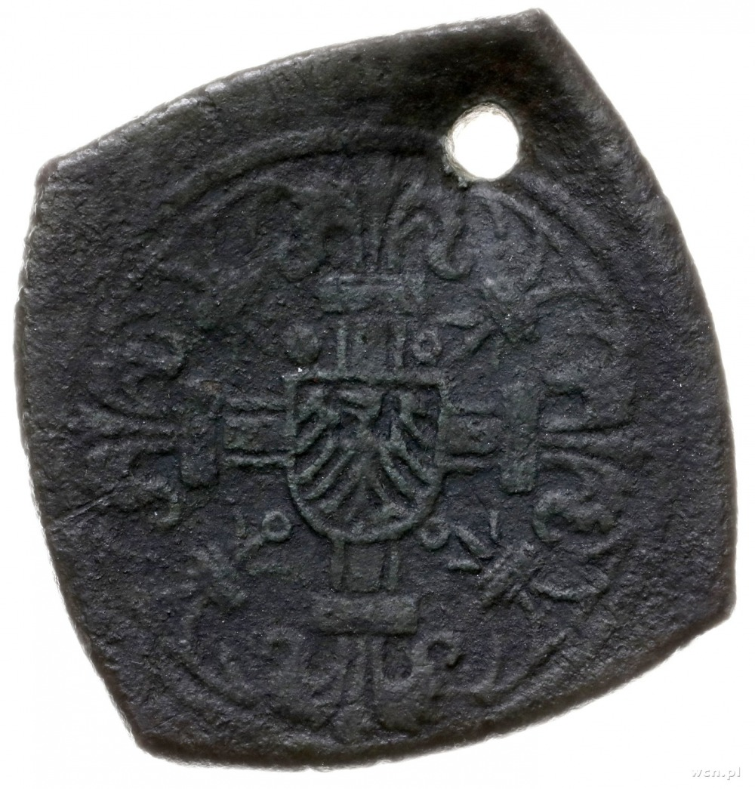</td>
  </tr>
  <tr>
    <th>Opis awersu</th>
    <td>Orzeł pruski w tarczy na tle ozdobnego krzyża w rozecie</td>
  </tr>
  <tr>
    <th>Rewers</th>
    <td></td>
  </tr>
  <tr>
    <th>Opis rewersu</th>
    <td>Madonna z dzieciątkiem na wprost</td>
  </tr>
  <tr>
    <th>Literatura</th>
    <td>Vossenberg 1242</td>
  </tr>
  <tr>
    <th>Uwagi</th>
    <td></td>
  </tr>
  <tr>
    <th>Źródło</th>
    <td><a href="https://onebid.pl/pl/monety-klipa-cwierctalara-8-groszy-1521-krolewiec-aw-mado/192223">WCN</a></td>
  </tr>
</table>

[Powrót](https://numizmatyka.satola.net)