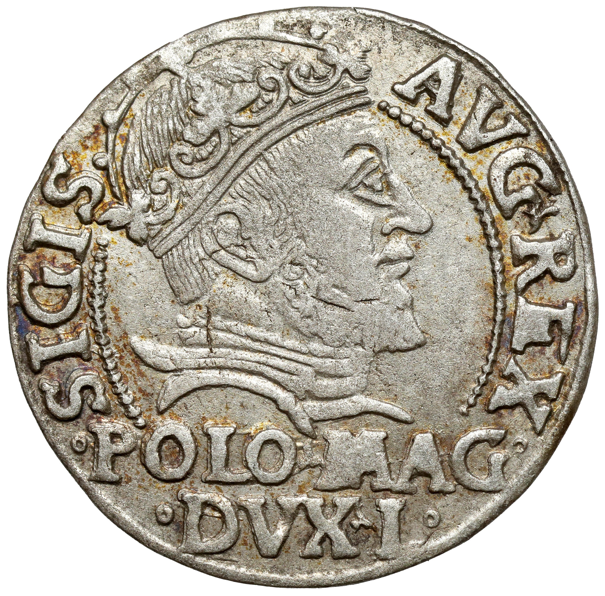
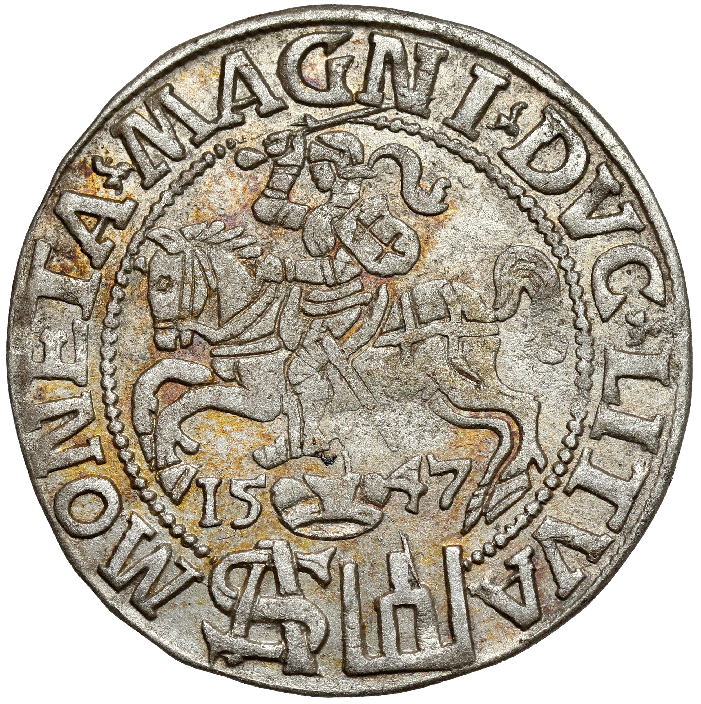

[Powrót](https://numizmatyka.satola.net)

# Monety Zakonu Krzyżackiego (1226-1525)

**Zakon krzyżacki**, **zakon niemiecki**, **Zakon Szpitala Najświętszej Marii Panny Domu Niemieckiego w Jerozolimie** (łac. Ordo domus Sanctae Mariae Theutonicorum) - jeden z trzech największych, obok joannitów i templariuszy, chrześcijańskich zakonów rycerskich, które powstały na fali krucjat w XI i XII wieku. Sprowadzony w 1226 na Mazowsze przez Konrada Mazowieckiego, by zapewnić obronę posiadłości piastowskich przed Prusami, dokonał ich podboju i chrystianizacji, opanował militarnie obszary późniejszych Prus Wschodnich oraz dzisiejszej Łotwy i Estonii tworząc z tych ziem własne państwo. Zakon podbił także niektóre tereny Polski i Litwy. [więcej...](https://pl.wikipedia.org/wiki/Zakon_krzy%C5%BCacki)

`TODO`: dodać spis treści

Mennictwo krzyżackie z punktu widzenia numizmatyki polskiej można podzielić na dwa okresy (LMK. 13):
- **Monety krzyżackie** - od powstania państwa zakonnego do zawarcia traktatu toruńskiego w 1466 r. monety tego okresu powinny być traktowane jako monety obcego państwa znajdujące się w obiegu na ziemiach polskich.
- **Lenne monety krzyżackie** - od roku 1466 gdy Zakon został lennikiem króla polskiego do jego sekularyzacji w 1525 r. monety tego okresu należą do jednego z systemów monetarnych państwa polskiego, obok monet koronnych, litewskich oraz księstw pruskiego i kurlandzkiego.

## Monety krzyżackie (1226-1466)
`TODO`: opisać co się działo przed 1466

## Lenne monety krzyżackie (1466-1525)
19 października 1466 roku podpisany został II pokój toruński kończący zwycięską dla Polski trzynastoletnią wojnę z Zakonem Krzyżackim. W jego wyniku Pomorze Gdańskie, ziemia chełmińska i michałowska, oraz Warmia z Malborkiem i Elblągiem zostały wcielone bezpośrednio do Polski. Prusy Wschodnie z Królewcem pozostały we władaniu Zakonu jako lenno, z zastrzeżeniem wieczystego hołdu dla Korony Polskiej, z którą Zakon wraz ze wszystkimi swymi ziemiami i poddanymi miał odtąd tworzyć jedno nierozdzielne ciało. Wielki mistrz otrzymał miejsce w senacie między panami polskimi, dostojnicy zakonu zostali także dopuszczeni do rady królewskiej. Bez zgody króla polskiego, Zakon nie mógł zawierać traktatów i przymierzy. W każdej potrzebie wojennej Zakon miał wspierać Polskę militarnie.

Spośród siedmiu panujących od tego momentu wielkich mistrzów Zakonu, tylko Fryderyk ks. saski (1498-1510), drogą chytrych wybiegów i przy sprzyjającej sytuacji politycznej, zdołał się uchylić od złożenia hołdu królowi polskiemu. (LMK. 3) Ostatni z wielkich mistrzów, Albrecht von Hohenzollern ks. brandenburski (1511-1525), usiłując naśladować swego poprzednika doprowadził do wojny polsko-krzyżackiej (1519-1521). Po przegranej wojnie, zmuszony przez koneksje rodzinne oraz dla zachowania pokoju wewnętrznego, Albrecht przeszedł na luteranizm, co położyło kres istnieniu państwa zakonnego. Państwo zarządzane przez Albrechta, mimo że wciąż dość silne militarnie, znalazło się w próżni politycznej, co wykorzystał jego wuj, król polski Zygmunt I Stary i zmusił go do hołdu lennego w 1525, jako wieczystego lennika Królestwa Polskiego.

Monety wybijane przez Zakon od 1466 roku powinny być traktowane jako monety lenne państwa polskiego (mimo, że nie było na nich symboli podległości lennej, jak polskie herby czy inicjały króla, a ich stopa mennicza nie była zgodną z polską). (LMK. 12)

## Emitenci chronologicznie
Poniżej poczet tych wielkich mistrzów i zarządców, którzy emitowali monety Zakonu. Po kropkach podane brzmienie ich imienia według zapisu, jaki najczęściej występuje na monecie, choć i oczywiście tutaj istnieją odmiany. Zapis imienia emitenta zawsze poprzedza słowo MAGISTER, występujące w różnych formach, czasami skróceniach, czy przeinaczeniach typu MAGIST, MAGS, MGR...:
- Winrych von Kniprode (1351-1382) … WYNRICVS PRIMVS
- Konrad I Zöllner von Rothenstein (1382-1390) … CORADVS PRIM9
- Konrad III von Jungingen (1393-1407) … CORADVS TERCI
- Ulryk von Jungingen (1407-1410) … VLRICVS PRIMVS
- Henryk von Plauen (1410-1413) … hINRICVS PRIM
- Herman Gans (zarządca 1413-1414) MAGISTER GENERALIS
- Michał Kuchmeister von Sternberg (1414-1422) … MIChAEL PRIM
- Paweł von Russdorf (1422-1441) … PAVLVS PRIM
- Konrad von Erlichshausen (1441-1449) … CORADVS QVIN
- Ludwik von Erlichshausen (1450-1467) … LVDWIC DEPRIM
- Henryk Reuss von Plauen, zarządca (1467-1469) hINRICVS LOCVTENES M
- Henryk Reuss von Plauen (1469-1470) … hINRICVS PRI
- Henryk Reffle von Richtenberg (1470-1477) … hINRICVS QVA
- Marcin Truchsess von Wetzhausen (1477-1489) … MARTINV PRIM
- Jan von Tiefen (1489-1497) … IOhISP

`TODO`: Fryderyk ks. saski (1498-1510)

`TODO`: Albrecht von Hohenzollern ks. brandenburski (1511-1525)

## Systemy rachunkowo-pieniężne (Kop9-4)
### System rachunkowo-pieniężny krzyżacki z 1233 roku

| :-: | :-: | :-: | :-: | :-: |
| **grzywna** | 4 | 24 | 60 | 720 |
| 1/4 | **wiardunek** | 6 | 15 | 180 |
| 1/24 | 1/6 | **skojec** | 2 1/2 | 30 |
| 1/60 | 1/15 | 2/5 | **szeląg** | 15 |
| 1/720 | 1/180 | 1/30 | 1/12 | **fenig** |

### System rachunkowo-pieniężny krzyżacki z końca XIV w.

| :-: | :-: | :-: | :-: | :-: | :-: | :-: |
| **grzywna chełm.** | 4 | 24 | 45 | 60 | 180 | 720 |
| 1/4 | **wiardunek** | 6 | 11 1/4 | 15 | 45 | 180 |
| 1/24 | 1/6 | **skojec** | 1 7/8 | 2 1/2 | 7 1/2 | 30 |
| 1/45 | 4/45 | 8/15 | **półskojec** | 1 1/3 | 4 | 16 |
| 1/60 | 1/15 | 2/5 | 3/4 | **szeląg** | 3 | 12 |
| 1/180 | 1/45 | 2/15 | 1/4 | 1/3 | **kwartnik** | 4 |
| 1/720 | 1/180 | 1/30 | 1/16 | 1/12 | 1/4 | **fenig** |

### System rachunkowo-pieniężny krzyżacki z 1456 roku

| :-: | :-: | :-: |
| **grzywna prus.** | 60 | 360 |
| 1/60 | **szeląg** | 6 |
| 1/360 | 1/6 | **fenig** |

`TODO`: dokończyć systemy

<table style="table-layout: auto !important;"><tbody><tr><td>grzywna</td><td>4</td><td>24</td><td>60</td><td>720</td></tr><tr><td>1/4</td><td>wiardunek</td><td>6</td><td>15</td><td>180</td></tr><tr><td>1/24</td><td>1/6</td><td>skojec</td><td>2 1/2</td><td>30</td></tr><tr><td>1/60</td><td>1/15</td><td>2/5</td><td>szeląg</td><td>15</td></tr><tr><td>1/720</td><td>1/180</td><td>1/30</td><td>1/12</td><td>fenig</td></tr></tbody></table>

## Przykładowe typy monet

### Fenigi (beznapisowe brakteaty) z lat 1466-1525

 

    
| Rok | Lata emisji | Nominał | Mennica | Materiał | Waga [g] | Średnica [mm] | Rant |
| :-: | :-: | :-: | :-: | :-: | :-: | :-: | :-: |
| brak | 1466-1525 | Fenig (brakteat beznapisowy) | Królewiec | Ag | 0,2 | 12-16 | gładki |

| Awers | Rewers | Literatura | Uwagi | Źródło |
| :- | :- | :-: | :- | :-: |
| Orzeł brandenburski z tarczą Hohenzollernów na piersi i napis: ✠ ALBERTVS ⦂ D ⦂ G ⦂ MAGISTER ⦂ G[eneralis] | Orzeł brandenburski z tarczą Hohenzollernów na piersi i napis: ✠ ALBERTVS ⦂ D ⦂ G ⦂ MAGISTER ⦂ G[eneralis] | Neumann 34; Vossberg 1144 | 0062 | [WCN](https://wcn.pl/auctions/48/561) |

|&nbsp;&nbsp;&nbsp; Skrót &nbsp;&nbsp;&nbsp;| Tytuł | Autor | Rok wydania | Uwagi |
| :-: | :- | :- | :-: | :- |
| Kop9-4 | Katalog podstawowych typów monet i banknotów Polski oraz ziem historycznie z Polską związanych - Tom IX cz. 4 - Legendy, znaki mennicze, gatunki monet i inne elementy klasyfikacji | Edmund Kopicki | 1989 |  |
| LMK | Lenne Monety Krzyżackie | Andrzej Schmidt | 1979 |  |

[Powrót](https://numizmatyka.satola.net)